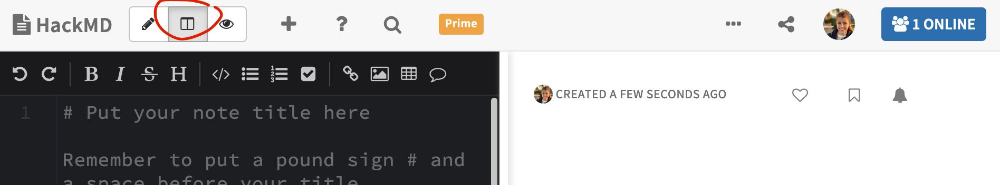
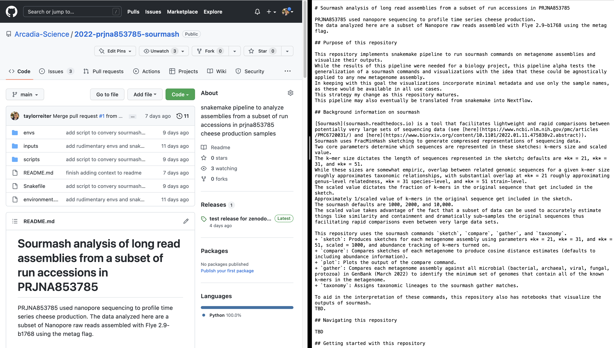

# Introduction to markdown syntax

Markdown is a lightweight markup language.
A markup language is a "text-encoding system consisting of a set of symbols inserted in a text document to control its structure, formatting, or the relationship between its parts" ([source](https://en.wikipedia.org/wiki/Markup_language)).
Other common markup languages include LaTeX and HTML.
Markdown was created to enable people to easily read and write plain text format.

Markdown (and other markup languages) can be automatically rendered to control the display format of a document.
It's often used in formatting for things like websites & blogs and in computational notebooks (jupyter & RMarkdown).

This tutorial provides a brief introduction to the markdown syntax and where you may encounter it.
 
## Markdown demonstration with side-by-side rendering in HackMD

[HackMD](https://hackmd.io) is a collaborative markdown editor.
It's similar to Google Docs but all text is written in markdown. 
We'll use HackMD to practice writing markdown syntax and to watch it render instantaneously.

Open a new HackMD document and make sure "Both" mode is selected at the top of the document viewer.



Copy and paste the following text into the left hand panel.
The text will auto-render on the right hand panel and demonstrate how the markdown language is interpreted and displayed.

This content is modified from [this gist](https://gist.github.com/benstr/8744304).
```
# Heading 1
## Heading 2
### Heading 3
#### Heading 4
##### Heading 5
###### Heading 6	

---

Paragraph
~~Mistaken text.~~	
*Italics*	
**Bold**	

---

Tasks
- [ ] a task list item
- [ ] incomplete
- [x] completed

---

Code Blocks

text `Inline Code` text		

    4 space indention
    makes full-width
    standard code blocks

\```
# (remove the slashes above and below the back ticks to render properly
# three backticks also makes a standard full-width code block
library(dplyr)
library(readr)
\```


---

* List item one
* List item two
    * A nested item

---

1. Number list item one		
	1.1. A nested item
2. Number list item two
3. Number list item three

---

> Quote
> 
> Second line Quote

---

Standard link =  http://ghost.org	
[Custom Text Link](http://ghost.org)

---

Image


---

Table

| Left-Aligned  | Center Aligned  | Right Aligned |
| :------------ |:---------------:| -----:|
| col 3 is      | some wordy text | $1600 |
| col 2 is      | centered        |   $12 |
| zebra stripes | are neat        |    $1 |
```

## Markdown and Notion & Slack

Both Slack and Notion auto-render text written in markdown as the text is written.
You don't have to write in markdown (you can use the GUI buttons in each app to format your text), but it's a nice option to more quickly format text.

## Markdown and GitHub

[GitHub](www.github.com) is a code hosting platform for version control and collaboration.
GitHub renders markdown in a few key places.

The first is in a repository's [README](https://docs.github.com/en/repositories/managing-your-repositorys-settings-and-features/customizing-your-repository/about-readmes). 
When a README is included in a repository, GitHub renders it below the code in that folder. 
Most repositories contain a README in the main folder that describes the content of that repository.
See the image below for an example of a README that was auto-rendered by GitHub.
Sometimes, folders contained within the repository will also contain a README describing the contents of that specific folder.



[GitHub issues](https://docs.github.com/en/issues/tracking-your-work-with-issues/about-issues) and [pull requests](https://docs.github.com/en/pull-requests/collaborating-with-pull-requests/proposing-changes-to-your-work-with-pull-requests/about-pull-requests) also support markdown syntax.
GitHub issues track ideas, feedback, tasks, or bugs for a repository.
GitHub pull requests contain suggested code or document changes along with a narrative left in a comment section.
Using markdown in issues and in pull request comments makes ideas and feedback easier to quickly read and digest.

Lastly, jupyter notebooks that are uploaded to GitHub are rendered, including the markdown syntax used inline in the document. 
Since a rendered notebook nicely presents the code that was run, its output, and any documentation added to the analysis, jupyter notebooks are a good way to share a data analysis.

## Flavors of markdown

By and large, the core syntax of markdown is consistent across platforms.
However, different platforms support different features. 
Each platform is briefly introduced below, followed by some platform-specific markdown features.
 
+ GitHub: GitHub supports a strict super set of the markdown language. See [this webpage](https://github.github.com/gfm/#what-is-github-flavored-markdown-) for a description of GitHub-flavored markdown.
+ HackMD: as mentioned above, HackMD is a collaborative markdown editor. It supports many additional markdown goodies that may not be available on or rendered by other platforms.  
    + drag-and-drop png -> URL -> rendered image: HackMD allows you to drag and drop an image into the text space, where it will generate a URL for the image and format that link as in markdown syntax for the image to render. Once this URL exists, you can drop it in any markdown document and it will render. I don't know how long these image links will be supported for. So far, my oldest image link is 2 years old and is still going strong.
    + `:::idea`: generates a blue-hued call out box that is separated from the rest of the text.
    + Table of contents: including `[toc]` at the top of a document generates a table of contents from headings in the document.
    + user name tags: You can generate a name tag (e.g. to label a specific addition to the document) using `> [name=taylorreiter]`.
+ RMarkdown: Rmarkdown weaves together code, code outputs, and text into a single document.
    + Documents begin with a yaml header to specify how the document should be rendered.
    + Code blocks begin with three back ticks, but code blocks that should be executed start with `{r}` after the three back ticks. The content inside the curly brackets controls the run and rendering behavior of a specific code block and its outputs.

## More on markdown

See below for links to additional materials on markdown.

+ [GitHub markdown cheatsheet](https://itnext.io/github-markdown-cheatsheet-50642835effa)
+ [RMarkdown cheatsheet](https://www.rstudio.com/wp-content/uploads/2015/02/rmarkdown-cheatsheet.pdf)
+ The Carpentries alpha [introduction to markdown lesson](https://carpentries-incubator.github.io/markdown-intro/about/index.html)
