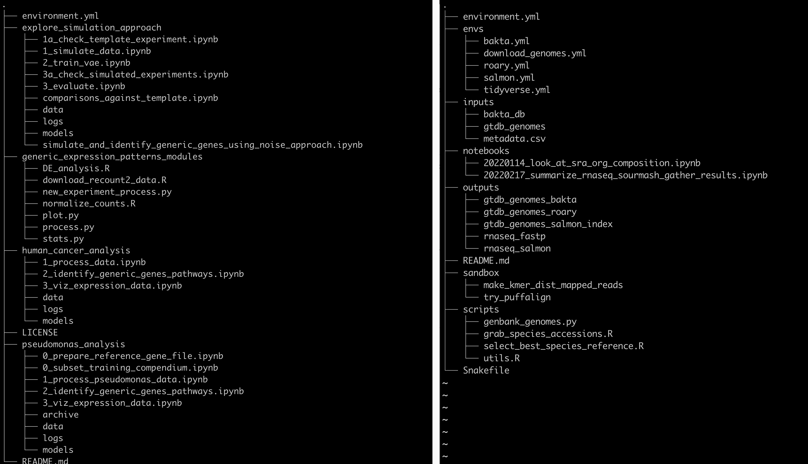
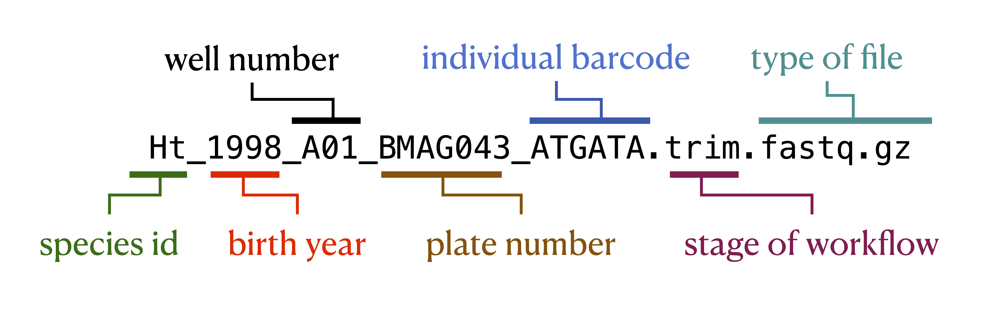
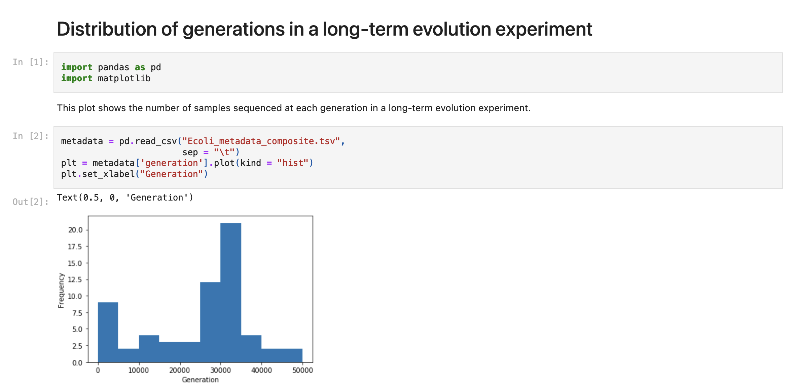
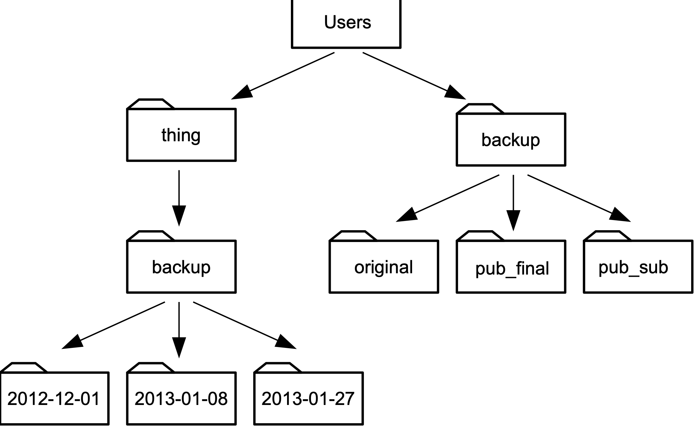

# Project organization and file & resource management

Bioinformatics data analyses often have many different input and output files with hundreds to thousands of intermediate files.
Keeping all of these files organized along with the code you used to obtain or make them and any other notes you may have is _hard_. 
This lessons covers some ideas for how to stay organized. 
There is no one-size-fits all, either for data analysts or for projects. 
You'll have to experiment to see what strategy works best for you and inevitably you'll get better with practice and feedback.

## Some not bad ideas to consider

### Use a good but flexible directory structure

The foundation to any computational project is a directory structure you use to store your data, notes, and analysis results.
Directory structures are a place where you can choose your own adventure.
Below we show two different strategies. 
Both are from real data analysis project but have been simplified to fit better on the screen (see repository for left project [here](https://github.com/greenelab/generic-expression-patterns) and the right project [here](https://github.com/greenelab/2022-microberna/)).
The images were generated using the linux program `tree` with parameter `-L 2` to reduce the depth of folders and files shown to two levels.

On the left side, the project created four top level directories for each of the four analyses they they undertook. 
Inside of each directory is a set of folder with data, models, and logs, and then a bunch of ordered jupyter notebooks that record the analyses themselves.
There are two other folders as well, one to explore the data (`explor_simulation_approach`) and one with scripts that were used across all of the analyses (`generic_expression_patterns_modules`).

On the right side, the project created a directory for `inputs`, `outputs`, software `envs`, `notebooks`, `scripts`, and a `sandbox`. 
The `inputs` folder holds all of the inputs to the data analysis workflow which includes data files produced in the lab or any file downloaded from the internet.
The `outputs` folder holds all of the analysis outputs, named by input data type and the tool that worked on the data.
The `notebooks` folder holds jupyter notebooks that analyze files in the `outputs` directory.
The files are named by date and the type of analysis that takes place in them to help identify interesting notebooks at much later times.
The `scripts` folder contains the scripts used over and over to produce the output files from the input files.
The `sandbox` folder documents random analyses that haven't been fully baked yet but have been experimented with and so are documented.
Lastly, the `envs` folder documents conda software environments for all of the software installed and used for this analysis.

There are many other great organization strategies, and often they may vary by project.
The important part is to think about the directory structure as you're starting a project to set yourself up for organizational success.

### Use consistent, self-documenting names

Using consistent and descriptive identifiers for your files, scripts, variables, workflows, projects, and even manuscripts helps keep your projects organized and interpretable for you and collaborators. 
For workflow systems, this strategy can be implemented by tagging output files with a descriptive identifier for each analysis step, either in the file name or by placing output files within a descriptive output folder. 
For example, the file shown in the figure below has been pre-processed with a quality control trimming step. 
For data analysis project with many steps, placing results from each step of your analysis in isolated, descriptive folders is one strategy for keeping your project work space clean and organized.

### Document data and analysis exploration using computational notebooks

Computational notebooks allow users to combine narrative, code, and code output (e.g., visualizations) in a single location, enabling the user to conduct analysis and visually assess the results in a single file.
These notebooks allow for fully documented iterative analysis development and are particularly useful for data exploration and developing visualizations prior to integration into a workflow or as a report generated by a workflow that can be shared with collaborators.

### Version control your project

As your project develops, version control allows you to keep track of changes over time. 
Several methods can be used to track changes even without version control software, including frequent hard drive backups or manually saving different versions of the same file -- e.g., by appending the date to a script name or appending "version_1" or "version_FINAL" to a manuscript draft. 
However, version control systems such as Git or Mercurial can both simplify and standardize this process, particularly as workflow length and complexity increase. 
These systems can keep track of all changes over time, even across multiple systems, scripting languages, and project contributors.
They can help you keep your data analysis project clean -- you can safely delete code you no longer are using, knowing that previous versions are recorded.
Furthermore, backing up your version-controlled analysis in an online repository such as GitHub can provide insurance against computer crashes or other accidents. 

### Use relative paths

A path is how you refer to a file on your computer so that the computer can do something with it. 
A relative path is a path that's specified from a specific location on your computer, in this case relative to where your analysis directory lives.
In the figure below, if our analysis was taking place in the `thing` directory, we would look into the `backup` folder using the path `backup`. 
This is as opposed to it's absolute path, `/Users/things/backup`.

Using relative paths ensures that if someone else picks up your analysis folder and tries to re-do what you have done, the paths will still be accurate on their system.

### Systematically document your project

Pervasive documentation provides indispensable context for biological insights derived from an analysis, facilitates transparency in research, and increases re-usability of the analysis code. 
Good documentation covers all aspects of a project, including organization of files and results, clear and commented code, and accompanying explanatory documents for design decisions and metadata.
Some good anchors to reach for:
* Every project should have a descriptive README file that describes the purpose the project.
* Each script should have at minimum a comment at the top describing what the script is used for.
* File and folder names should be descriptive.
* If possible, try and use a workflow manager. These tools document the connection between different analysis steps and are in and of themselves a minimal form of documentation.

## Credits

The ideas presented in this document are from the following sources, sometimes verbatim:

* Streamlining data-intensive biology with workflow systems, GigaScience, Volume 10, Issue 1, January 2021, giaa140, https://doi.org/10.1093/gigascience/giaa140
* The Data Carpentry [Shell Genomics lesson](https://datacarpentry.org/shell-genomics/02-the-filesystem/index.html)
