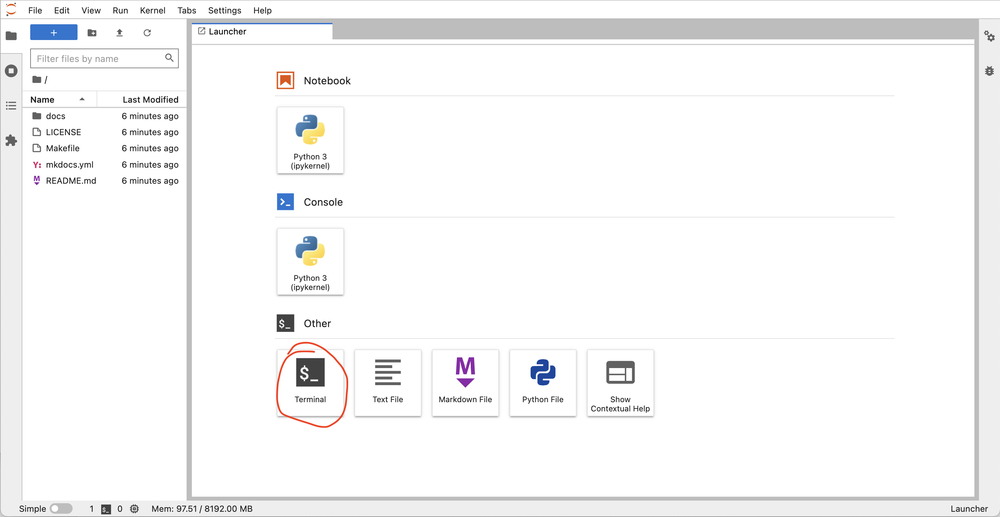

# Introduction to shell part 1

## What is the shell and why do we care about it?

A shell is a computer program that presents a command line interface which allows you to control your computer using commands entered with a keyboard.
This is as opposed to controlling your computer using a graphical user interface (GUI) with a mouse/keyboard/touchscreen combination.

Why should we care about learning the shell?

* Many bioinformatics tools can only be used through a command-line interface, and/or have extra capabilities in the command-line version that are not available in the GUI (e.g. BLAST).  
* It makes our work less error-prone. When humans do the same thing a hundred different times (or even ten times), we're likely to make a mistake. Your computer can do the same thing a thousand times with no mistakes. This also frees us up to do other things we can't automate, like the science part.  
* The shell makes our work more reproducible. When we carry out our work in a command-line interface (rather than a GUI), we can keep an exact record of all steps, which we can use to re-do our work when we need to. It also gives us a way to unambiguously communicate what we've done to others.  
* Many bioinformatic tasks require large amounts of computing power and can't realistically be run on our own machines. These tasks are best performed using remote computers or cloud computing, which can only be accessed through a shell.

## Common shell terminology

Many different terms are used to refer to the shell or its computing environment. 
Some commons ones are included below with their definitions.

| **Term**     | **What it is**  |
|:------------:|:---------------:|
| **`shell`** | what we use to talk to the computer; anything where you are pointing and clicking with a mouse is a **G**raphical **U**ser **I**nterface (**GUI**) shell; something with text only is a **C**ommand **L**ine **I**nterface (**CLI**) shell | 
| **`command line`** | a text-based environment capable of taking input and providing output (a "terminal" is the same idea) |
| **`Unix`** | a family of operating systems |
| **`bash`** | the most common programming language used at a Unix command-line. This is also a shell. |


## Accessing the shell for this lesson

For this lesson, we need to have access to a Unix shell. 
Click the button below to launch a shell through [binder](https://mybinder.org/).

[](https://mybinder.org/v2/gh/arcadia-science/arcadia-computational-training/main)

This will launch a computer in the cloud.
You'll interact with this computer through your browser.
Click the Terminal button to launch a Terminal that we will work with for the rest of the lesson.



<details>
  <summary>More information on binder and what happens when you click the launch binder button.</summary>

Binder is a service that turns a Git repo into a collection of interactive notebooks. 
When a repository is configured to run as a binder, passing the GitHub repository URL to binder starts the binder-building process.
Binder first builds a docker image that contains all of the software installations specified by a special set of files in the GitHub repository.
A docker image is a set of instructions that are used to create a docker container.
A docker container is a runnable instance of a docker image -- it's an encapsulated computing environment that can be used to reproducibly install sets of software on diverse computers.
Armed with the docker container, binder launches an "instance" in the cloud (either on Google Cloud or AWS typically) on which it runs the docker container.
Binder does some additional work in the background -- if no software configuration files are provided in the GitHub repo, or if those contain a minimal set of software, binder will by default include JupyterHub in the docker.
When the cloud instance is launched, this is the screen you interact with.
You interact with the cloud instance  in your browser.
Binders are ephemeral instances -- after a period of inactivity, the instance is automatically shut down, and any work you have done will be lost.
You're able to download files from your work before the instance is shut down if you do want to save anything.


You may notice that this instance already has a bunch of files on it. 
And that these files look suspiciously exactly like the files in the GitHub repository <a href="https://github.com/arcadia-science/arcadia-computational-training">Arcadia-Science/arcadia-computational-training</a>. 
That's because that's the repository we used to build the binder from. 
</details>

<br />

## Running commands

A "command" is a set of typed instructions entered at the command line prompt. 
The general syntax working at the command line goes like this: `command` `argument`.
Arguments (which can also be referred to as "flags" or "options" or "parameters") can be optional or required based on the command being used.

The dollar sign is a **prompt**, which shows us that the shell is waiting for input; your shell may use a different character as a prompt and may add information before the prompt. 
When typing commands, do not type the prompt, only the commands that follow it.
In this lesson, we've omitted the prompt so you won't have to worrry about remembering to not include it.

Let's find out where we are by running a command called `pwd` (which stands for "print working directory").
At any moment, our **current working directory** is our current default directory.
This is the directory that the computer assumes we want to run commands in unless we explicitly specify something else.

```
pwd
```

We see:
```
/home/jovyan
```

In this case, `jovyan` is our user name. 
This was configured by the service that launched our instance. 
You can see more context about the name [here](https://docs.jupyter.org/en/latest/community/content-community.html#what-is-a-jovyan).

## Looking at files with `ls`, `head`, and `tail`
 
Let's look at how our file system is organized. We can see what files and subdirectories are in this directory by running `ls`, which stands for "listing":

```
ls
```

We see:
```
docs  LICENSE  Makefile  mkdocs.yml  README.md
```

`ls` prints the names of the files and directories in the current directory in alphabetical order, arranged neatly into columns. 
In this case, we have all the files that were in the GitHub repo that was used to build this binder.
[This repo](https://github.com/arcadia-science/arcadia-computational-training) contains all of the computational training material at Arcadia, as well as some directions to turn the repo into a [nicely rendered website](https://arcadia-science.github.io/arcadia-computational-training/).
(side note -- we'll have a training in a few weeks demonstrating how to turn a GitHub repo into a website).

We can make the `ls` output more comprehensible by using the **flag** `-F`, which tells `ls` to add a trailing `/` to the names of directories:

```
ls -F
```
Which produces:
```
docs/  LICENSE  Makefile  mkdocs.yml  README.md
```

If we want to preview the contents of these files, we can start by using `head`.

```
head README.md
```

This outputs the first 10 lines of the file `README.md`:
```
# Arcadia Computational Training

This repository houses computational training materials developed for or delivered at Arcadia.
The repository is still a work in progress so things may shift around as we settle on an organizational structure.

The content in this repository is meant to present a sensible set of defaults for common computational tasks in biology at the time that the content is added to the repo.


## Building and deploying a site with MkDocs
```

What if we only wanted to see the first 5 lines?
We could use the `-n` flag:

```
head -n 5 README.md
```

Which would then only print the first 5 lines of the `README.md` file to the terminal:
```
# Arcadia Computational Training

This repository houses computational training materials developed for or delivered at Arcadia.
The repository is still a work in progress so things may shift around as we settle on an organizational structure.

```

If we instead wanted to see the last line of a file, we could use `tail`:
```
tail -n 1 README.md
```

Which shows:
```
Then in your browser, navigate to the URL printed to standard out.
```

## The Unix file system structure

Your computer stores file locations in a hierarchical structure. 
You are likely already used to navigating through this stucture by clicking on various folders (also known as directories) in a Windows Explorer window or a Mac Finder window. 
Just like we need to select the appropriate files in the appropriate locations there (in a GUI), we need to do the same when working at a command-line interface. 
What this means in practice is that each file and directory has its own "address", and that address is called its "path".

Here is an image of an example file-system structure:
 


There are two special locations in all Unix-based systems: the "root" location and the current user’s "home" location. 
"Root" is where the address system of the computer starts; "home" is where the current user’s location starts.

We tell the command line where files and directories are located by providing their address, their "path". 
If we use the `pwd` command like we did above, we can find out what the path is for the directory we are sitting in:

```
pwd
```

## Absolute vs relative paths

There are two ways to specify the path (address) of the file we want to do something to:

* An **absolute path** is an address that starts from one of those special locations: either the "root" **`/`** or the "home" **`~/`** location. 
* A **relative path** is an address that starts from wherever we are currently sitting.

For example, let's look again at the **`head`** command we ran above:

```
head README.md
```

What we are actually doing here is using a **relative path** to specify where the "README.md" file is located.
This is because the command line automatically looks in the current working directory if we don't specify anything else about its location (it's starting from where we are). 

We can also run the same command on the same file using an **absolute path**:

```
head ~/README.md
head /home/joyvan/README.md
```

The previous three commands all point to the same file. 
But the first way, `head README.md`, will only work if we are entering it while "sitting" in the directory that holds that file, while the second and third ways will work no matter where we happen to be in the computer. 

It is important to always think about *where* we are in the computer when working at the command line. 
One of the most common errors/easiest mistakes to make is trying to do something to a file that isn't where we think it is. 
Let's run `head` on the "README.md" file again, and then let's try it on another file: "index.md":

```bash
head README.md
head index.md
```

Here the `head` command works fine on "README.md", but we get an error message when we call it on "index.md" telling us no such file or directory. 
If we run the `ls` command, we can see the computer is absolutely right – spoiler alert: it usually is – and there is no file here named "index.md". 

Here is how we can run `head` on "index.md" by specifying an accurate **relative path** to that file:

```bash
head docs/index.md
```

## Tab-completion

Tab-completion is a huge time-saver, but even more importantly it helps prevent mistakes. 

If we are trying to specify a file that's in our current working directory, we can begin typing its name and then press the <kbd>tab</kbd> key to complete it. 
If there is only one possible way to finish what we've started typing, it will complete it entirely for us.
If there is more than one possible way to finish what we've started typing, it will complete as far as it can, and then hitting <kbd>tab</kbd> twice quickly will show all the possible options. 
If tab-complete does not do either of those things, then the file we're looking for is not in the directory we're pointing to.

## Navigating by the command line

We can also move into the directory containing the file we want to work with by using the `cd` command (**c**hange **d**irectory). 
This command takes a positional argument that is the path (address) of the directory we want to change into. 
This can be a relative path or an absolute path. 
Here we'll use the relative path of the subdirectory, "docs", to change into it (use tab-completion!):

```bash
cd docs
pwd
ls
head index.md
```

Great. But now how do we get back "up" to the directory above us? 
One way would be to provide an absolute path, like `cd /home/joyvan`, but there is also a shortcut.
`..` are special characters that act as a relative path specifying "up" one level – one directory – from wherever we currently are. 
So we can provide that as the positional argument to `cd` to get back to where we started:

```bash
cd ..
pwd
ls
```

The `..` can also be combined to specify going up multiple levels:
```
ls ../..
```

## Summary 

<center>
<h4><i>Terms introduced:</i></h4>

| **Term**     | **What it is**    |
|:----------:|:------------------:|
| **`path`** | the address system the computer uses to keep track of files and directories |
| **`root`** | where the address system of the computer starts, `/`|
| **`home`** | where the current user's location starts, `~/`|
| **`absolute path`** | an address that starts from a specified location, i.e. root, or home |
| **`relative path`** | an address that starts from wherever we are |
| **`tab completion`** | auto complete file paths once you start typing |

<h4><i>Commands introduced:</i></h4>

|**Command**     |**Function**          |
|:----------:|:------------------:|
|**`head`**| prints out the first lines of a file |
|**`tail`**| prints out the last lines of a file |
|**`pwd`**       |tells us where we are in the computer (**p**rint **w**orking **d**irectory)|
|**`ls`**        |lists contents of a directory (**l**i**s**t)|
|**`cd`**| **c**hange **d**irectories |

<h4><i>Special characters introduced:</i></h4>

|**Characters**     |  **Meaning**  |
|:----------:|:------------------:|
| **`/`** | the computer's root location |
| **`~/`** | the user's home location |
| **`../`** | specifies a directory one level "above" the current working directory |

</center>

## Credit

This lesson was modified from:

* ANGUS 2019: https://angus.readthedocs.io/en/2019/shell_intro/shell-getting-started-01.html
* Data Carpentry Genomics: https://datacarpentry.org/shell-genomics/
