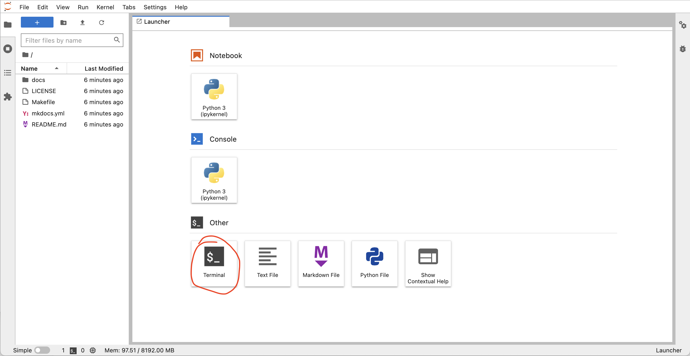

# Introduction to shell part 2

In the [previous lesson](../20220906-intro-to-shell1/lesson.md), we introduced the concept of the Unix shell, showed how to navigate the shell, and introduced the commands `head`, `tail`, `pwd`, `ls`, and `cd`.
In this lesson, we'll cover how to create and delete directories (folders), how to move, copy, and delete files, and how to search the contents of a file more systematically.

## Accessing the shell for this lesson

For this lesson, we need to have access to a Unix shell. 
Click the button below to launch a shell through [binder](https://mybinder.org/).

[](https://mybinder.org/v2/gh/arcadia-science/arcadia-computational-training/main)

This will launch a computer in the cloud.
You'll interact with this computer through your browser.
Click the Terminal button to launch a Terminal that we will work with for the rest of the lesson.



<details>
  <summary>More information on binder and what happens when you click the launch binder button.</summary>

Binder is a service that turns a Git repo into a collection of interactive notebooks. 
When a repository is configured to run as a binder, passing the GitHub repository URL to binder starts the binder-building process.
binder first builds a docker image that contains all of the software installations specified by a special set of files in the GitHub repository.
A docker image is a set of instructions that are used to create a docker container.
A docker container is a runnable instance of a docker image -- it's an encapsulated computing environment that can be used to reproducibly install sets of software on diverse computers.
Armed with the docker container, binder launches an "instance" in the cloud (either on Google Cloud or AWS typically) on which it runs the docker container.
Binder does some additional work in the background -- if no software configuration files are provided in the GitHub repo, or if those contain a minimal set of software, binder will by default include JupyterHub in the docker.
When the cloud instance is launched, this is the screen you interact with.
You interact with the cloud instance  in your browser.
Binders are ephemeral instances -- after a period of inactivity, the instance is automatically shut down, and any work you have done will be lost.
You're able to download files from your work before the instance is shut down if you do want to save anything.


You may notice that this instance already has a bunch of files on it. 
And that these files look suspiciously exactly like the files in the GitHub repository [Arcadia-Science/arcadia-computational-training](https://github.com/arcadia-science/arcadia-computational-training).
That's because that's the repository we used to build the binder from. 
</details>

## Interrogating the content of files 

### Looking at whole files

As we learned in the previous lesson, we can investigate the beginning and end of a file using `head` or `tail`.
What if you want to see all of the contents of a file?
The command `cat` will print the contents of a file to `stdout` -- the standard output stream that prints to the shell.

Let's run `ls` and see what files we're working with.

```
ls 
```

And then look at the contents of `mkdocs.yml` using `cat`:

```
cat mkdocs.yml
```

We see the following content:

```
site_name: Arcadia Science Computational Training
site_url: http://arcadia-science.github.io/arcadia-computational-training
repo_name: arcadia-computational-training
repo_url: https://github.com/arcadia-science/arcadia-computational-training
edit_uri: ""

copyright: 'Copyright &copy; 2022 <a href="https://www.arcadiascience.com">Arcadia Science</a>'

# change directory names here to reflect directories in the repository
docs_dir: docs
site_dir: site

theme:
  name: lux

extra_css: 
    - css/extra.css

# organize site structure and give a title for each page
# paths are relative to the docs directory
nav:
    - "Home": "index.md"
    - "Arcadia Users Group": "arcadia-users-group/overview.md"
    - "Workshops": "workshops/overview.md"
    - "Contribute": "CONTRIBUTING.md"
```

<details>
  <summary>More information on YAML (`.yml`, `.yaml`) file formats.</summary>
[YAML](https://yaml.org) originally stood for Yet Another Markup Language as it was originally developed and released around the same time as many other markup languages (HTML, etc).
Now, it stands for YAML Ain't A Markup Language.  
Unlike [Markdown](../20220822-intro-to-markdown-syntax/lesson.md) which strives to be human-readable and parseable into pretty documents, YAML is a data-oriented.
YAML is a human-friendly data serialization language for all programming language.
It's a file format commonly used to specify configuration files.
Configuration files specify where a computer program can find files it needs, parameters for when the program runs, or other metadata for a program.
</details>

In this case, the output of the file is palatable; we can grok the whole files contents by printing it all to stdout.

Let's use `cat` on a longer file:

```
cat docs/arcadia-users-group/20220822-intro-to-markdown-syntax/lesson.md 
```

When we run this command, the output takes up more than we can see without scrolling.
If we were to run `cat` on a really long file, it may take seconds, minutes, or even hours to print all of the contents to the screen. 
Enter `less`.
`less` is a terminal pager that shows a files contents one screen at a time.

```
less docs/arcadia-users-group/20220822-intro-to-markdown-syntax/lesson.md
```

This allows us to interactivley view the contents of a file. 
To navigate the lesson screen, we can use key board arrows (line-by-line navigation), the space bar (page jump), or even special combinations of keys (`GG` jumps to the bottom of the file). 
To exit out of `less`, press the `q` key.

### Looking for specific content in a file

Sometimes, we care less about all the things in a file and instead want to find something specific.
`grep` is a great command for this.
`grep` (**g**lobal **r**egular **e**x**p**ression) is a search tool. 
It looks through text files for strings (sequences of characters). 
In its default usage, `grep` will look for whatever string of characters you give it (1st positional argument), in whichever file you specify (2nd positional argument), and then print out the lines that contain what you searched for. 
Let's try it:

```
grep "Arcadia" mkdocs.yml
```

```
site_name: Arcadia Science Computational Training
copyright: 'Copyright &copy; 2022 <a href="https://www.arcadiascience.com">Arcadia Science</a>'
    - "Arcadia Users Group": "arcadia-users-group/overview.md"
```

We see `Arcadia` appears three times.

If we `grep` for a string that is not in the file, nothing will be printed to the screen:
```
grep "hippo" mkdocs.yml
```

### Figuring out how long a file is

Sometimes we care less about the specific contents of a file and instead we want a general overview of the contents of a file.
This can be helpful when you download a large file -- you may know the number of lines you expect to see inside of it. 
We can use the `wc` **w**ord **c**ount command to get a summary of the number of lines, words, and characters in a file.

```
wc mkdocs.yml
```

This file has 25 lines, 75 words, and 782 characters.
```
 25  75 782 mkdocs.yml
```

`wc` also accepts flags -- the `-l` flag limits the output of `wc` to only the number of lines in a file.
```
wc -l
```

The options below allow you to select which counts are printed.
* `-l`, `--lines` - print the number of lines.
* `-w`, `--words` - print the number of words.
* `-m`, `--chars` - print the number of characters.
* `-c`, `--bytes` - print the number of bytes.
* `-L`, `--max-line-length` - print the length of the longest line.


