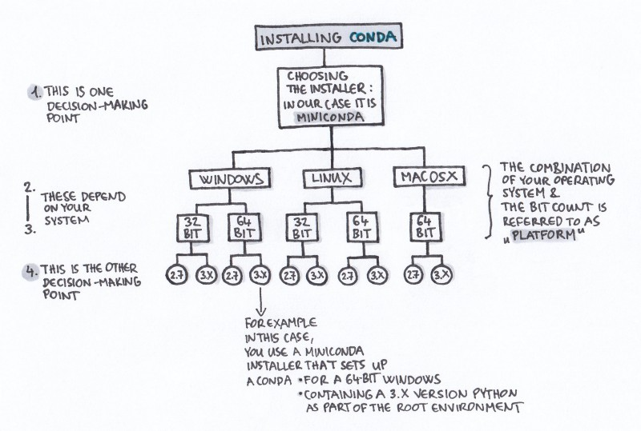
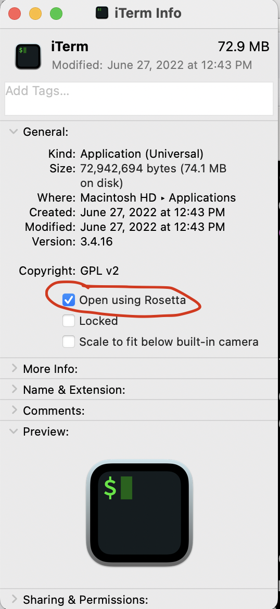
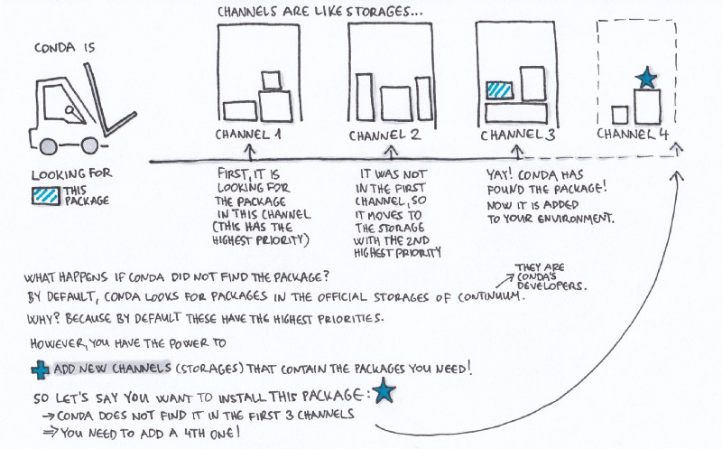
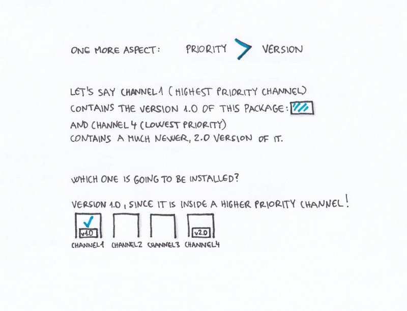

# Introduction to conda for software installation and environment management

## Why should I use a package and environment management system?

**Package managers and why we use them.** 
A [package manager](https://en.wikipedia.org/wiki/Package_manager) is a software tool that automates the process of installing, upgrading, configuring, or removing software from your computer.
[Pip](https://pypi.org/project/pip/) (python), [BiocManager](https://cran.r-project.org/web/packages/BiocManager/vignettes/BiocManager.html) (Bioconductor R packages), and [APT](https://en.wikipedia.org/wiki/APT_(software)) (ubuntu) are three commonly encountered package managers. 
Package managers make installation software easier. 

**Environments and why we use them.** 
Environment managers address the problems created when software is installed system-wide.
System-wide installs create complex dependencies between disparate projects that are difficult to entangle to version compute environments and that can create dependcency conflicts. 
An environment is a directory that contains a specific collection of packages/tools that you have installed. 
An environment manager is a software tool that organizes where and how software is installed on a computer.
For example, you may have one environment with Python 2.7 and its dependencies, and another environment with Python 3.4 for legacy testing. 
If you change one environment, your other environments are not affected. 
You can easily activate or deactivate environments, which is how you switch between them. 

## What is Conda?

Conda is open source package and runs on Windows, Mac OS and Linux.

+ Conda can quickly install, run, and update packages and their dependencies.
+ Conda can create, save, load, and switch between project specific software environments on your local computer.

Conda as a package manager helps you find and install packages. 
If you need a package that requires a different version of Python, you do not need to switch to a different environment manager, because Conda is also an environment manager. 
With a few commands, you can set up a totally separate environment to run that different version of Python, while continuing to run a different version of Python in another environment.

## How does Conda work?

<center>
<figure markdown>
  { width="700" }
  <figcaption> Cartoon of conda environments by Gergely Szerovay <a href='https://www.freecodecamp.org/news/why-you-need-python-environments-and-how-to-manage-them-with-conda-85f155f4353c/' target='_blank'>www.freecodecamp.org</a> </figcaption>
</figure>
</center>

### Installing Conda

<center>
<figure markdown>
  { width="700" }
  <figcaption> Cartoon of decision points for conda installation by Gergely Szerovay <a href='https://www.freecodecamp.org/news/why-you-need-python-environments-and-how-to-manage-them-with-conda-85f155f4353c/' target='_blank'>www.freecodecamp.org</a> </figcaption>
</figure>
</center>

For this lesson, we'll install miniconda. 
We've included the latest installation instructions below.
You can access the latest and legacy installation links [here](https://docs.conda.io/en/latest/miniconda.html#latest-miniconda-installer-links).

#### Installing conda on an Apple machine

Apple now has two processor types, the Intel x64 and the Apple M1 (or M2) ARM64.
As of October 2022, many of the packages available via conda-forge and other conda installation channels are only available of the Intel x64 processor. 
Therefore, even if you have an M1 (or M2) Mac, we currently recommend that you use the Intel x64 installation and take advantage of Apple's translation program Rosetta. 
This requires a little bit of pre-configuration to make sure your Terminal application also runs with Rosetta.
To set this up, open **Finder** -> navigate to your **Applications** folder -> right click on your Terminal application (either Terminal or iTerm2) -> select **Get Info** -> check the box for **Open using Rosetta**.

<center>
<figure markdown>
  { width="200" }
  <figcaption> Running Terminal/iTerm using Rosetta </figcaption>
</figure>
</center>

After that is configured, open your Terminal application and copy and paste the following commands to download and install miniconda.

```
curl -JLO https://repo.anaconda.com/miniconda/Miniconda3-latest-MacOSX-x86_64.sh
bash Miniconda3-latest-MacOSX-x64_64.sh 
```

This will prompt you to accept the miniconda license, ask you whether you accept the default installation location, and whether you want the installation script to intialize conda. 
Accept all of the defaults and then open and close your terminal for the installation to take effect.
 
#### Installing conda on a Linux machine

Each time you start a new AWS (or many other cloud) machine, you'll have to install miniconda. 
The installation process is the same as it is on Mac except you'll need to use a different download URL.

```
curl -JLO https://repo.anaconda.com/miniconda/Miniconda3-latest-Linux-x86_64.sh
bash Miniconda3-latest-Linux-x86_64.sh
``` 

This will prompt you to accept the miniconda license, ask you whether you accept the default installation location, and whether you want the installation script to intialize conda. 
Accept all of the defaults and then open and close your terminal for the installation to take effect.
To activate conda, you can either log out and log back in or run:

```
source ~/.bashrc
```

#### Additional notes about conda installations 

**Versioning conda installations.**
The conda API has changed over the years.
You can access legacy installers associated with specific versions of python [here](https://docs.conda.io/en/latest/miniconda.html#latest-miniconda-installer-links).
If you need a specific version of conda, you can access the conda package through the conda-forge channel and install it using the instructions for installing specific versions of a package detailed later in the lesson.

**Conda intialization.**
By default, the Conda installer "initializes" conda.
This allows you to access Conda commands by putting conda in your path any time you log into a terminal.
Conda acheives this by appending code to you `~/.zshrc` or `~/.bashrc` file.
These lines of code look like this:
```
# >>> conda initialize >>>
# !! Contents within this block are managed by 'conda init' !!
__conda_setup="$('/Users/taylorreiter/miniconda3/bin/conda' 'shell.zsh' 'hook' 2> /dev/null)"
if [ $? -eq 0 ]; then
    eval "$__conda_setup"
else
    if [ -f "/Users/taylorreiter/miniconda3/etc/profile.d/conda.sh" ]; then
        . "/Users/taylorreiter/miniconda3/etc/profile.d/conda.sh"
    else
        export PATH="/Users/taylorreiter/miniconda3/bin:$PATH"
    fi
fi
unset __conda_setup
# <<< conda initialize <<<
```
There is a command, `conda init`, that you can use to initialize conda if you choose to skip this step during installation.
You can always remove these lines if you change your mind about wanting conda in your PATH.

### Activating conda and the `(base)` environment

Conda needs to be activated for it to be usable. 
During the installation process, we configured conda to automatically activate when the shell is started.
If conda is activated, you should see `(base)` prepend your path. 

If at any point you don't want the `base` environment to be active when you log in to a shell, you can disable this behavior using the command:
```
conda config --set auto_activate_base false
```

The `base` environment contains all of the software needed for conda to run.
This includes a python installation and some core system libraries and dependencies of Conda. 

### Installing mamba

While you can install new packages with conda, sometimes it's...slow.
[Mamba](https://mamba.readthedocs.io/en/latest/index.html) helps solve this problem. 
Mamba is a drop in replacement for conda and it improves installation speeds by decreasing the time it takes to solve dependency conflicts.
You can install mamba with:

```
conda install -c conda-forge mamba
```

### Conda channels

Channels are the locations of the repositories (directories) online containing Conda packages. 
Upon Conda’s installation, Continuum’s (Conda’s developer) channels are set by default, so without any further modification, these are the locations where your Conda will start searching for packages.

Channels in Conda are ordered. 
The channel with the highest priority is the first one that Conda checks, looking for the package you asked for. 
You can change this order, and also add channels to it (and set their priority as well).

You should follow the channel order below -- otherwise, sometimes you'll encounter weird bugs because packages will be installed from the wrong location. 
```
conda config --add channels defaults
conda config --add channels bioconda
conda config --add channels conda-forge
```

Once we have our channel order configured, you will no longer need to use the explicit channel parameter `-c` when you install new packages.

<center>
<figure markdown>
  { width="700" }
  <figcaption> Cartoon of conda channels by Gergely Szerovay <a href='https://www.freecodecamp.org/news/why-you-need-python-environments-and-how-to-manage-them-with-conda-85f155f4353c/' target='_blank'>www.freecodecamp.org</a> </figcaption>
</figure>
</center>

If multiple channels contain a package, and one channel contains a newer version than the other one, the order of the channels determines which of these two versions is going to be installed, even if the higher priority channel contains the older version.


<center>
<figure markdown>
  { width="700" }
  <figcaption> Cartoon of conda channel priorities by Gergely Szerovay <a href='https://www.freecodecamp.org/news/why-you-need-python-environments-and-how-to-manage-them-with-conda-85f155f4353c/' target='_blank'>www.freecodecamp.org</a> </figcaption>
</figure>
</center>


### Creating a new environment

Other than mamba, we recommend you keep you `base` environment free from all other installations. 
If you install everything in `base`, you'll end up with lots of dependencies that need to be solved which will decrease installation speeds.
It also becomes more difficult to document software installations and versions required for specific project. 

To create a new environment named, for instance `mynewenv` (you can name it what ever you like), run:

```
conda create --name mynewenv
```

### Navigating environments through `activate` and `deactivate`

If you want to use an environment (for instance manage packages, or run Python scripts inside it) you need to first activate it.

```
conda activate mynewenv
```

If this command gives you an error, you might not selected for conda to initialize during installation. 
You can initialize conda with:
```
conda init
```

Once you've successfully run `conda activate`, the command prompt should be prepended by `(mynewenv)` instead of `(base)`.
The command prompt is a useful tool to orient yourself as to which environment you're currently using.

If you install a new tool while in an environment, it only gets installed in that environment.
```
mamba install samtools
```

Even better, you can specify which version of samtools you would like to install:
```
mamba install samtools=1.9
```

We just installed a very old version. 
We can ask mamba to automatically update our package installation to the latest version:
```
mamba update samtools
```

The directories of the active environment’s executable files are added to the system path (this means that you can now access them more easily). 

```
which samtools
```

You can leave an environment with this command:

```
conda deactivate
```

Now, if we run the same command, we'll get a different result:

```
which samtools
```

### Searching, installing, and removing packages

To list out all the installed packages in the currently active environment, run:

```
conda list
```

To search for all the available versions of a certain package, you can use the search command. 
For instance, to list out all the versions of samtools, run:

```
conda search samtools
```

Similarly to the conda list command, this one results in a list of the matching package names, versions, and channels:

```
Loading channels: done
# Name                       Version           Build  Channel
samtools                      0.1.12               0  bioconda
samtools                      0.1.12               1  bioconda
samtools                      0.1.12               2  bioconda
samtools                      0.1.12      hdd8ed8b_3  bioconda
```

### Freezing an environment

Keeping track of the software versions you used to run your analyses is a cornerstone of reproducible science.
Conda facilitates this in many ways.
One handy way is to record the packages you've installed into a text file.

This will save the list of **conda-installed** software you have in a particular environment to the file `packages.txt`:
```
conda activate mynewenv
conda env export > mynewenv.yml
conda deactivate
```
(it will not record the software versions for software not installed by conda.)

```
conda env create -n mynewenv2 --file mynewenv.yml
```
will install those packages in your local environment.

### Encoding environments in and installing environments from text files

Freezing an environment with `conda env export` is a perfectly viable option to record your compute state for a given environment.
This approach can be brittle to operating system because so there are other more flexible ways to achieve similar things.

Instead, you can keep track of software and versions you install in a YAML file.
Open a text file using nano, vim, VS Code, or your favorite text editor and paste the following text.

```
channels:
  - conda-forge
  - bioconda
  - defaults
dependencies:
  - samtools=1.9
```

Save the file as `samtools.yml`.
Then, you can install:

```
mamba env create -n samtools -f samtools.yml
```

### Using small environments

The performance of conda environments decreases with increasing size.
We hinted at this above when we recommended to keep the `base` environment free of software installations other than `mamba`.
The larger a conda environment becomes, the longer it takes to activate the environment and to install new software. 
You'll have to experiment with a strategy that works for you as far as environment size goes, but we recommend a strategy that keeps environments small.
One starting place might be to have one environment per project.
If you want to test new installations of software before you're committed to using it, you could create a `sandbox` environment and install software for experimenting there.
Then, when that environment gets too big, you can delete it and start over.
To delete an environment, run:

```
conda env remove -n sandbox
```

### Keeping an eye on the size of conda environments

Conda environments can become quite large depending on how many packages are installed. 
We can check how large any of our Conda enviroments are by finding the path to the environment directory and then estimating the file space usage of that directory.

First, let's find where we put out `mynewenv` directory
```
conda env list
```

This will print out a list of the locations of our Conda environments.
We installed conda in our home directory, so we can use the `~` shortcut to access our environment paths.

Next, let's use the command `du` to estimate the space our `mynewenv` directory is taking up!

```
du -sh ~/miniconda3/envs/mynewenv/
```

We can see our `mynewenv` environment is taking up about 12K of space. 

## Summary of Conda Commands

| Conda commands | action |
| -------- | -------- |
| `conda install`     | install a package     |
| `conda search`     |  search for a package   |
| `conda info`     | list of information about the environment     |
| `conda list`     | list out all the installed packages in the currently active environment    |
| `conda remove`     | remove a conda package     |
| `conda config --get channels`     | list out the active channels and their priorities     |
| `conda update`     | update all the installed packages     |
| `conda env list` | list the different environments you have set up and their locations | 
| `conda activate mynewenv` | activate the mynewenv Conda environment (this also works for activating our `base` environment |

## A note about the conda ecosystem

Conda has truly been a gift to the scientific community, taking software installs that used to take days and bringing it down to minutes.
It also simplified versioning and environment management by integrating software encoded in many different languages into its ecosystem (python, R, perl, rust...).
It has therefore attracted contributions from many parties over the years that have lead to a diversity of modular pieces that participate in the conda ecosystem. 
This can be especially confusing for conda newcomers.
This section outlines many of the key pieces in the conda ecosytem to reduce confusion as people onboard to conda.

Conda itself is a piece of software that is a package and environment manager.
To get access to the conda software, you need to install it.
The most popular way to install conda is via miniconda or miniforge.
**[miniforge](https://github.com/conda-forge/miniforge)** is the community (conda-forge) driven minimalistic conda installer. 
By default, subsequent package installations come from conda-forge channel.
**[miniconda](https://docs.conda.io/en/latest/miniconda.html)** is the Anaconda (company) driven minimalistic conda installer. 
By default, subsequent package installations come from anaconda channels (default or otherwise).
The default channel order can be changed for either conda installation type.
miniforge started when miniconda didn't support the linux aarch64 system architectures and was quickly adopted by many conda user.
It's stuck around even though both miniconda and miniforge support most system architectures.

There's another distinction between miniconda and [anaconda](https://anaconda.org/).
Anaconda comes with all of the contents of miniconda, plus a bunch of other packages that are used frequently with scientific computing. 
Anaconda also comes with a graphical user interface. 
We use miniconda because its the minimum set of tools that we need to install packages and manage environments and we can use it locally and on remote computers.

One of the problems conda addresses is resolving dependency conflicts betweens many pieces of software installed in the same environment.
This is an [NP-complete problem](https://www.anaconda.com/blog/understanding-and-improving-condas-performance) meaning it gets slower as more software is added to an environment and it's a hard problem to solve.
[mamba](https://mamba.readthedocs.io/en/latest/index.html) is a drop-in replacement for conda that offers higher speed and more reliable environment solutions.
However, the best way to install mamba at the moment is via conda.
Mamba is worth the confusion it has caused -- it decreases install times by orders of magnitude thus saving time.

## Extra content

### Conda and workflow managers

Conda is integrated into workflow managers like snakemake and nextflow.
Using environment files or other directives that point toward the conda packages that are needed for a specific rule or process, the workflow manager will use conda to build the necessary environments and will automatically activate and deactivate them for each rule or process as it runs the workflow.
In this case, it's best practice to have only the tools needed for a specific rule or process in a given environment -- often, this will mean only including one tool per an environment.

For snakemake, conda environments are encoded in YAML files and fed to a given rule using the `conda:` directive and the path to the YAML file.
For nextflow, conda environments are actually the least-recommended way to execute a pipeline.
While you can give a process a conda package name and its build hash, it's better to use the biocontainer build for that conda package on docker.
This overcomes [issues with reproducibility that stem from differences in operating systems](https://www.nature.com/articles/nbt.3820).

### Building a conda package from an R library on CRAN

Once you become reliant on conda to manage all of your packages, it can be disappointing when your favorite new pacakge isn't available on the conda-forge channel.
If the R package is available on CRAN, it's relatively straightforward to build the conda package yourself and get it onto conda-forge.
You can follow instructions in [this blog post](https://taylorreiter.github.io/2020-01-16-Building-a-conda-forge-package-from-an-R-CRAN-package/) if you ever want to do this.
This only works for CRAN packages that do not depend on Bioconductor packages -- Bioconductor packages and the packages that depend on them are released on bioconda, while CRAN packages are released on conda-forge.

### Installing packages with pip when they're in PyPi but not in a conda channel

Sometimes the package you're interested in installation is available in [PyPi](https://pypi.org/) but not in a conda channel.
You can use `pip` to install things into a conda environment to overcome this.
To do this, you need to install pip via conda, and then you can use `pip install`.
Whatever packages you pip install will only be available in the conda environment you have active at time of installation.
To document pip installations in a YAML file, use the following syntax:

```
channels:
    - conda-forge
    - bioconda
    - defaults
dependencies:
    - pip
    - pip:
      - genome-grist==0.7
```

### Installing PyPi-compliant packages from GitHub into a conda channel using pip

Similar to installing packages in PyPi via pip, you can install PyPi-compliant packages that are on GitHub directly from GitHub.
We include a YAML file demonstrating this below.
While this is handy, especially for development, it's can be difficult to version software installations so you should use this approach with caution and be sure to document versions (or commit hashes) elsewhere.

```
channels:
   - conda-forge
   - bioconda
   - defaults
dependencies:
   - sourmash
   - pip
   - pip:
       - git+https://github.com/czbiohub/orpheum@master
```

### Conda-lock

[Conda-lock](https://github.com/conda-incubator/conda-lock) is a lightweight library generates lock files for conda environments.
These lock files document the results of conda solve for each platform that you designate.
This can help to exactly reproduce an environment across operating systems and to reduce environment creation times.
