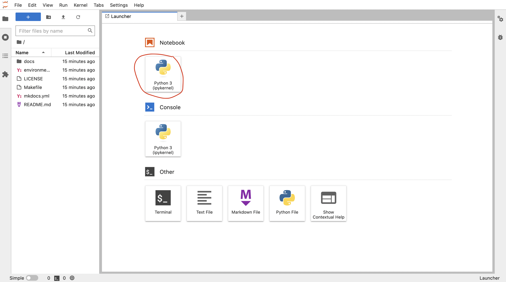
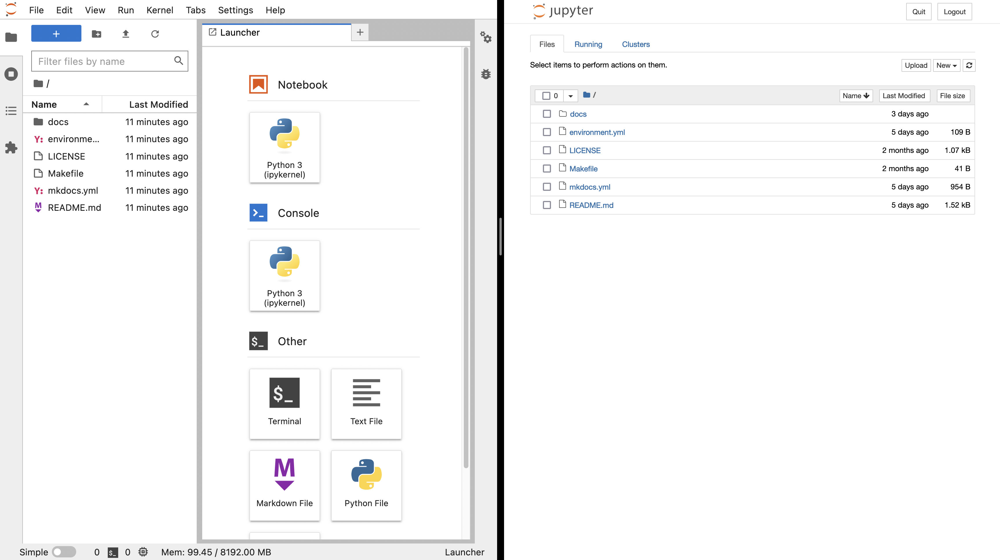
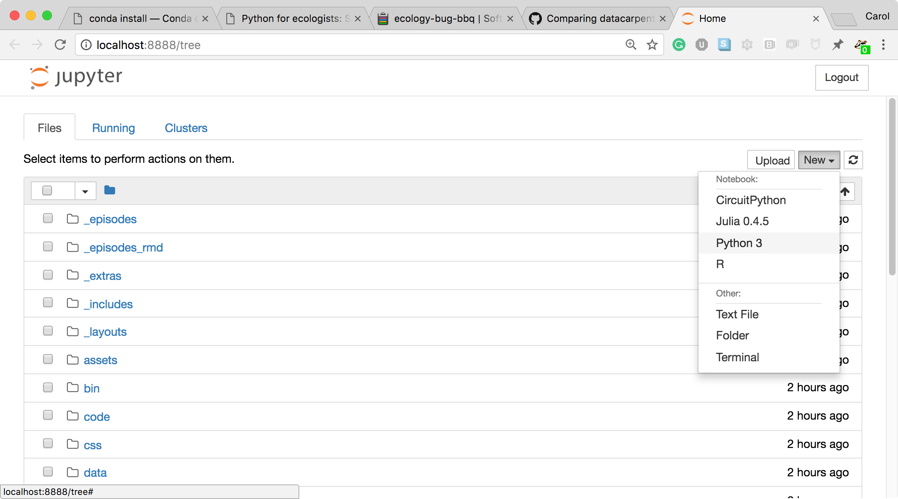
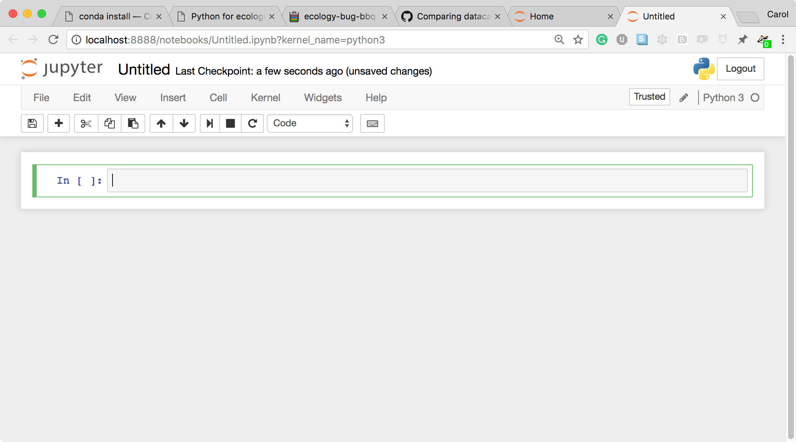

# Introduction to Jupyter notebooks

## Jumping in with Jupyter notebooks

We'll start today's tutorial using a Binder installation of jupyter notebook in the cloud.
After we take a tour of jupyter notebooks, we'll learn how to install and interact with them on our local computers.

Click the button below to launch a jupyter notebook through [binder](https://mybinder.org/).

[](https://mybinder.org/v2/gh/arcadia-science/arcadia-computational-training/main)

This will launch a computer in the cloud.
You'll interact with this computer through your browser.
Click the Python 3 button under the Notebook section to launch a jupyter notebook.



<details>
  <summary>More information on binder and what happens when you click the launch binder button.</summary>

Binder is a service that turns a Git repo into a collection of interactive notebooks. 
When a repository is configured to run as a binder, passing the GitHub repository URL to binder starts the binder-building process.
Binder first builds a docker image that contains all of the software installations specified by a special set of files in the GitHub repository.
A docker image is a set of instructions that are used to create a docker container.
A docker container is a runnable instance of a docker image -- it's an encapsulated computing environment that can be used to reproducibly install sets of software on diverse computers.
Armed with the docker container, binder launches an "instance" in the cloud (either on Google Cloud or AWS typically) on which it runs the docker container.
Binder does some additional work in the background -- if no software configuration files are provided in the GitHub repo, or if those contain a minimal set of software, binder will by default include JupyterHub in the docker.
When the cloud instance is launched, this is the screen you interact with.
You interact with the cloud instance  in your browser.
Binders are ephemeral instances -- after a period of inactivity, the instance is automatically shut down, and any work you have done will be lost.
You're able to download files from your work before the instance is shut down if you do want to save anything.
<br />
<br />
You may notice that this instance already has a bunch of files on it. 
And that these files look suspiciously exactly like the files in the GitHub repository <a href="https://github.com/arcadia-science/arcadia-computational-training">Arcadia-Science/arcadia-computational-training</a>. 
That's because that's the repository we used to build the binder from. 
</details>


### Jupyter notebook vs. JupyterLab

Technically, our entry point for this tutorial is JupyterLab.
JupyterLab is the next-generation user interface that includes notebooks.
For an in depth comparison between Jupyter notebooks and JupyterLab, see [this article](https://medium.com/analytics-vidhya/why-switch-to-jupyterlab-from-jupyter-notebook-c6d98362945b).

The image below depicts the JupyterLab (left) and Jupyter notebook (right) start up screens.
JupyterLab provides a richer set of entry points for computation.
Once you start a notebook, the notebook interface is identical.

 

### How the Jupyter notebook works

* Click in the first cell and type some Python code.

  

* This is a **Code** cell (see the cell type dropdown with the word **Code**). To run the cell, type <kbd>Shift</kbd>+<kbd>Return</kbd>.

  

* Let's look at a **Markdown** cell.
  Markdown is a text manipulation language that is readable yet offers additional formatting. 
  Don't forget to select **Markdown** from the cell type dropdown. 
  Click in the cell and enter the markdown text.

  

* To run the cell, type <kbd>Shift</kbd>+<kbd>Return</kbd>.

  

This workflow has several advantages:

- You can easily type, edit, and copy and paste blocks of code.
- Tab completion allows you to easily access the names of things you are using and learn more about them.
- It allows you to annotate your code with links, different sized text, bullets, etc. to make information more accessible to you and your collaborators.
- It allows you to display figures next to the code that produces them to tell a complete story of the analysis.

### How the notebook is stored

The notebook file is stored in a format called JSON and has the suffix `.ipynb`.
Just like HTML for a webpage, what's saved in a notebook file looks different from what you see in your browser.
This format allows Jupyter to mix software (in several languages) with documentation and graphics, all in one file.

### Viewing and interacting with jupyter notebooks

While jupyter notebooks are saved in a plain text file in JSON format, the files themselves are quite large (often exceeding a megabyte).
This text-rich format isn't very rewarding to look at it in its raw format.
Historically, one needed to use `jupyter notebook` to open, view (render), and execute a jupyter notebook.
This could be a heavy lift when you wanted to share a notebook with collaborators.
This is probably still the most popular way to interact with notebooks but there are now lighter weight alternatives.

**Viewing and interacting with jupyter notebooks.**
To view a jupyter notebook, you can use any of the following strategies.

1. Use a local installation of jupyter notebook or jupyter hub to open the notebook in your browser. You'll have full functionality of the notebook with this strategy.
2. Use VS Code to open and render the notebook. You'll still need jupyter installed locally for this to work, and you'll have full functionality of the notebook but it will be rendered directly in VS Code.

**Only viewing jupyter notebooks.**
If your goal is view the notebook, or allow others to view the notebook, you can use the following strategies.

1. Export the notebook to html, markdown, or PDF. You can then share the file with others who would like to view it.
2. Upload the notebook to a GitHub repository. GitHub will automatically render the notebook, allowing others to view it without having to download it and use a local installation of jupyter notebook to open it.
3. You can use [nbviewer](https://nbviewer.org/) or other third party applications that render and distribute jupyter notebooks. 

### Notebook modes: Control and Edit

The notebook has two modes of operation: Control and Edit. 
Control mode lets you edit notebook level features; while, Edit mode lets you change the contents of a notebook cell. 
Remember a notebook is made up of a number of cells which can contain code, markdown, html, visualizations, and more.

### Executing shell commands in a jupyter notebook

To execute a line of bash code in a python jupyter notebook, prepend the line of code with an `!`:

```
!ls
```

## Running jupyter notebooks locally: installation and startup

Until this point, we've been using a JupyterLab installation on a cloud computer. 
This allowed us to learn how to use Jupyter notebooks without having to install the program ourselves.
In this section, we'll learn to install jupyter locally using conda.
If you don't have conda install, head over to the [miniconda lesson](../20221017-conda/lesson.md) to get it set up on your machine. 

### Managing jupyter notebook installations with conda

Jupyter brings along a lot of dependencies, so we'll create a new environment just for jupyter.
In the long run, you'll also need to install any dependencies you need into this environment. 
For practice, we'll install pandas and seaborn to demonstrate how to do this.

```
mamba create -n jupyter jupyter pandas
```

After we've created our environment, we  need to activate it to be able to access the software we just installed.
```
conda activate jupyter
```

The command to start a jupyter notebook is `jupyter notebook`.
```
jupyter notebook
```

### Starting a jupyter notebook and an explanation of what jupyter is doing 

After typing the command `jupyter notebook`, the following happens:

* A Jupyter Notebook server is automatically created on your local machine.
* The Jupyter Notebook server runs locally on your machine only and does not use an internet connection.
* The Jupyter Notebook server opens the Jupyter notebook client, also known as the notebook user interface, in your default web browser.

* To create a new Python notebook select the "New" dropdown on the upper right of the screen.

* When you can create a new notebook and type code into the browser, the web browser and the Jupyter notebook server communicate with each other.

* The Jupyter Notebook server does the work and calculations, and the web browser renders the notebook.
* The web browser then displays the updated notebook to you.

### Managing other software used in jupyter notebooks

When we installed jupyter notebook, we also installed pandas.
We can check that our installation worked by importing pandas.

```
import pandas as pd
```

It works!

This used the pandas library we installed when we created the environment. 
If we later realize we need another piece of software, say seaborn, we can check if it's installed:

```
import seaborn
```

Since we haven't installed it yet, it's not available and we get the error:
```
---------------------------------------------------------------------------
ModuleNotFoundError                       Traceback (most recent call last)
Cell In [2], line 1
----> 1 import seaborn

ModuleNotFoundError: No module named 'seaborn'
```

We need to install it into our `jupyter` environment and then it will be accessible.
We can do this from our jupyter notebook using the `!` to access bash from the notebook.
We'll add the `-y` flag to our installation command to autamatically accept the install -- we do this because jupyter notebooks aren't interactive in the same way that the terminal would be during conda/mamba installations.

```
!mamba install seaborn -y
```

Then seaborn will be installed for us to use.
```
import seaborn
```

You can also install things from the terminal into the environment when your `jupyter` environment is activated.
Check your prompt to make sure it's prepended with `(jupyter)`, and then install the software you're interested in obtaining:
```
mamba install scikit-learn
```

Then, in our notebook, we could run:
```
import sklearn
```

### Shutting down a jupyter notebook

You can use the jupyter notebook interface to shut down specific notebooks.
To stop jupyter from running, you need to run <kbd>Ctrl</kbd>+<kbd>c</kbd> in the same terminal that you originall ran `jupyter notebook` in.
Jupyter will prompt you to confirm the shut down. 
Press <kbd>y</kbd> and then <kbd>Enter</kbd>.

### Setting up an R kernel to run R code in a jupyter notebook

Jupyter notebooks can run languages other than python but require additional configuration.
To run R, we need to install a package called irkernel.
We'll create a new environment, and also install popular R packages like tidyverse.

```
conda deactivate
mamba create -n tidyjupyter jupyter r-irkernel r-tidyverse
```

Activate the new environment
```
conda activate tidyjupyter
```

And start jupyter notebook
```
jupyter notebook
```

Now when we start a new notebook from jupyter, we have the option to start it with an R kernel.

## Credits

This lesson was modified from the [Data Carpentry python ecology lesson on jupyter notebooks](https://datacarpentry.org/python-ecology-lesson/jupyter_notebooks/).
