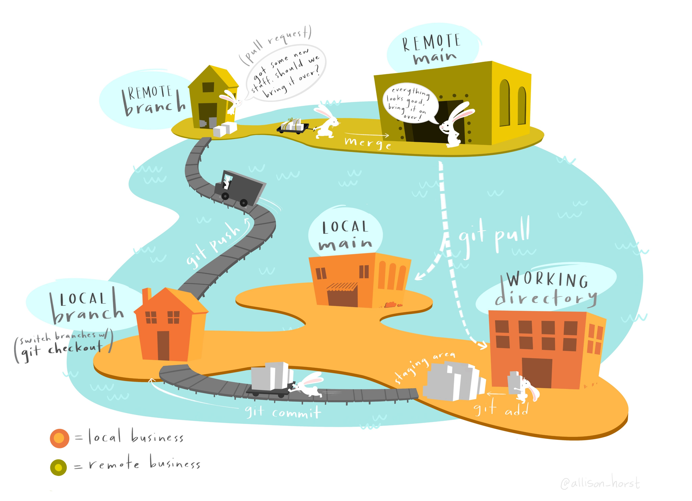

# Code review during the pub process

At Arcadia, one of our central tenets is that our science should be maximally useful.
We believe that useful computing is innovative, usable, reproducible, and timely.

Increase reproducibility and usability of the computational products we put out by making sure:

1. Our code is readable and well-documented.
2. The software (and versions!) and resources we used are documented.
3. It's clear how data inputs and outputs relate to the code.

## Code review FAQ and discussion

**Question:** Is code review really necessary for things like figures, or things that just use existing methods and don't write new analysis code?

**Thoughts:** We think so!
For command line tools, the parameters you specify or the versions of tools you use can make a pretty big impact on results, so writing these things down explicity can be really helpful for interpretation of the results or for comparing to new results generated by the same tools.
It's also super helpful for other people to see what you ran so they can use it as a recipe for a reasonable way to analyze their data -- think of it like a tutorial in disguise.
For figures, we think filtering steps or transformations are important to capture.
Even if you don't do any of these steps, your figure code is also like a tutorial in disguise – since we provide our input data and pubs openly, providing the code use to make a plot allows other people to interface with our results or to accomplish something similar to what we did.
We get that coding a pub-ready figure is a big task – it's totally fine to edit titles, labels, and fonts in PowerPoint/Photoshop after making the plot (just be careful not to edit the data!).

Imagine a world in which you pick up a manuscript that has some really interesting new result.
Wouldn't it be cool if you could you could access the code for the figures inline, and recreate them all, but zooming in on the results you specifically care about?
Or even cooler – what if you could follow the exact recipe documented in the manuscript for your data, and then quickly add your observations to the plots in the original manuscript?
[Executable manuscripts](https://www.nature.com/articles/s42005-020-00403-4) are a thing, but they're hard for reasons beyond code and data availability. 
Even still, providing the code we use – including for our figures – is both a key component to achieving these products and a suitable minimum replacement when the full thing isn't possible.

**Question:** Could code review happen after version 1 of the pub?

**Thoughts:** The goal of code review in the pub release process is to make sure someone inside or outside of Arcadia could pick up the code you used and with minimal effort, reproduce the results you got and reuse the code you wrote.
We think that code review prior to the release of the first version of a pub will increase the usefulness of the computational products we're releasing to the world.

Our goal is to have the code review component of the pub release process become a formality; we want code review to happen quickly after a unit of code is written (a new function, a new analysis notebook, a new figure) so that the feedback you get is actually useful and doesn't slow you down.
If we can get to that point, the checks in the pub release cycle will be super quick.
To make this process faster and to reduce the heat around version 1 pub releases, we've created [a checklist](#minimums-for-passing-code-review-a-checklist) of the five things that are needed to approve code associated with the first release of a pub.
Any other suggestions you get are just that – suggestions – and can be punted to later pub releases or ignored.

## Overview of the pub process and how it relates to code review

Checkout the **What to expect from code review during the pub process** Notion page for an up to date guide through this process.

## Minimums for passing code review: a checklist

1. All software packages and their versions are documented.
2. Data inputs and outputs are documented.
3. Only relative paths (not absolute paths) are used and the relative paths reference files in the repo or there is documentation for how to get the file.
4. Enough comments and/or documentation are provided so it's clear what the code does.
5. DOI for pub is linked in the README.

## Most common pain points with code review

1. Pushing to `main` or `master` instead of to a branch and opening a pull request
2. Requesting review of the entire repo instead of requesting periodic reviews

## GitHub refresher

<figure markdown>
  { width="900" }
  <figcaption> Figure by Allison Horst. <a href='https://twitter.com/allison_horst/status/1563210538510737409?s=20&t=USB46onUf9i7zYnkqjUSPQ' target='_blank'>www.twitter.com/allison_horst</a> </figcaption>
</figure>

1. Make a new folder wherever your GitHub repos live. Name it `tmp-yourinitials-aug`.
1. Download [this file](https://raw.githubusercontent.com/Arcadia-Science/2022-prjna853785-sourmash/main/scripts/utils.R) as our pretend code that we've been working on. Save it in your new folder.
2. Create an empty, private repository in the Arcadia-Science organization. Use the same name as the local folder we made.
3. Copy and paste the instructions given to you on the screen.
4. Create and checkout a new branch with `git checkout -b `ter/init-pr`. Name it `yourinitials/init-pr`.
5. Use `git add`, `git commit`, and `git push` to add our file to a branch in your new repository.
6. Open a pull request and explain your changes.
7. Convert your PR to a draft.
8. Convert it back to "ready for review" and request review from someone.

## Resources to help you thrive through code review

1. Your code review partner, AUG office hours, and the #software-questions channel
2. [Arcadia software handbook](https://github.com/Arcadia-Science/arcadia-software-handbook)
3. [GitHub workshop](../../workshops/20220920-intro-to-git-and-github/lesson.md) and [recording](https://www.youtube.com/watch?v=fRUrbWC3htc)

## Future directions

We really want the code review process to be as painless as possible.
When we identify things that people do over and over again – building a binder from an R repo, [writing a Nextflow pipeline](https://github.com/Arcadia-Science/nextflow-template-repository) – we can build templates that you can clone at the start of a project and use to cut down on repetitive work.

If you have any other ideas of how we can help, we're always happy to try new things!
