# Intro to R via `ggplot2`

Note that this lesson has been modified from [The Carpentries](https://carpentries.org/index.html) [alternative version](https://carpentries.org/blog/2023/07/r-ecology-alt-beta/) of the [R Ecology lesson](https://carpentries-incubator.github.io/R-ecology-lesson-alternative/visualizing-ggplot.html).
Parts are reproduced in full, but the major changes were included to shorten the lesson to 60 minutes.

## Introduction to R and RStudio

### What are R and RStudio?

R refers to a programming language as well as the software that runs R code.

[RStudio](https://rstudio.com) is a software interface that can make it easier to write R scripts and interact with the R software. 
It's a very popular platform, and RStudio also maintains the [`tidyverse`](https://www.tidyverse.org/) series of packages we will use in this lesson.


### Navigating RStudio

We will use the RStudio integrated development environment (IDE) to write code into scripts, run code in R, navigate files on our computer, inspect objects we create in R, and look at the plots we make. 
RStudio has many other features that can help with things like version control, developing R packages, and writing Shiny apps, but we won't cover those in the workshop.

{alt='Screenshot of RStudio showing the 4 "panes".'}

In the above screenshot, we can see 4 "panes" in the default layout:

- Top-Left: the **Source** pane that displays scripts and other files. 
  - If you only have 3 panes, and the Console pane is in the top left, press <kbd>Shift+Cmd+N</kbd> (Mac) or <kbd>Shift+Ctrl+N</kbd> (Windows) to open a blank R script, which should make the Source pane appear.
- Top-Right: the **Environment/History** pane, which shows all the objects in your current R session (Environment) and your command history (History)
  - there are some other tabs here, including Connections, Build, Tutorial, and possibly Git
  - we won't cover any of the other tabs, but RStudio has lots of other useful features
- Bottom-Left: the **Console** pane, where you can interact directly with an R console, which interprets R commands and prints the results
  - There are also tabs for Terminal and Jobs
- Bottom-Right: the **Files/Plots/Help/Viewer** pane to navigate files or view plots and help pages

You can customize the layout of these panes, as well as many settings such as RStudio color scheme, font, and even keyboard shortcuts.
You can access these settings by going to the menu bar, then clicking on Tools → Global Options.

RStudio puts most of the things you need to work in R into a single window, and also includes features like keyboard shortcuts, autocompletion of code, and syntax highlighting (different types of code are colored differently, making it easier to navigate your code).

### Console vs. script

You can run commands directly in the R console, or you can write them into an R script.
It may help to think of working in the console vs. working in a script as something like cooking.
The console is like making up a new recipe, but not writing anything down.
You can carry out a series of steps and produce a nice, tasty dish at the end.
However, because you didn't write anything down, it's harder to figure out exactly what you did, and in what order.

Writing a script is like taking nice notes while cooking- you can tweak and edit the recipe all you want, you can come back in 6 months and try it again, and you don't have to try to remember what went well and what didn't.
It's actually even easier than cooking, since you can hit one button and the computer "cooks" the whole recipe for you!

An additional benefit of scripts is that you can leave **comments** for yourself or others to read.
Lines that start with `#` are considered comments and will not be interpreted as R code.

### Working in R and RStudio

The basis of programming is that we write down instructions for the computer to follow, and then we tell the computer to follow those instructions. 
We write these instructions in the form of *code*, which is a common language that is understood by the computer and humans (after some practice). 
We call these instructions *commands*, and we tell the computer to follow the instructions by *running* (also called *executing*) the commands.


#### Console

- The R console is where code is run/executed
- The **prompt**, which is the `>` symbol, is where you can type commands 
- By pressing <kbd>Enter</kbd>, R will execute those commands and print the result.
- You can work here, and your history is saved in the History pane, but you can't access it in the future

#### Script

- A script is a record of commands to send to R, preserved in a plain text file with a `.R` extension
- You can make a new R script by clicking `File → New File → R Script`, clicking the green `+` button in the top left corner of RStudio, or pressing <kbd>Shift+Cmd+N</kbd> (Mac) or <kbd>Shift+Ctrl+N</kbd> (Windows). It will be unsaved, and called "Untitled1"
- If you type out lines of R code in a script, you can send them to the R console to be evaluated
  - <kbd>Cmd+Enter</kbd> (Mac) or <kbd>Ctrl+Enter</kbd> (Windows) will run the line of code that your cursor is on
  - If you highlight multiple lines of code, you can run all of them by pressing <kbd>Cmd+Enter</kbd> (Mac) or <kbd>Ctrl+Enter</kbd> (Windows)
  - By preserving commands in a script, you can edit and rerun them quickly, save them for later, and share them with others
  - You can leave comments for yourself by starting a line with a `#`
  

## Data visualization with ggplot2

### Getting started with ggplot2 and data

We are going to be using **functions** from the `ggplot2` **package** to create visualizations of data.
Functions are predefined bits of code that automate sets of actions.
R itself has many built-in functions, but we can access many more by loading other **packages** of functions and data into R.

If you don't have a blank, untitled script open yet, go ahead and open one with <kbd>Shift+Cmd+N</kbd> (Mac) or <kbd>Shift+Ctrl+N</kbd> (Windows).

First, we'll use the `install.packages()` function to install the `ggplot2` package.

```
install.packages("ggplot2")
```

This function installs the `ggplot2` package onto your computer so that R can access it. 
To use it in our current session, we **load** the package using the `library()` function.


```r
library(ggplot2)
```

Next lesson we will learn how to read data from external files into R, but for now we are going to use a clean and ready-to-use dataset that is provided by the **`ratdat`** data package.
While most packages exist to bring new functionality into R, others package data, and some do both.
To make our dataset available, we need to install and load the `ratdat` package too.


```r
install.packages('ratdat')
library(ratdat)
```


The `ratdat` package contains data from the [Portal Project](https://github.com/weecology/PortalData) which is a long-term data set from Portal, Arizona, in the Chihuahuan desert. 

We will be using a data set called `complete_old`, which contains older years of survey data.
Let's try to learn a little bit about the data.

We can use the `View()` function to open an interactive viewer which behaves like a simplified version of a spreadsheet program.
It's a handy function, but somewhat limited when trying to view large data sets.

```
View(complete_old)
```

If you hover over the tab for the interactive `View()`, you can click the "x" that appears, which will close the tab.

We can find out more about the dataset by using the `str()` function to examine the **str**ucture of the data.


```r
str(complete_old)
```

```
## 'data.frame':	16878 obs. of  13 variables:
##  $ record_id      : int  1 2 3 4 5 6 7 8 9 10 ...
##  $ month          : int  7 7 7 7 7 7 7 7 7 7 ...
##  $ day            : int  16 16 16 16 16 16 16 16 16 16 ...
##  $ year           : int  1977 1977 1977 1977 1977 1977 1977 1977 1977 1977 ...
##  $ plot_id        : int  2 3 2 7 3 1 2 1 1 6 ...
##  $ species_id     : chr  "NL" "NL" "DM" "DM" ...
##  $ sex            : chr  "M" "M" "F" "M" ...
##  $ hindfoot_length: int  32 33 37 36 35 14 NA 37 34 20 ...
##  $ weight         : int  NA NA NA NA NA NA NA NA NA NA ...
##  $ genus          : chr  "Neotoma" "Neotoma" "Dipodomys" "Dipodomys" ...
##  $ species        : chr  "albigula" "albigula" "merriami" "merriami" ...
##  $ taxa           : chr  "Rodent" "Rodent" "Rodent" "Rodent" ...
##  $ plot_type      : chr  "Control" "Long-term Krat Exclosure" "Control" "Rodent Exclosure" ...
```

`str()` will tell us how many observations/rows (obs) and variables/columns we have, as well as some information about each of the variables.
We see the name of a variable (such as `year`), followed by the kind of variable (**int** for integer, **chr** for character), and the first 10 entries in that variable. 
We will talk more about different data types and structures later on.

### Plotting with **`ggplot2`**

**`ggplot2`** is a powerful package that allows you to create plots from tabular data (data in a table format with rows and columns).
The **`gg`** in **`ggplot2`** stands for "grammar of graphics", and the package uses consistent vocabulary to create plots of widely varying types.
Therefore, we only need small changes to our code if the underlying data changes or we decide to make a box plot instead of a scatter plot.
This approach helps you create publication-quality plots with minimal adjusting and tweaking.

**`ggplot2`** is part of the **`tidyverse`** series of packages, which tend to like data in the "long" or "tidy" format, which means each column represents a single variable, and each row represents a single observation.
Well-structured data will save you lots of time making figures with **`ggplot2`**.
For now, we will use data that are already in this format.
Later, we'll learn about other packages in tidyverse and how to use them to get data into this format.
We start learning R by using **`ggplot2`** because it relies on concepts that we will need when we talk about data transformation in the next lessons.

**`ggplot`** plots are built step by step by adding new layers, which allows for extensive flexibility and customization of plots.

To build a plot, we will use a basic template that can be used for different types of plots:

```r
ggplot(data = <DATA>, mapping = aes(<MAPPINGS>)) + <GEOM_FUNCTION>()
```

We use the `ggplot()` function to create a plot.
To tell it what data to use, we need to specify the `data` **argument**.
An argument is an input that a function takes.
You set arguments using the `=` sign.


```r
ggplot(data = complete_old)
```

<!-- -->

We get a blank plot because we haven't told `ggplot()` which variables we want to correspond to parts of the plot.
We can specify the "mapping" of variables to plot elements, such as x/y coordinates, size, or shape, by using the `aes()` function.
We'll also add a comment, which is any line starting with a `#`.
It's a good idea to use comments to organize your code or clarify what you are doing.


```r
# adding a mapping to x and y axes
ggplot(data = complete_old, mapping = aes(x = weight, y = hindfoot_length))
```

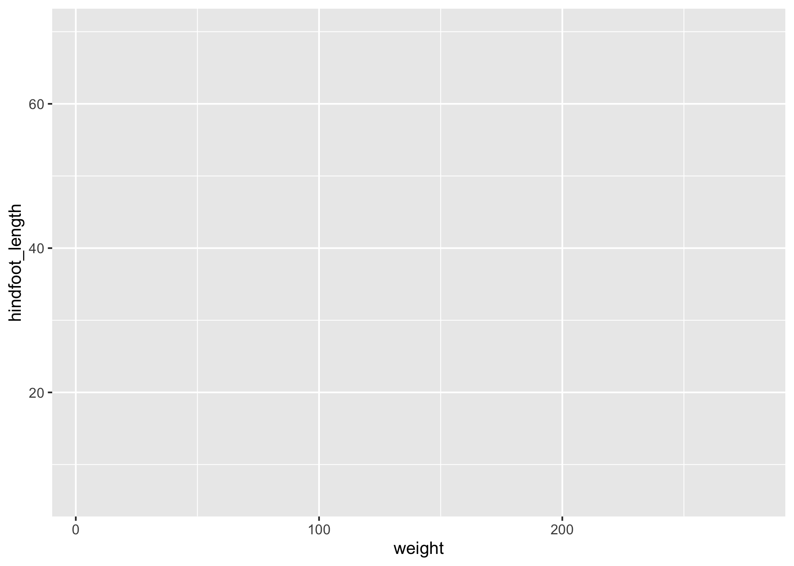<!-- -->

Now we've got a plot with x and y axes corresponding to variables from `complete_old`.
However, we haven't specified how we want the data to be displayed.
We do this using `geom_` functions, which specify the type of `geom`etry we want, such as points, lines, or bars.
We can add a `geom_point()` layer to our plot by using the `+` sign.
We indent onto a new line to make it easier to read.
The plus sign `+` at the end of the first line signifies that we are adding another layer to the plot.


```r
ggplot(data = complete_old, mapping = aes(x = weight, y = hindfoot_length)) +
  geom_point()
```

```
## Warning: Removed 3081 rows containing missing values (`geom_point()`).
```

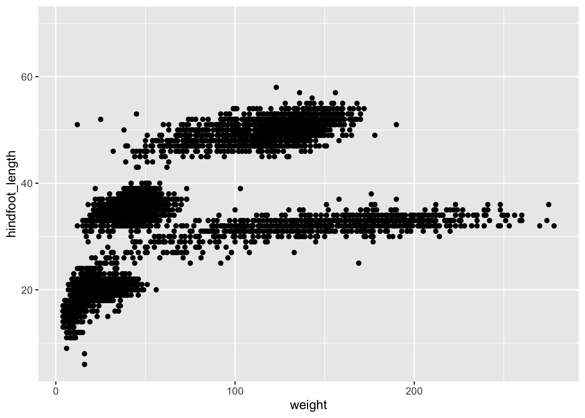<!-- -->

You may notice a warning that missing values were removed.
If a variable necessary to make the plot is missing from a given row of data (in this case, `hindfoot_length` or `weight`), it can't be plotted.
`ggplot2` uses a warning message to let us know that some rows couldn't be plotted.

**Warning** messages are one of a few ways R will communicate with you.
Warnings can be thought of as a "heads up".
Nothing necessarily went *wrong*, but the author of that function wanted to draw your attention to something.
In the above case, it's worth knowing that some of the rows of your data were not plotted because they had missing data.

A more serious type of message is an **error**.
Here's an example:


```r
ggplot(data = complete_old, mapping = aes(x = weight, y = hindfoot_length)) +
  geom_poit()
```

As you can see, we only get the error message, with no plot, because something has actually gone wrong.
This particular error message is fairly common, and it happened because we misspelled `point` as `poit`.
Because there is no function named `geom_poit()`, R tells us it can't find a function with that name.


### Changing aesthetics

`ggplot` plots are made layer by layer.
We'll keep adding new layers to the plot we just made to make it look different.
You may have noticed that parts of our scatter plot have many overlapping points, making it difficult to see all the data.
We can adjust the transparency of the points using the `alpha` argument, which takes a value between 0 and 1:


```r
ggplot(data = complete_old, mapping = aes(x = weight, y = hindfoot_length)) +
  geom_point(alpha = 0.2)
```

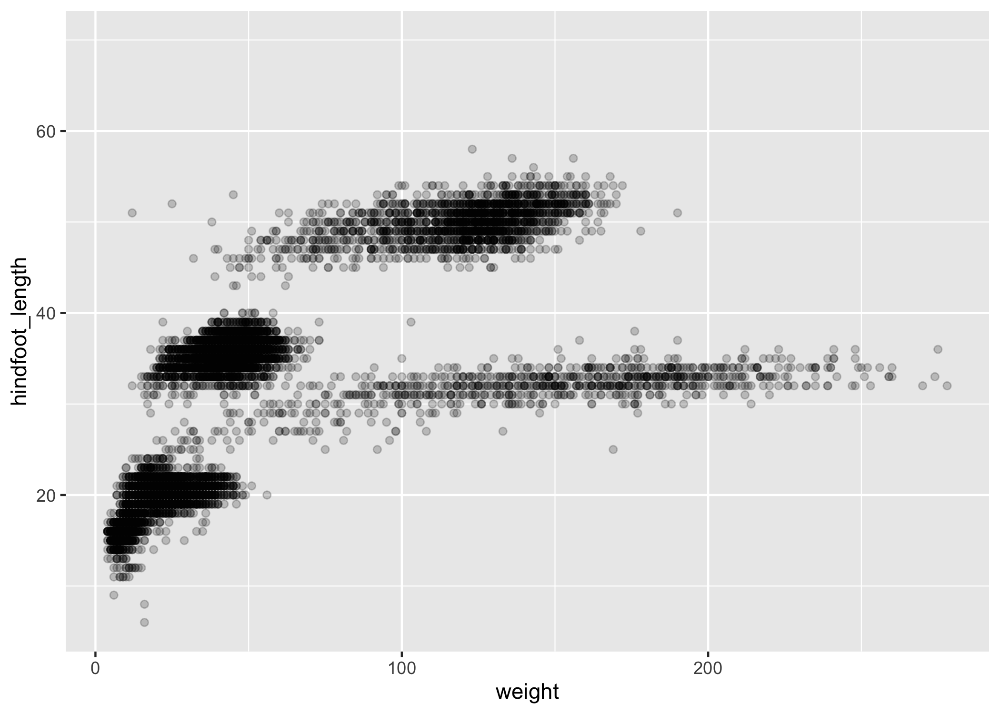<!-- -->

We can also change the color of the points:


```r
ggplot(data = complete_old, mapping = aes(x = weight, y = hindfoot_length)) +
  geom_point(alpha = 0.2, color = "blue")
```

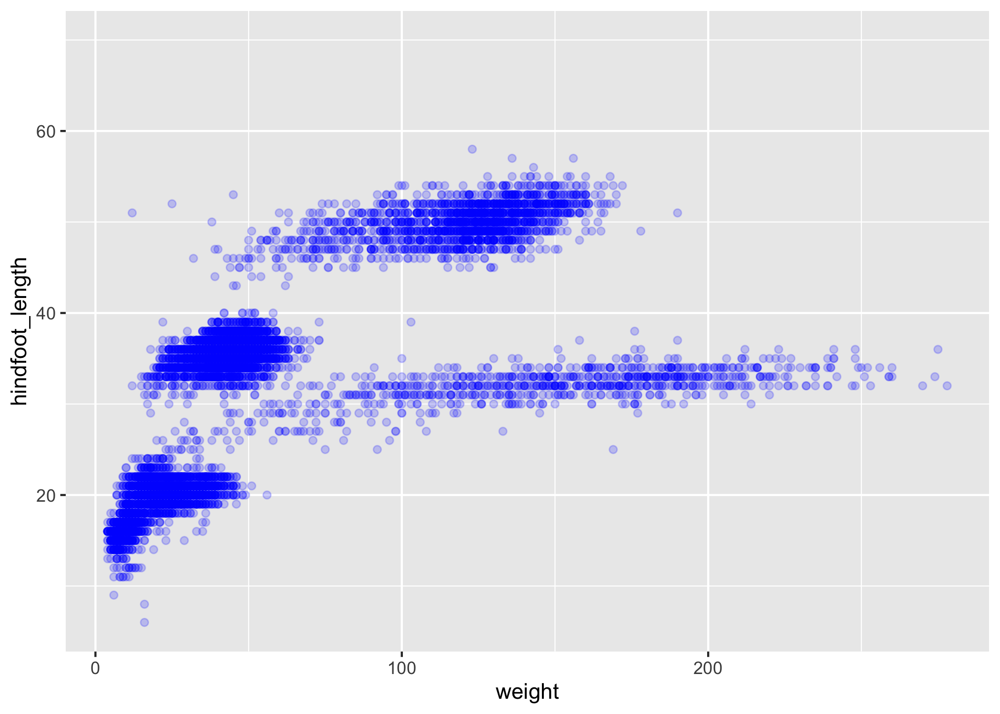<!-- -->

When we add more information into the `aes()` function, we're changing the aesthetic of the plot. 
This information is linked directly to the data in the underlying data frame that we're plotting.

### Adding another variable

Let's try coloring our points according to the sampling plot type (plot here refers to the physical area where rodents were sampled and has nothing to do with making graphs).
Since we're now mapping a variable (`plot_type`) to a component of the ggplot2 plot (`color`), we need to put the argument inside `aes()`:


```r
ggplot(data = complete_old, mapping = aes(x = weight, y = hindfoot_length, color = plot_type)) +
  geom_point(alpha = 0.2)
```

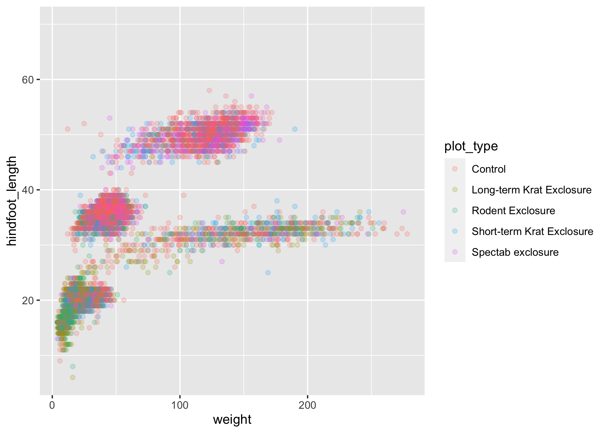<!-- -->

**Challenge 1: Modifying plots**

Part 1: Try modifying the plot so that the `shape` of the point varies by `sex`. You will set the `shape` the same way you set the `color`. Do you think this is a good way to represent `sex` with these data?

<details>
  <summary>Challenge solution</summary>


```r
ggplot(data = complete_old, 
       mapping = aes(x = weight, y = hindfoot_length, shape = sex)) +
  geom_point(alpha = 0.2)
```

</details>
<br>

Part 2: Now try changing the plot so that the `color` of the points vary by `year`. Do you notice a difference in the color scale compared to changing color by plot type? Why do you think this happened?

<details>
  <summary>Challenge solution</summary>


```r
ggplot(data = complete_old, 
       mapping = aes(x = weight, y = hindfoot_length, color = year)) +
  geom_point(alpha = 0.2)
```
- For Part 2, the color scale is different compared to using <code>color=plot_type</code> because <code>plot_type</code> and <code>year</code> are different variable types. 
<code>plot_type</code> is a categorical variable, so <code>ggplot2</code> defaults to use a <b>discrete</b> color scale, whereas <code>year</code> is a numeric variable, so <code>ggplot2</code> uses a <b>continuous</b> color scale.

</details>

<br>

### Changing scales

The default discrete color scale isn't always ideal: it isn't friendly to viewers with colorblindness and it doesn't translate well to grayscale.
However, **`ggplot2`** comes with quite a few other color scales, including the fantastic `viridis` scales, which are designed to be colorblind and grayscale friendly. We can change scales by adding `scale_` functions to our plots:


```r
ggplot(data = complete_old, mapping = aes(x = weight, y = hindfoot_length, color = plot_type)) +
  geom_point(alpha = 0.2) +
  scale_color_viridis_d()
```

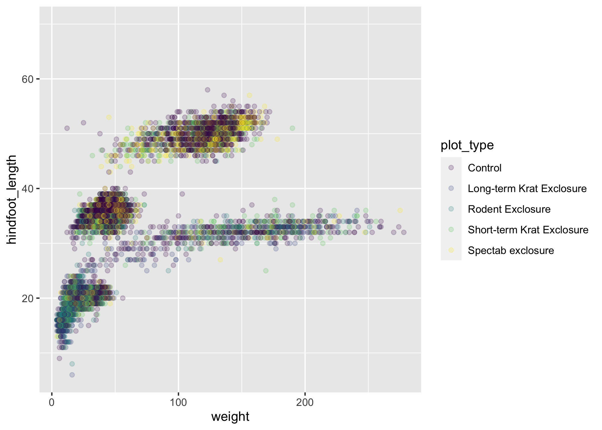<!-- -->

Scales don't just apply to colors - any plot component that you put inside `aes()` can be modified with `scale_` functions. Just as we modified the scale used to map `plot_type` to `color`, we can modify the way that `weight` is mapped to the `x` axis by using the `scale_x_log10()` function:


```r
ggplot(data = complete_old, mapping = aes(x = weight, y = hindfoot_length, color = plot_type)) +
  geom_point(alpha = 0.2) +
  scale_x_log10()
```

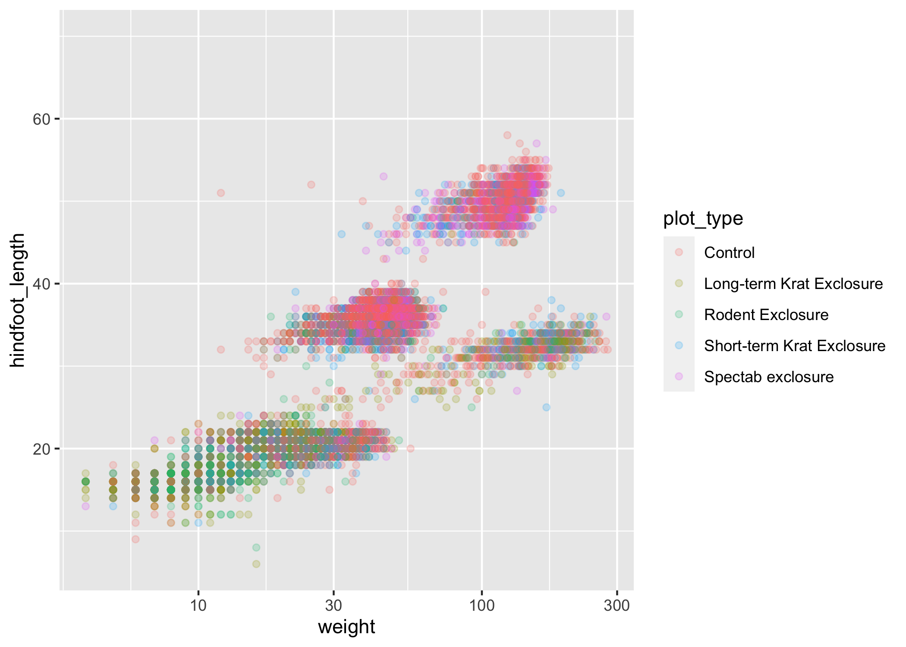<!-- -->

## Boxplot

Let's try making a different type of plot altogether. We'll start off with our same basic building blocks using `ggplot()` and `aes()`.


```r
ggplot(data = complete_old, mapping = aes(x = plot_type, y = hindfoot_length))
```

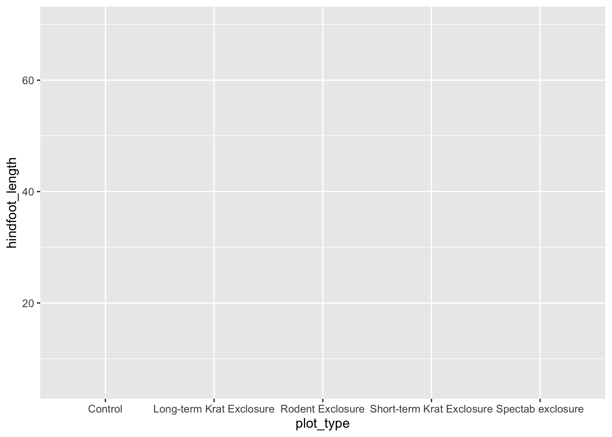<!-- -->

This time, let's try making a boxplot, which will have `plot_type` on the x axis and `hindfoot_length` on the y axis.
We can do this by adding `geom_boxplot()` to our `ggplot()`:


```r
ggplot(data = complete_old, mapping = aes(x = plot_type, y = hindfoot_length)) +
  geom_boxplot()
```

```
## Warning: Removed 2733 rows containing non-finite values (`stat_boxplot()`).
```

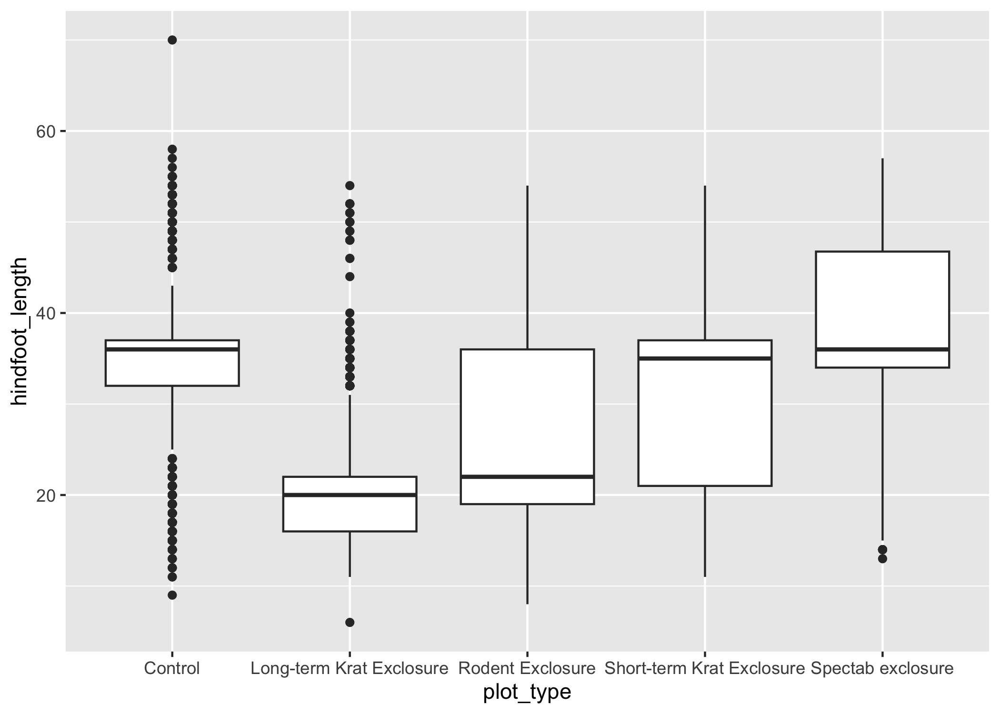<!-- -->

Just as we colored the points before, we can color our boxplot by `plot_type` as well:


```r
ggplot(data = complete_old, mapping = aes(x = plot_type, y = hindfoot_length, color = plot_type)) +
  geom_boxplot()
```

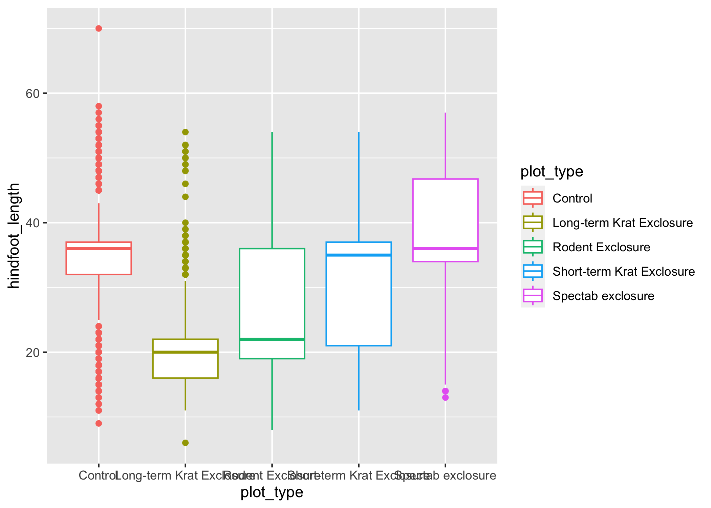<!-- -->

It looks like `color` has only affected the outlines of the boxplot, not the rectangular portions.
This is because the `color` only impacts 1-dimensional parts of a `ggplot`: points and lines.
To change the color of 2-dimensional parts of a plot, we use `fill`:


```r
ggplot(data = complete_old, mapping = aes(x = plot_type, y = hindfoot_length, fill = plot_type)) +
  geom_boxplot()
```

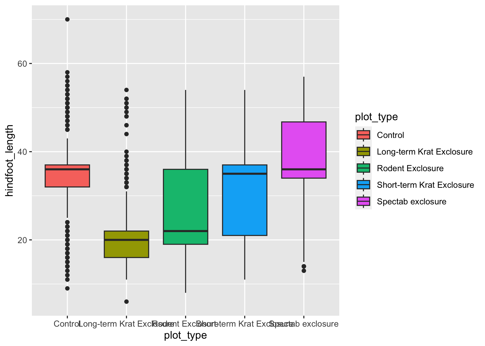<!-- -->

## Adding geoms

One of the most powerful aspects of **`ggplot`** is the way we can add components to a plot in successive layers.
While boxplots can be very useful for summarizing data, it is often helpful to show the raw data as well.
With **`ggplot`**, we can easily add another `geom_` to our plot to show the raw data. 

Let's add `geom_point()` to visualize the raw data.
We will modify the `alpha` argument to help with overplotting.


```r
ggplot(data = complete_old, mapping = aes(x = plot_type, y = hindfoot_length)) +
  geom_boxplot() +
  geom_point(alpha = 0.2)
```

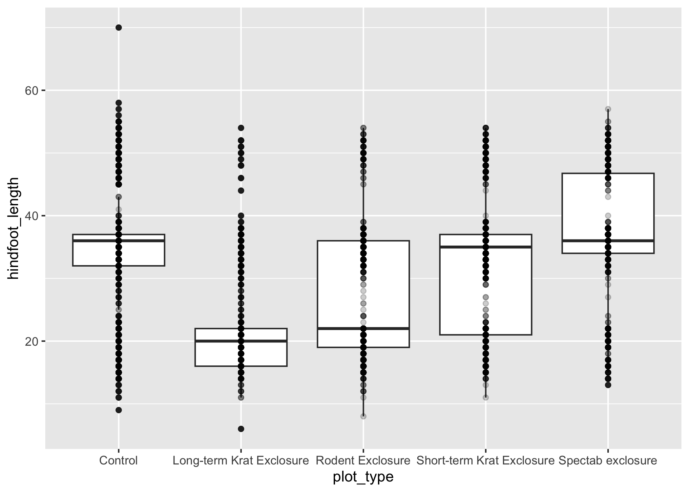<!-- -->

Uh oh... all our points for a given `x` axis category fall exactly on a line, which isn't very useful.
We can shift to using `geom_jitter()`, which will add points with a bit of random noise added to the positions to prevent this from happening.


```r
ggplot(data = complete_old, mapping = aes(x = plot_type, y = hindfoot_length)) +
  geom_boxplot() +
  geom_jitter(alpha = 0.2)
```

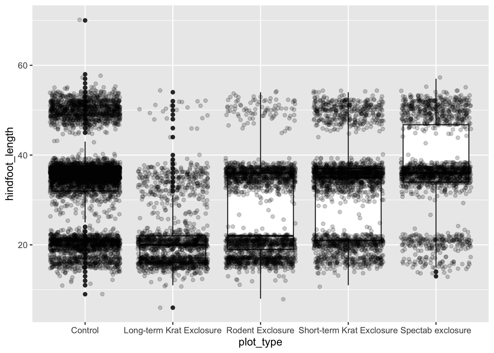<!-- -->

You may have noticed that some of our data points are now appearing on our plot twice: the outliers are plotted as black points from `geom_boxplot()`, but they are also plotted with `geom_jitter()`.
Since we don't want to represent these data multiple times in the same form (points), we can stop `geom_boxplot()` from plotting them.
We do this by setting the `outlier.shape` argument to `NA`, which means the outliers don't have a shape to be plotted.


```r
ggplot(data = complete_old, mapping = aes(x = plot_type, y = hindfoot_length)) +
  geom_boxplot(outlier.shape = NA) +
  geom_jitter(alpha = 0.2)
```

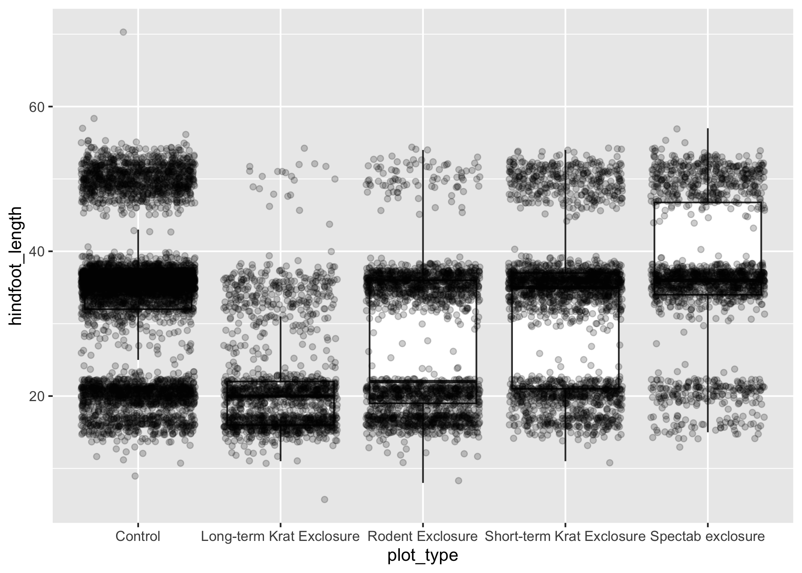<!-- -->

Just as before, we can map `plot_type` to `color` by putting it inside `aes()`.


```r
ggplot(data = complete_old, mapping = aes(x = plot_type, y = hindfoot_length, color = plot_type)) +
  geom_boxplot(outlier.shape = NA) +
  geom_jitter(alpha = 0.2)
```

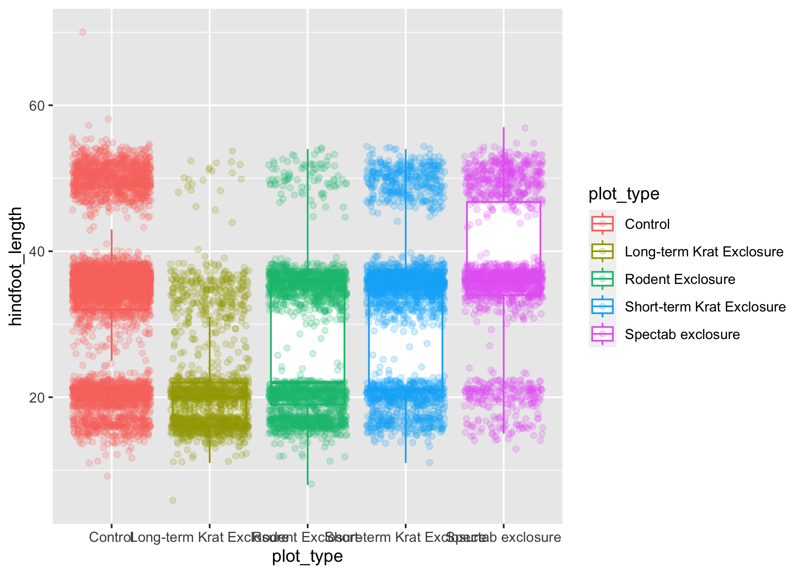<!-- -->

Notice that both the color of the points and the color of the boxplot lines changed.
Any time we specify an `aes()` mapping inside our initial `ggplot()` function, that mapping will apply to all our `geom`s.

If we want to limit the mapping to a single `geom`, we can put the mapping into the specific `geom_` function, like this:


```r
ggplot(data = complete_old, mapping = aes(x = plot_type, y = hindfoot_length)) +
  geom_boxplot(outlier.shape = NA) +
  geom_jitter(aes(color = plot_type), alpha = 0.2)
```

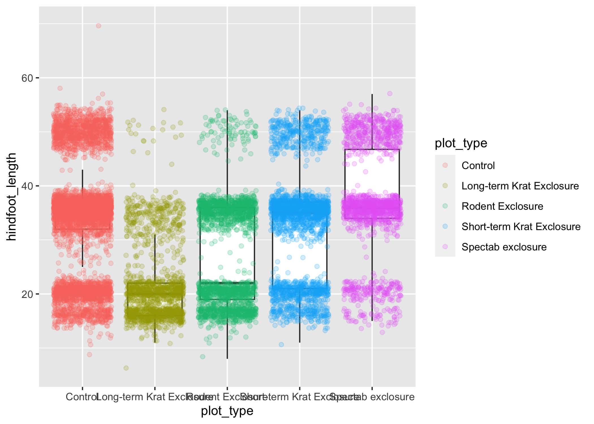<!-- -->

Now our points are colored according to `plot_type`, but the boxplots are all the same color.
One thing you might notice is that even with `alpha = 0.2`, the points obscure parts of the boxplot.
This is because the `geom_point()` layer comes after the `geom_boxplot()` layer, which means the points are plotted on top of the boxes.
To put the boxplots on top, we switch the order of the layers:


```r
ggplot(data = complete_old, mapping = aes(x = plot_type, y = hindfoot_length)) +
  geom_jitter(aes(color = plot_type), alpha = 0.2) +
  geom_boxplot(outlier.shape = NA)
```

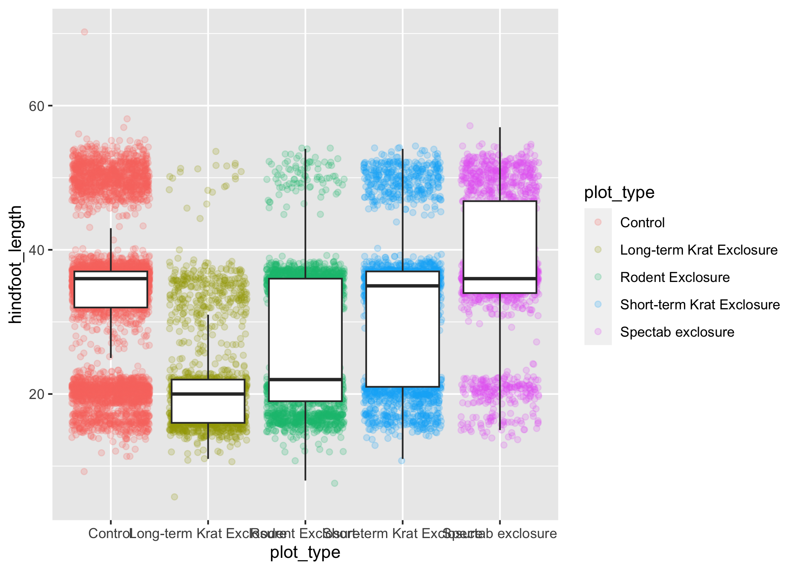<!-- -->

Now we have the opposite problem!
The white `fill` of the boxplots completely obscures some of the points.
To address this problem, we can remove the `fill` from the boxplots altogether, leaving only the black lines.
To do this, we set `fill` to `NA`:


```r
ggplot(data = complete_old, mapping = aes(x = plot_type, y = hindfoot_length)) +
  geom_jitter(aes(color = plot_type), alpha = 0.2) +
  geom_boxplot(outlier.shape = NA, fill = NA)
```

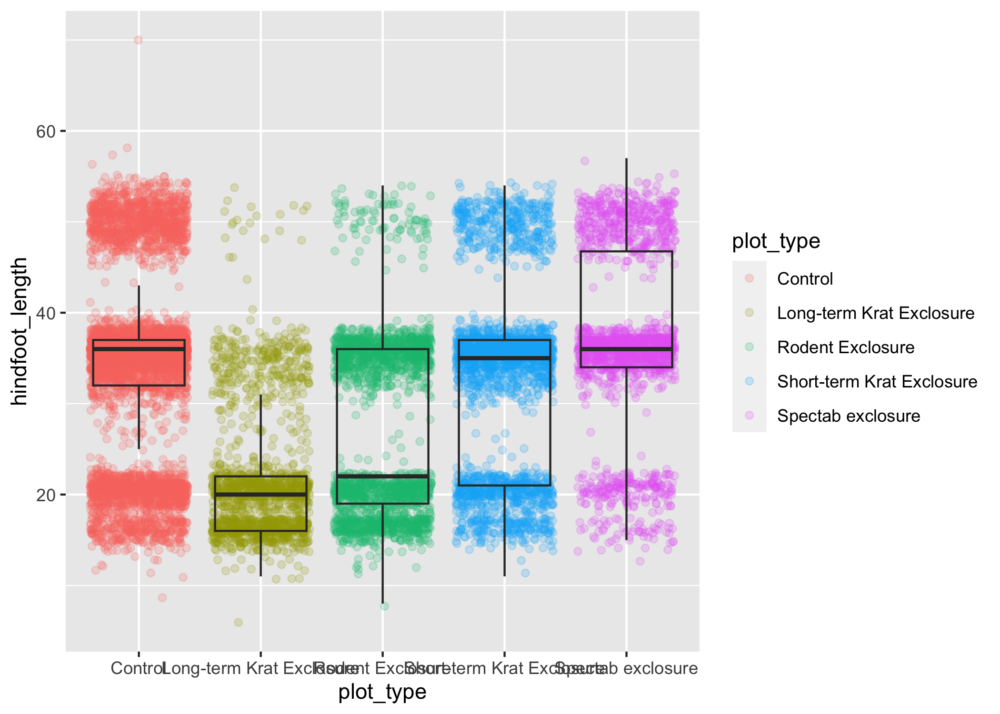<!-- -->

Now we can see all the raw data and our boxplots on top.

**Challenge 2: Change `geom`s**

Violin plots are similar to boxplots- try making one using `plot_type` and `hindfoot_length` as the x and y variables.
Remember that all geom functions start with `geom_`, followed by the type of geom.

This might also be a place to test your search engine skills.
It is often useful to search for `R package_name stuff you want to search`.
So for this example we might search for `R ggplot2 violin plot`.

<details>
  <summary>Challenge solution</summary>

```r
ggplot(data = complete_old, 
       mapping = aes(x = plot_type, 
                     y = hindfoot_length,
                     color = plot_type)) +
  geom_jitter(alpha = 0.2) +
  geom_violin(fill = "white")
```
</details>
<br>

For an *extra challenge*, make the color of the points and outlines of the violins vary by `plot_type`, and set the fill of the violins to white.
Try playing with the order of the layers to see what looks best.

<details>
  <summary>Challenge solution</summary>


```r
ggplot(data = complete_old, 
       mapping = aes(x = plot_type, 
                     y = hindfoot_length,
                     color = plot_type)) +
  geom_jitter(alpha = 0.2) +
  geom_violin(fill = "white")
```
</details>
<br>

### Changing themes

So far we've been changing the appearance of parts of our plot related to our data and the `geom_` functions, but we can also change many of the non-data components of our plot. 

At this point, we are pretty happy with the basic layout of our plot, so we can **assign** it to a plot to a named **object**.
We do this using the **assignment arrow** `<-`.
What we are doing here is taking the result of the code on the right side of the arrow, and assigning it to an object whose name is on the left side of the arrow.

We will create an object called `myplot`. If you run the name of the `ggplot2` object, it will show the plot, just like if you ran the code itself.


```r
myplot <- ggplot(data = complete_old, mapping = aes(x = plot_type, y = hindfoot_length)) +
  geom_jitter(aes(color = plot_type), alpha = 0.2) +
  geom_boxplot(outlier.shape = NA, fill = NA)

myplot
```

```
## Warning: Removed 2733 rows containing non-finite values (`stat_boxplot()`).
```

```
## Warning: Removed 2733 rows containing missing values (`geom_point()`).
```

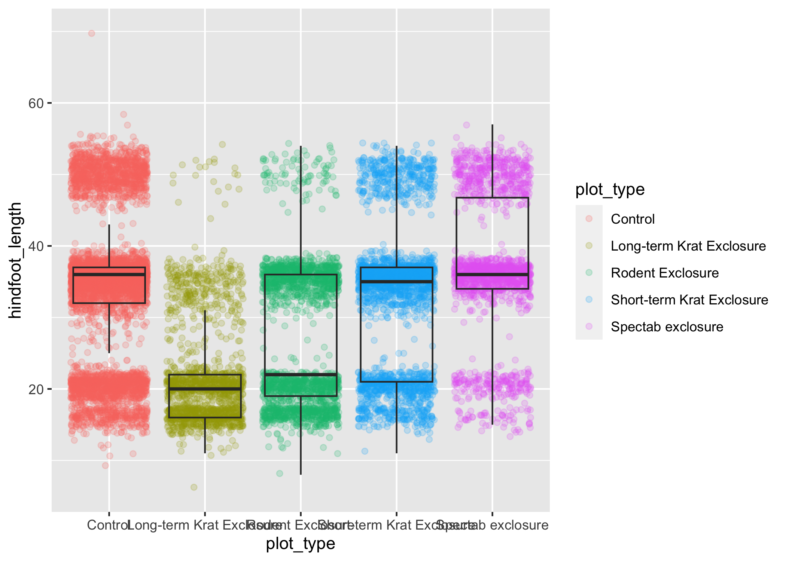<!-- -->

This process of assigning something to an **object** is not specific to `ggplot2`, but rather a general feature of R.
We will be using it a lot in the rest of this lesson.
We can now work with the `myplot` object as if it was a block of `ggplot2` code, which means we can use `+` to add new components to it.

We can change the overall appearance using `theme_` functions. Let's try a black-and-white theme by adding `theme_bw()` to our plot:


```r
myplot + theme_bw()
```

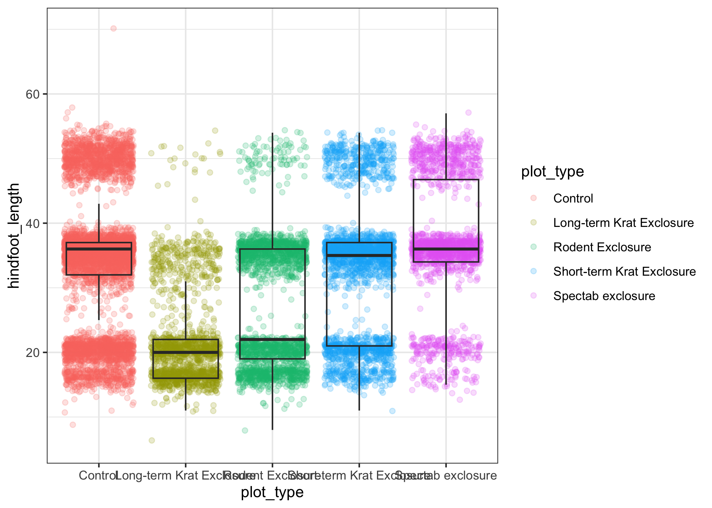<!-- -->

As you can see, a number of parts of the plot have changed. 
`theme_` functions usually control many aspects of a plot's appearance all at once, for the sake of convenience.
To individually change parts of a plot, we can use the `theme()` function, which can take many different arguments to change things about the text, grid lines, background color, and more.
Let's try changing the size of the text on our axis titles.
We can do this by specifying that the `axis.title` should be an `element_text()` with `size` set to 14.


```r
myplot +
  theme_bw() +
  theme(axis.title = element_text(size = 14))
```

<!-- -->

Another change we might want to make is to remove the vertical grid lines.
Since our x axis is categorical, those grid lines aren't useful.
To do this, inside `theme()`, we will change the `panel.grid.major.x` to an `element_blank()`.


```r
myplot +
  theme_bw() +
  theme(axis.title = element_text(size = 14), 
        panel.grid.major.x = element_blank())
```

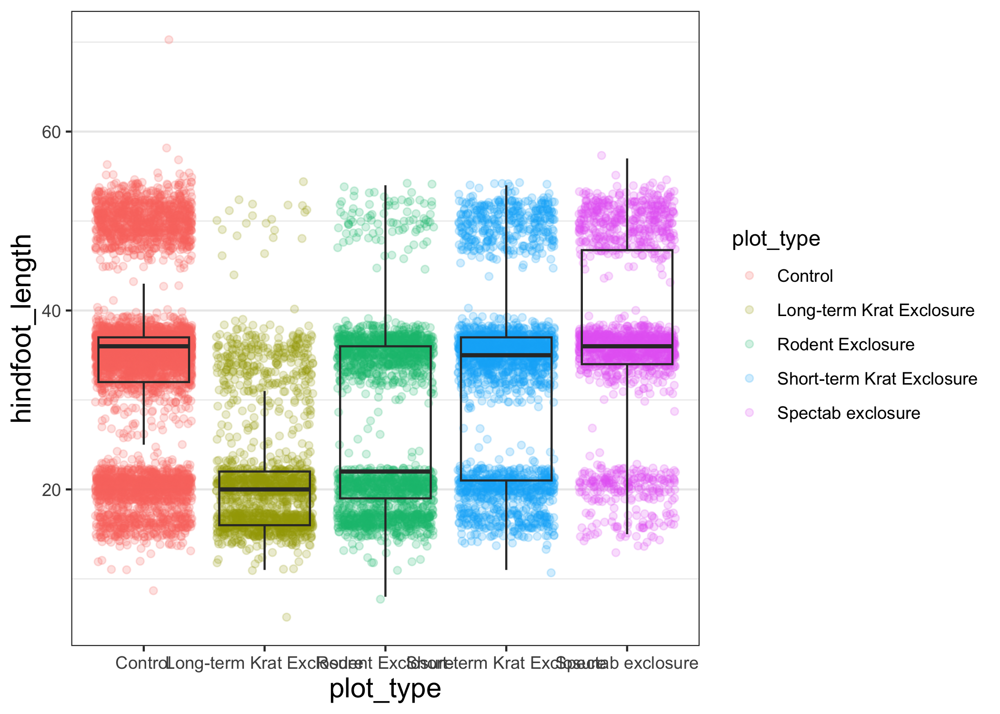<!-- -->

Another useful change might be to remove the color legend, since that information is already on our x axis.
For this one, we will set `legend.position` to "none". 


```r
myplot +
  theme_bw() +
  theme(axis.title = element_text(size = 14), 
        panel.grid.major.x = element_blank(), 
        legend.position = "none")
```

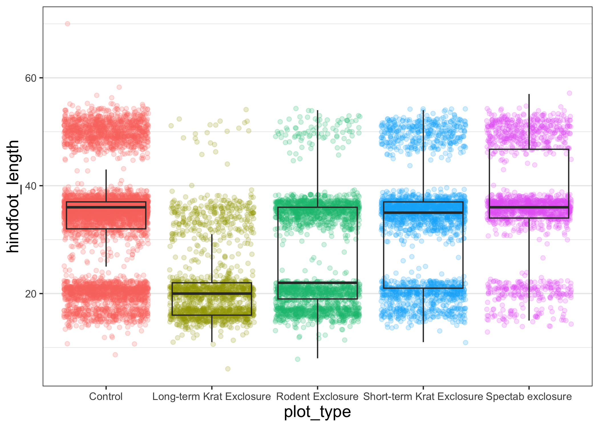<!-- -->

## Changing labels

We probably want to make our axis titles nicer, and perhaps add a main title to the plot.
We can do this using the `labs()` function:


```r
myplot +
  theme_bw() +
  theme(axis.title = element_text(size = 14), 
        legend.position = "none") +
  labs(title = "Rodent size by plot type",
       x = "Plot type",
       y = "Hindfoot length (mm)")
```

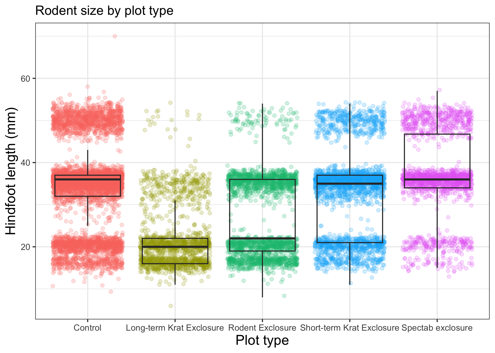<!-- -->

We removed our legend from this plot, but you can also change the titles of various legends using `labs()`.
For example, `labs(color = "Plot type")` would change the title of a color scale legend to "Plot type".

**Challenge 3: Customizing a plot**

Modify the previous plot by adding a descriptive subtitle. 
Increase the font size of the plot title and make it bold.
**Hint**: "bold" is referred to as a font "face."

<details>
  <summary>Challenge solution</summary>


```r
myplot +
  theme_bw() +
  theme(axis.title = element_text(size = 14), legend.position = "none",
        plot.title = element_text(face = "bold", size = 20)) +
  labs(title = "Rodent size by plot type",
       subtitle = "Long-term dataset from Portal, AZ",
       x = "Plot type",
       y = "Hindfoot length (mm)")
```
</details>
<br>

### Faceting

One of the most powerful features of **`ggplot`** is the ability to quickly split a plot into multiple smaller plots based on a categorical variable, which is called **faceting**. 

So far we've mapped variables to the x axis, the y axis, and color, but trying to add a 4th variable becomes difficult.
Changing the shape of a point might work, but only for very few categories, and even then, it can be hard to tell the differences between the shapes of small points.

Instead of cramming one more variable into a single plot, we will use the `facet_wrap()` function to generate a series of smaller plots, split out by `sex`.
We also use `ncol` to specify that we want them arranged in a single column:


```r
myplot +
  theme_bw() +
  theme(axis.title = element_text(size = 14), 
        legend.position = "none", 
        panel.grid.major.x = element_blank()) +
  labs(title = "Rodent size by plot type",
       x = "Plot type",
       y = "Hindfoot length (mm)",
       color = "Plot type") +
  facet_wrap(vars(sex), ncol = 1)
```

<!-- -->

Faceting comes in handy in many scenarios.
It can be useful when:

- a categorical variable has too many levels to differentiate by color (such as a dataset with 20 countries)
- your data overlap heavily, obscuring categories
- you want to show more than 3 variables at once
- you want to see each category in isolation while allowing for general comparisons between categories

## Exporting plots

Once we are happy with our final plot, we can assign the whole thing to a new object, which we can call `finalplot`.


```r
finalplot <- myplot +
  theme_bw() +
  theme(axis.title = element_text(size = 14), 
        legend.position = "none", 
        panel.grid.major.x = element_blank()) +
  labs(title = "Rodent size by plot type",
       x = "Plot type",
       y = "Hindfoot length (mm)",
       color = "Plot type") +
  facet_wrap(vars(sex), ncol = 1)
```

After this, we can run `ggsave()` to save our plot. The first argument we give is the path to the file we want to save, including the correct file extension.
This code will make an image called `rodent_size_plots.jpg` in the `images/` folder of our current project.
We are making a `.jpg`, but you can save `.pdf`, `.tiff`, and other file formats.
Next, we tell it the name of the plot object we want to save.
We can also specify things like the width and height of the plot in inches.


```r
ggsave(filename = "images/rodent_size_plots.jpg", plot = finalplot,
       height = 6, width = 8)
```

The final plot should look like this:

```
## Warning: Removed 2733 rows containing non-finite values (`stat_boxplot()`).
```

```
## Warning: Removed 2733 rows containing missing values (`geom_point()`).
```

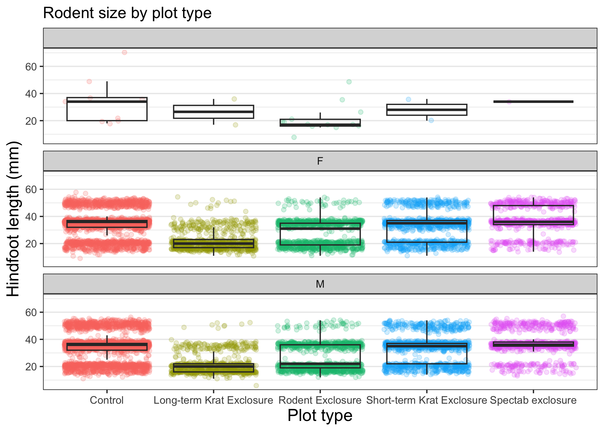<!-- -->

**Challenge 4: Make your own plot**

Try making your own plot! You can run `str(complete_old)` or `?complete_old` to explore variables you might use in your new plot. 
Feel free to use variables we have already seen, or some we haven't explored yet.

Here are a couple ideas to get you started:

  - make a histogram of one of the numeric variables
  - try using a different color `scale_`
  - try changing the size of points or thickness of lines in a `geom`
