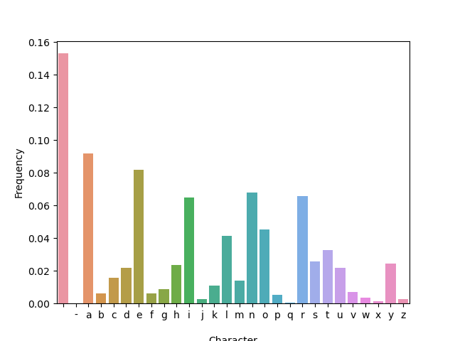
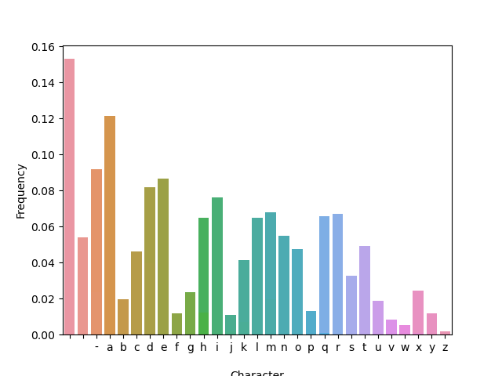
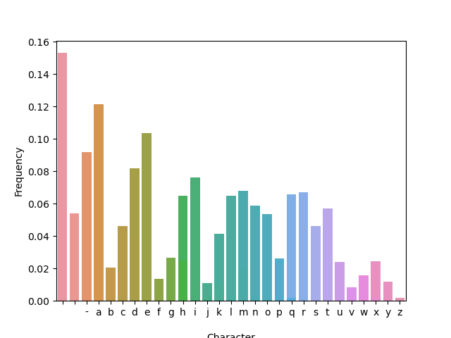
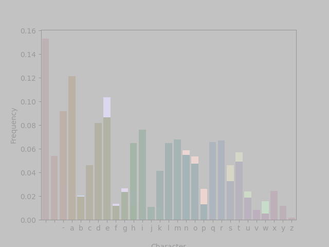

# Building test data sets

In our previous lesson, we covered different types of tests.
In the unit test section, we used five functions to test that our `mean()` function produced the output that we expected it to.
For each of these functions, we started by defining our test data, `num_list`, a list of numbers for which we wanted to calculate the mean.

These test data were small; each list only had five numbers in it.
The "correct" answer to the test was clear with relatively little human effort (we could take a few seconds to calculate the mean of each list in our own heads).
The creation of each test data set was encoded in the test itself.

Below we discuss strategies for creating test data sets to help maintain some of these desirable qualities in real code bases.

## Lesson set up

### Software installation

This lesson will take advantage of the skills we've learned in many previous lessons.
We'll use [Jupyter Notebooks](https://training.arcadiascience.com/arcadia-users-group/20221024-jupyter-notebooks/lesson/), [GitHub](https://training.arcadiascience.com/workshops/20220920-intro-to-git-and-github/lesson/), [conda](https://training.arcadiascience.com/arcadia-users-group/20221017-conda/lesson/), and [Python](https://training.arcadiascience.com/arcadia-users-group/20230228-intro-to-python-1/lesson/).
This is more overhead than we typically strive for in a lesson, but we hope that it's a chance to practice these skills to achieve a new goal.
In the future, we may provide a [GitPod](https://www.gitpod.io/) environment for learners to use while working through this lesson, however if possible we would prefer to empower users to start implementing tests on their own computers using their own setup.

To start this lesson, we'll begin by creating a conda environment that has the tools we'll need.

```
mamba create -n augtest2 jupyter pytest pandas matplotlib seaborn pillow
conda activate augtest2
```

We'll also create a folder to help us stay organized.
```
mkdir 20231128-aug-testing-lesson
cd 20231128-aug-testing-lesson
```

Once our environment is activated, start a Jupyter notebook

```
jupyter notebook
```

### Example function

As a running example, similar to the `mean()` function we used in the previous lesson, we'll use `distribution()`, a simple function that returns the distribution of characters in text.

```python
def distribution(text):
    return { char: text.count(char)/len(text) for char in text.lower() }
```

As an aside, this function is intentionally implemented inefficiently; the same functionality can be implemented much faster in Python.
We do this to later demonstrate what to do when a complex function -- of the type typically found in computational biology workflows -- is too slow to run on longer test inputs.

If you're curious, the reason `distribution()` is inefficient is that an input text of length _n_ will be read _n^2_ times -- for each character in the text, `count()` is called, and it will in turn traverse the entire input.
Instead, a single pass over the text can be used to keep running counts of the characters observed.

Let's try it:

```
distribution('testing datasets')
```

```
{'t': 0.25,
 'e': 0.125,
 's': 0.1875,
 'i': 0.0625,
 'n': 0.0625,
 'g': 0.0625,
 ' ': 0.0625,
 'd': 0.0625,
 'a': 0.125}
```

## Test data for functions and scripts

### Creating data within the test itself

As seen in our previous lesson and described above, one strategy is to create test data within the test using built-in functions or data structures.
When possible, this is a great strategy.
These test data are small and self-contained and the correct answer to the test is easy to figure out.
Functions like `[]` (list creation), or `range()` in Python and `c()`, `rep()`, `seq()`, `data.frame()`, and `list()` in R can be used to create test data that are relevant to a function.
Some data-creation functions might be non-deterministic, but setting the seed ensures that the same output are produced each time.

Often, we'll test a combination of "typical" inputs for which we verified the expected outputs, alongside edge cases - empty, very large, or nonsensical inputs.
For `distribution()`, a typical in-test set of test cases could include:

```python
DISTRIBUTION_INPUTS_AND_EXPECTED_OUTPUTS = [
    ('', {}),                                    # An empty string should produce an empty output
    ('abcc', {'a': 0.25, 'b': 0.25, 'c': 0.5}),  # Typical short input
    (100, None),                                 # Nonsensical input (wrong type)
    ...
]
```

### Testing input files

Some of the functions or workflows you will seek to test may take input files and produce output files.
We'll extend our example function to to the same:

```python
def distribution_in_file(file_in, file_out):
    with open(file_in) as fi, open(file_out, 'w') as fo:
        counts = distribution(fi.read())
        fo.write(str(counts))
```

Test input files are often checked in alongside the code and the tests. For simplicity, we'll just use files that are already present in the operating system.
Let's try it:

```
distribution_in_file('/usr/share/dict/propernames', '/tmp/propernames.txt')
```

And examine the results:

```sh
cat /tmp/propernames.txt
{'a': 0.0917388251813714, 'r': 0.06576175988766675, 'o': 0.0452843435525392, 'n': 0.06798502223262345, '\n': 0.15305406037912472, 'd': 0.021647554411420546, 'm': 0.014158670723145332, 'l': 0.04118886028551369, 'i': 0.06482564942663234, 'g': 0.00877603557219752, 't': 0.03276386613620407, 'h': 0.023636789141118653, 'e': 0.08190966534051018, 's': 0.025626023870816757, 'b': 0.005967704189094313, 'j': 0.002808331383103206, 'x': 0.0015211794991809033, 'f': 0.0062017318043529135, 'v': 0.007020828457758015, 'y': 0.024221858179265154, 'w': 0.003627428036508308, 'u': 0.021998595834308448, 'c': 0.015562836414696935, 'k': 0.010999297917154224, 'p': 0.005148607535689211, 'z': 0.0025743037678446056, 'q': 0.000468055230517201, '-': 0.0002340276152586005}
```

<details>
  <summary>What is the <code>/usr/share/dict/propernames</code> file?</summary>

The <code>/usr/share/dict/propernames</code> on macOS systems is is a text file that contains a list of common proper names, one per line.
It's similar to the words file located at <code>/usr/share/dict/words</code> which contains a list of common words. 
These files are typically used by spell-checking programs to verify the spelling of words and proper names.
</details>

### Comparing file outputs

We can directly compare an output file to a "reference" or "golden" output that is accessible to the test.
Checksums can also be used to compare the results of a function against other types of files.
For example, if you have a function that produces a data frame, you can write that object to a CSV file.
Then, you could compare the output CSV file against a reference CSV file by their checksums.
When using this strategy, it might be necessary to sort your data frame prior to writing a file.

An example of comparing checksums: 

```python
import hashlib

with open('expected.txt', 'rb') as expected, '/tmp/propernames.txt', 'rb') as actual:
    assert hashlib.md5(expected.read()).hexdigest() == hashlib.md5(actual.read()).hexdigest()
```

Checksums can also be used to compare the results of a function against other types of files.
For example, if you have a function that produces a data frame, you can write that object to a CSV file.
Then, you could compare the output CSV file against a reference CSV file by their checksums.
When using this strategy, it might be necessary to sort your data frame prior to writing a file.

### Testing image outputs

Often times, a function or a script produces an image output.
Images are trickier to test than some other outputs, but can still be used in unit tests.
If a function produces the image and an image object is produced in your coding environment, you can sometimes check the metadata of the image to make sure it matches expected values.
This includes dimensions, color profiles, or file formats.
These types of tests have the built-in benefit of testing whether the function produces an image successfully on top of confirming attributes about the image.

Even if you check metadata attributes about an image, the image itself might still be different than expected.
If you want to test the output image more thoroughly, you can compare the output produced by a test to a reference image stored in your test data.
Both checksum comparisons and pixel comparisons are useful in this scenario.

We'll create another function to generate an image -- a histogram of letter counts:

```python
import matplotlib.pyplot as plt
import seaborn as sns
import pandas as pd

def histogram(file_in, file_out):
    with open(file_in) as fi, open(file_out, 'w') as fo:
        counts = distribution(fi.read())
        df = pd.DataFrame(
            list(counts.items()), columns=['Character', 'Count']
        ).sort_values(by='Character')
        sns.barplot(data=df, x='Character', y='Count')
        plt.savefig(file_out)
```

Let's try it:

```
histogram('/usr/share/dict/propernames', '/tmp/propernames.png')
```



To compare generated images to ground truth, we can use checksums as before, or we can visually compare them.
For this, we'll use a Python image processing library.

```python
from PIL import Image, ImageChops

def image_diff(file1, file2, file_out):
    """Compare file1 and file2; if different, store diff to file_out and assert."""
    img1 = Image.open(file1)
    img2 = Image.open(file2)
    diff = ImageChops.difference(img1, img2)
    if diff.getbbox():
        # Diff is the same as an empty image, i.e. `img1` and `img2` are identical.
        return True
    else:
        # Images differ, store a comparison of them.
        ImageChops.blend(img1, diff, alpha=0.5).save(file_out)
        assert False, f"Images differ, comparison in {file_out}"
```

For example, the histograms of the two samples discussed earlier -- the head of `/usr/share/dict/web2a` and a random sample from it - look relatively similar:




But applying `image_diff()` highlights areas that have changed:

<div align="center">
    
</div>

## Test data sets for workflow integration tests

Identifying a small data set that will quickly run through the entire workflow can be tricky.
Below we cover some strategies to help achieve this.

### Subsetting input data

Sometimes, typical inputs (say, genomics data or images) are large and result in slow test times.
For example, let's try `distribution_in_file` on a larger input (feel free to terminate the cell, if it takes too long):

```python
distribution_in_file('/usr/share/dict/web2a', '/tmp/web2a.txt')
```

Depending on the type of machine, this could take several minutes -- certainly more than we'd like a test to run.
In this case, subsetting the data could shorten the test time significantly, while still checking core functionality.

Sometimes, you can subset your data by running `head` or `tail` on your input files, or sub sampling input samples to a lower number, and your workflow will still run.
This is a great option when it works!

For example, let's try taking just the first 1,000 lines of `/usr/share/dict/web2a` as a test file:

```
!head -1000 /usr/share/dict/web2a > /tmp/web2a.head
distribution_in_file('/tmp/web2a.head', '/tmp/web2a.head.txt')
```

Runtime is much faster.
Unfortunately, results are significantly different - because the input file is sorted, we're testing words that are more likely to start with letters like 'a', skewing the character distribution.
Examining `/tmp/web2a.txt` vs `/tmp/web2a.head.txt`, we see that the letter 'a' appears at a frequency of 6.7% in the former, but 12.1% in the latter.

In this case can try sampling random lines from the file, instead of the first lines:

```
!sort -R /usr/share/dict/web2a | head -1000 > /tmp/web2a.rand
distribution_in_file('/tmp/web2a.rand', '/tmp/web2a.rand.txt')
```

The frequency of 'a' is again 6.7%, and the distribution as a whole more similar to the distribution over the full dataset.

Because it's relatively fast to subset data this way, you can always try this strategy first and see if produces a representative test data set before moving on to other strategies.

Often times, with biological files, simple subsetting strategies like this will fail in even more problematic ways -- subsampling in this manner can cause some tools in your workflow to produce no results, rendering the rest of the workflow unable to run or producing blank, meaningless outputs.

### Subset input data by results

One strategy to circumvent this issue is to run the workflow from start to finish on a full data set and then to cleverly subset the results.
For example, if you are writing a workflow that performs genome assembly, you could assemble all reads, map the reads back to your assembly, and extract all of the reads that map to one contiguous sequence.
This would effectively subset the number of reads you're working with but ensure that those reads will still assemble.

### Making databases small

This is true for databases as well.
Many workflows will rely on a database for at least one step -- identifying BLAST hits, performing functional annotation, etc.
The size of the database will often be the driving factor in search times.
When possible, you can generate a small test database as a drop in replacement.
Sometimes, the developers of a tools will have already generated a small test database that you can use (see [this issue](https://github.com/eggnogdb/eggnog-mapper/issues/140) for an example for the [EggNOG ortholog annotation tool](http://eggnog-mapper.embl.de/).
Other times, you can take the same strategy as suggested above: run a full data set through your pipeline, identify a database hit that is in your data, and then subset the database and your input data to retain information relevant only to that hit.

### Parameterization to keep tests lightweight 

You may need to introduce new user-controlled parameters into your workflow to reduce run times or API calls.
For example, if your workflow queries a database or an API and by default returns the top 500 hits, you may need to parameterize this value to reduce the number of returned hits to something much smaller (like 3).
(An alternative in this case would be to select a test data set that only returns a small number of hits because it doesn't have many matches in the database.)
Parameterization can also reduce run time or RAM required to run your pipeline.
For example, the default k-mer length in MMSeq2 clustering uses more RAM than is available for GitHub Actions workflows; [parameterizing this value](https://github.com/Arcadia-Science/reads2transcriptome/blob/a2105ba9616fbdf1e736440ef12c47442a873d18/conf/test.config#L30) reduces the RAM required to run an integration test on workflows that use MMSeqs2.

## Guiding principles for test data set creation

1. **Small data**: Data should be small and run fast. Even for large multi-step workflows or big software libraries, tests shouldn't take more than a few minutes to run. The data itself should be storable in a GitHub repository and should be as small as possible to reliably capture the behavior of the tool or workflow.
2. **Address known bugs**: Create new test each time someone submits an issue identifying a bug in your code. If possible, build and test and use test data from a minimum reproducible example that recreates the behavior of the error.
3. **Representative data**: The test data should be representative of the actual data the software will handle. It should cover a variety of data types, structures, and edge cases to ensure the software behaves as expected in different scenarios.
4. **Deterministic results**: Choose test data that will produce deterministic results, making the tests predictable and repeatable. This is crucial for verifying the accuracy and consistency of the software over time.
5. **Modular and reusable**: When possible, design test data in a modular fashion, making it reusable across different tests. This promotes efficiency and consistency in testing.
6. **Documented**: Document the source and structure of the test data, along with any assumptions or simplifications made. This helps other developers understand the purpose and limitations of the test data.
