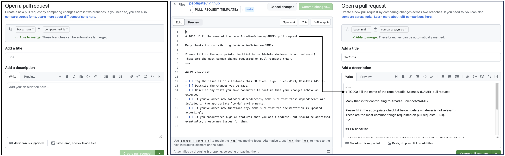
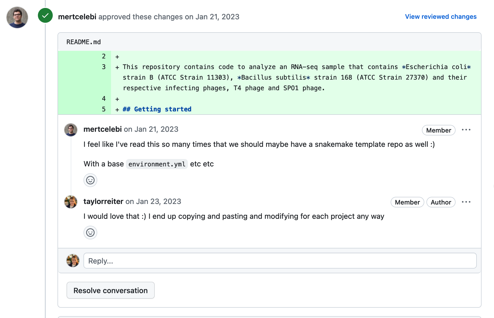

# Introduction to GitHub Templates

GitHub templates provide a structured way to create new repositories, ensuring consistency, efficiency, and adherence to best practices across projects.
GitHub templates are predefined repository setups that can be used to start new projects with a consistent set of files, folders, and configurations.
This not only saves time but helps make sure that all projects follow Arcadia's coding and documentation standards.
Templates typically include everything from README files, installation guides, contribution guidelines, and more.

In this lesson, we will focus on Arcadia's [`python-analysis-template`](https://github.com/Arcadia-Science/python-analysis-template).
Arcadia also has an [`r-analysis-template`](https://github.com/Arcadia-Science/r-analysis-template), a [`snakemake-template`](https://github.com/Arcadia-Science/snakemake-template), and a [`nextflow-template`](https://github.com/Arcadia-Science/nextflow-template).

## Creating a new repository using a template

### Choosing the Right Template

Depending on the analysis type or the technology stack used in your project, select the appropriate template. 
For instance, use `r-analysis-template` for R-based analyses, `python-analysis-template` for Python projects, `snakemake-template` for workflows managed with Snakemake, and `nextflow-template` for Nextflow pipelines.

Why isn't there a Python package template?

We could create one. 
We haven't generated one yet because there are a ton templates out there that could be used and we haven't created many Python packages yet as an organization.
If you find yourself in need of a Python template, try out <a href=https://github.com/TezRomacH/python-package-template>an existing template</a> and make note of what works well and what doesn't.
We can then use that to generate a future organization standard template.

### Repository Initialization

There are two ways to create a new repo with a template.
First, you can navigate to the template you want to start from (e.x. https://github.com/Arcadia-Science/python-analysis-template) and click the green "Use this template" button in the upper right hand corner.
This will take you to the New Repository launch screen with the "Repository template" section already filled out.
Alternatively, you can the "+" button in the upper right hand corner of any GitHub page and select "New repository" from the drop down menu.
On the New Repository launch screen, select the template you wish to start from in the "Repository template" drop down menu.
In either case, fill out the rest of the new repository information and click the "Create repository" button.
This will generate a new repository that already has all of the files and folders that were in the template.

!!! warning "Working in branches"

    After your new repository is created, **create a new branch** before you start making any changes.
    Do your work in branches and when you are ready to merge your changes into the `main` branch, open a Pull Request and request a review.
    For more on how to use branches, [see this lesson](https://training.arcadiascience.com/workshops/20220920-intro-to-git-and-github/lesson/#working-on-branches).
    For more on why we think code review is important, [see this blog post](https://www.codegram.com/blog/an-ode-to-code-reviews/) (note we didn't write this blog post, we just agree with a lot of the content). 
    **We recommend setting up branch protection rules** that can prevent code from making it into `main` with out a Pull Request and review.
    

    
How to set up branch protection rules in your repository

    Branch protection rules are configured by clicking on the "branches" menu item on the lefthand side of the repo "settings" page.
    The following Branch protection rules should be enabled:
    <li>**Require a pull request before merging**: this blocks *anyone* from pushing directly to the main branch (this is particularly important to prevent accidental pushes directly to the public repo `main` when updating the public repo from the private repo).</li>
    <li>**Require approvals:** this requires that there be at least one approving reviews before a PR can be merged. For public repos, the minimum number should probably be two (since public PRs may be from untrusted external users).</li>
    <li>**Require status checks to pass before merging**: this blocks PRs from being merged until all of the CI checks are passing.</li>
    <li>**Dismiss stale pull request approvals when new commits are pushed”:** this should be enabled in the public repo to require that the most recent reviewable commit has been reviewed and approved (we don’t need this requirement in the private repo, since we can trust internal folks not to push substantive commits without review).</li>
    <li>**Require linear history**”: this prevents PRs from being merged without squash-merging (this will need to be overridden when merging sync PRs).</li>
    

## Anatomy of a template: Python analysis template

We can create a new repo from a template!
But what is actually in the template and what do those files do?
Below we go through each file in the [`python-analysis-template`](https://github.com/Arcadia-Science/python-analysis-template) and discuss their functions and how template users can interact with them.

### Documentation and re-use

- [README.md](https://github.com/Arcadia-Science/python-analysis-template/blob/main/README.md): This README has two sections. The first is an outline for the documentation for the new repository. It includes boiler plate sections and language that we expect will be standard across most projects, as well as TODO statements where specific details need to be changed or filled in. The second section covers developer notes detailing what the files in the repository do and tips for how to use them. The second section should eventually be deleted but is included for ease of use.
- [envs/dev.yml](https://github.com/Arcadia-Science/python-analysis-template/tree/main/envs/dev.yml): By default, we recommend analysis repositories use conda to manage software installations and record software versions. The `envs` directory is where these yaml files are stored. The `dev.yml` file installs python, jupyter, pip, and linting software.
- [LICENSE](https://github.com/Arcadia-Science/python-analysis-template/tree/main/LICENSE): The LICENSE file specifies the terms under which the software can be freely used, modified, and shared. Technically, software must have a license for it to be re-usable by others. The default license for all of our GitHub repositories is MIT, however the license may need to change depending on the software the project uses and the code it includes. Be sure to check with legal about your license before making a GitHub repository public.
- [.github/PULL_REQUEST_TEMPLATE.md](https://github.com/Arcadia-Science/python-analysis-template/tree/main/.github/PULL_REQUEST_TEMPLATE.md): The .github folder controls some behavior of the GitHub repository itself. The PULL_REQUEST_TEMPLATE.md is a text document where users can provide the text that they want to appear by default each time a new PR is opened. Often, these files remind users of the list of things that need to be done before a PR is read to be reviewed. Below we show this in action. On the left is the typical screen a user is prompted with when they open a pull request in a repository without a PR template. On the right is the PR template as well as that template rendered in the pull request.

### Checking for accuracy, enforcing conventions, and making your life easier

- [.gitignore](https://github.com/Arcadia-Science/python-analysis-template/tree/main/.gitignore): The `.gitignore` file lists files and directories that should be ignored by git, meaning they won't be tracked or included in the repository. This typically includes temporary files, local configuration files, and sensitive information. Using a .gitignore file helps keep the repository clean and prevents the accidental inclusion of irrelevant or sensitive files.
- [.github/lint.yml](https://github.com/Arcadia-Science/python-analysis-template/tree/main/.github/lint.yml): The `.github/lint.yml` file is a GitHub Actions configuration file that sets up linting for the repository. Linting automatically checks the code for stylistic errors, programming errors, and other potential issues according to predefined rules. This helps maintain code quality and consistency across the project, making it easier to read, maintain, and contribute to (see [this AUG lesson](https://training.arcadiascience.com/arcadia-users-group/20240206-intro-to-formatting-and-linting/lesson/) for more details).
- [.pre-commit-config.yaml](https://github.com/Arcadia-Science/python-analysis-template/tree/main/.pre-commit-config.yaml): The `.pre-commit-config.yaml` file configures pre-commit hooks for the repository. Pre-commit hooks are scripts that run automatically on each commit to check for common issues, such as syntax errors, formatting issues, or failing tests. This setup helps catch and fix problems early in the development process, improving code quality and reducing the time spent on code reviews.
- [.vscode/extensions.json](https://github.com/Arcadia-Science/python-analysis-template/tree/main/.vscode/extensions.json): The `.vscode/extensions.json` file is a configuration file for Visual Studio Code that specifies recommended extensions for the project. This file will prompt VS Code to install the ruff linter.
- [Makefile](https://github.com/Arcadia-Science/python-analysis-template/tree/main/Makefile): The `Makefile` helps automate code quality and style checks, making it easier for developers to run all of these checks at once.

## Benefits of templates

- **Low effort for best practices:** The Python analysis template repository has 10 files. While none of these files are complicated on their own, creating each of them takes time and domain knowledge of tools and syntax. Further, if each user had to create each file on their own, there is a lot of room for error. Using a template saves this time and cuts down on the number of mistakes that users create in their repos while reinforcing best practices.
- **Reviewed once:** When a repository is started from a template, all of the code and files from that template are instantiated on the `main` branch. As you make your changes, reviewers only need to review the things you change, not all of the files from the template. This saves reviewers time because they don't have to review similar or idential text between many different repositories -- the content of a README.md or GitHub action workflow are reviewed when they are added to or changed in the template only. Overall, this saves reviewers time.

- **Feedback in one place:** Templates themselves are repositories, meaning they have Issues and Pull Requests. Users can report problems with a template or enhancements they'd like to see. When bugs are fixed or enhancements integrated, these changes are visible to every future project at Arcadia. This saves others from debugging the same problem you already fixed and helps keep all of our projects up to date. Some examples of this in action include:
	* When Snakemake upgraded to version 8, the command line interface changed and a syntax was needed to launch a workflow with conda. Keith caught this change and documented it in the Snakemake template README.md file. When I started a new snakemake workflow, I used Keith's template documentation to launch my workflow and didn't need to spend time looking up the new command.
	* The version of Snakemake installed in the Snakemake template [causes a `TypeError`](https://github.com/Arcadia-Science/snakemake-template/issues/2). I reported this issue on the template and how I fixed it so that future Snakemake workflow repositories know how to fix it. Eventually, we will incorporate this change into the template itself.
- **Documentation and training:** The templates themselves are centralized sources of best-practice documentation. Interfacing with this documentation and with the tools and conventions used in the templates trains users on those best practices.
