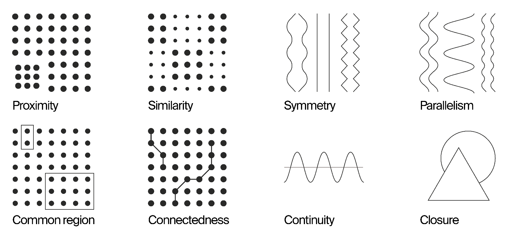

# Fundamentals of Design

This AUG lesson is a brief introduction to the principles of design, with a focus on how they can be applied to scientific visualizations.  We will cover the following topics:
- Why we should care about good design
- **Layout:** how we arrange and compose figures to guide the viewer
  - Gestalt principles
  - Visual hierarchy
  - Composition
  - Grids, grouping, and alignment
- Layout exercise
- **Design details:** how to choose visual elements to communicate better
  - Typography and hierachy
  - Symbols
  - Color
- Design critique

## Introduction
### Where we're starting from

> “Beauty is a very important entry point for readers to get interested about the visualization and be willing to explore more.  Beauty cannot replace functionality, but beauty and functionality together achieve more.” – *Better Data Visualization*

Beautiful scientific visualizations are able to grab your attention. But design is more than just aesthetics – it is a critical component of effective communication.  Efficient design is functional; it distills complex information into simple and clear contrasts, patterns, or sequences. (Tufte)

In this lesson, we’re going to discuss design principles as they emerged as a formalized system, most famously established by German/Swiss design movements in the early 20th century.  These are time-tested tools which draw from graphical history/culture and perception science.  

> “Traditionally, graphic design theory has privileged intuition and creativity over empirical research…. [But] it can be argued that the art-based principles of graphic design - including (but not limited to ) contrast, hierarchy, repetition, alignment, and color - are in fact theories proven through a long history of successful experimentation in practice.  Indeed, graphic designers - through professional practice - have tested and restested to the point where it makes sense to refer to these theories as laws or principles.” – *Audrey G. Bennett, Design Studies: Theory and Research in Graphic Design*

    
 A note about decolonizing design 

    There’s been a lot of discussion of and work towards decolonizing design, and I can speak to some of the projects I’m familiar with.  But I also feel strongly that the visual systems codified by Bauhaus and Swiss design are basically summaries of very ancient systems of visual cognition that don’t belong to Europe, they just had the power/structure to formalize and disseminate it. (Ex: the golden ratio concept (often associated with Swiss grid design) is at least as old as ancient greece and there’s evidence of stronger ties to ancient African civilizations.)  Not to mention the impact of millenia of trade and travel and centuries of colonization that had incalculable influence on European thought.

## Destination & Audience
### Why do we care about good design?

The point of communication is to get people to understand something.  The figures we’re creating aren’t just about marking that we did something or keeping a record for ourselves, they’re about explaining to other people what happened in a way that will be understandable and compelling.

> “People will read your [pub]. People will listen to you discuss your work.  It might have taken you months or even years to compile and analyze the data.  And yet many of us spend far too little time thinking about how we can best present our findings.  Instead we use whatever default approach is quickest and easiest.” – *Jon Schwabish, Better Data Visualizations*

While you’re familiar with your process and findings, your viewer isn’t.  Thinking carefully about how data/subject matter is presented to people is just as important as the data itself.

When beginning a design, it’s important to consider the audience and the context in which they will be viewing the figure. We can break down this process into a few steps:

#### 1. Defining the key takeaway(s)
Begin by defining the communication goal of your visualization.  
- What key message(s) do you hope to convey?  
- What should someone remember after looking at your figure?
- Who is your audience?
- What visual vocabulary will my audience understand?
- What necessary context needs to be provided?
- What kind of impact do I want?

Clarifying these points early will guide the design process and ensure that the final product is effective in communicating your message.

#### 2. Choosing types of engagement
Sometimes we just want to show the data or subject matter as succinctly, cleanly, and accurately as possible. But we’ve all seen a zillion barcharts, and sometimes, our goal is to get people to stop and actually look at our figure.  Standard charts (like bar and line charts) are perceptually more accurate, but they may not draw people in to investigate it, read it closely, and explore.

> “Different shapes and uncommon forms that move beyond the borders of our typical data visualization experience can draw readers in.  Reading a graph is not like the spontaneous comprehension of seeing a photograph.  Instead, reading a graph has more of the complex cognitive processes of reading a paragraph.” – *Jon Schwabish, Better Data Visualizations*

##### Explanatory vs. exploratory visuals
Consider whether your visualization is meant to provide a specific narrative, or if it is meant to allow the viewer to explore the data themselves.
- *Explanatory* visualizations highlight the key findings, helping viewers understand cause and effect, trends, and conclusions. This can be achieved through data selection, annotations, direct labels, highlighting, and encoding emphasis.  
- *Exploratory* visualizations allow viewers to interact with a dataset to draw conclusions themselves. This can be achieved through interactivity, encoding categories with equal visual weight.
- What kind of experience are you looking to create?

#### 3. What kind of media will you be using?
Before starting on a design, consider through what medium it will be seen. Different media have different constraints and affordances that will affect how you design your figure.  For example:
- **Pub:** This medium can handle more detail/dense information, text, and annotations.
- **Twitter / X / Bluesky / etc.**: On social media platforms, effective posts are image heavy with sparse text. You may want to consider a using Graphical Abstract (GA) or animation to draw a reader's attention.
- **Slide:** During a talk, information can be broken up/introduced across multiple slides. You can also use animations to guide the viewer’s attention.
- **Poster:** With a large, printed medium such as a poster, the grouping of information and visual flow becomes very crucial. Legibility at a distance is also important.

#### 4. What format will you use?
- Data figures
- Methods
- GAs and Illustrations.
  - Dense explanatory info
  - A more complex/complete story
  - A step-by-step guide

## Layout
At a high level, how we arrange and compose figures impacts their comprehensibility.

### Gestalt Principles
The term “gestalt” refers to the idea that the whole is greater than the sum of its parts.  The gestalt principles of design are a set of rules that describe how we perceive visual elements as a whole. 

For example, consider the image below. What do you see?

You might say that the image is a of a dalmatian. But if you look closer, you’ll see that the image is actually made up of a series of black and white shapes.  This is an example of the gestalt principle of *emergence*, which describes how we perceive a whole image before we see its individual parts.

These principles show up in a variety of different forms of perceptual grouping, including:
- **Proximity:** objects that are close together go together
- **Similarity:** objects that are similar in size, shape, color go together 
- **Symmetry**
- **Parallelism**
- **Common region:** objects that are bounded go together 
- **Connectedness:** connected objects go together
- **Continuity:** smooth and continuous lines are easier to track
- **Closure:** incomplete shapes get closed

    
 History of gestalt principles 

    <li>“The study of visual perception that resulted in Gestalt principles emerged in studies of psychology in the 1930s. This interest in formal methods was part of a broader cultural sensibility in which attempts at formalizing the representation of thought in logic, linguistics, structuralist analyses across cultural domains, and social sciences became prevalent (Wittgenstein, etc.)....  The term “gestalt” refers to groupings and our tendency to see patterns wherever possible. Human perception isn’t literal. We will close gaps, see motion, make partial shapes into whole ones in ways that are surprisingly predictable.</li> 
    <li>"Biologists who study perception refer to the “ecology” of vision— ways our visual processes favor needs or tasks essential to our survival. Such ideas counter the old “representational” approach to vision as a “picture in our heads,” and replace it with constructivist notions. We don’t simply see what is in a mechanistic way. Instead, what is seen is what is made.”</li> 
    <li>Gestalt Psychology: “more or less rooted in the idea that the whole is greater than the sum of its parts…. Relationships between those parts inform how we perceive the whole.”  Most of these ideas have held up under subsequent research, especially with two-dimensional abstract graphics. (though Gestaltists thought these processes were innate to the brain, not the influence of learning and experience).</li>

### Visual hierarchy
Visual hierarchy refers to the arrangement of visual elements in a way that implies importance.  This is important because it helps guide the viewer’s eye through the figure, making it easier to understand the information being presented.

> “Hierarchy can be conveyed visually, through variations in scale, value, color, spacing, placement, and other signals.  Expressing order is a central task of the graphic designer.  Visual hierarchy controls the delivery and impact of a message.  Without hierarchy, graphic communication is dull and difficult to navigate. …Hierarchy can be simple or complex, rigorous or loose, flat or highly articulated.  Regardless of approach, hierarchy employs clear marks of separation to signal a change from one level to another.” - *Graphic Design: The New Basics*

When deciding how to use hierarchy, you should return to the key message of your visualization and consider what sequence of information conveys that message most effectively.  Sometimes it can be helpful to think of what type of question you’re answering, as you start to organize the elements and sequence of your graphic. After defining the sequence of information, you can use the following “marks of separation” to pull viewers through the content in that order:

1. **Position**
   - Western readers will start at the top left and move left-to-right, top-to-bottom. Use this ordering to your advantage.
   - For example, place title or set-up imagery that applies to the rest of the composition (acts as a locator map/starting point that lets us get our bearings) in the top left corner.  All subsequent content fits below this umbrella that visually reinforces its role as the first thing viewers should absorb.
2. **Size**
   - The eye is drawn to the largest element first.  Size can be used to indicate importance.
   - The largest element can also provide an anchor/starting point.  Will be seen early and seen as important.  Supporting information can be smaller.
   - Also applies to line thickness, arrowheads
3. **Contrast**
   - Elements that are different from the rest of the composition will stand out.
   - Create areas of contrast by breaking from the design pattern (scale, weight, color, saturation). Use annotation to clarify.
   - Use dark/saturated lines and fills to show emphasis, lighter elements to provide context.
   - See Highlights/contrasting colors in Style Guide.  Sometimes creating contrast is as much about removing ink as adding ink.
4. Combine these principles for the greatest impact.

### Composition
Composition refers to the arrangement of visual elements in a figure.  This includes the layout of the figure, the use of negative space, and the use of visual elements to guide the viewer’s eye through the figure.

Questions to consider when composing a figure:
- How should the information be partitioned?
- Where will the reader’s gaze enter the space?
- What piece of information do they need first, second, and third?
- How can I direct their attention through that series in an intuitive manner?
- How can the position of the elements reinforce the story I’m trying to tell?

Examples of different types of composition:
- **Sequential:** Start at top left, move left-to-right, top-to-bottom. Helpful to create a path through the information using negative space, grouping, or arrows.
- **Cyclical:** Start at noon, move clockwise.  Can be helpful for showing a process or cycle.
- **Compare/contrast (or zoom/callout):** Keep orientation exactly the same and add differentiation (color/contrast/weight - we’ll talk about this later) to directly compare variables.  Show what to pay attention to!
- **Small multiples:**

In general, you should use composition to call out or highlight something of interest. Instead of trying to fit as much as possible into the frame, think about how to direct the reader’s gaze through your graphic’s narrative.

### Grids, grouping, and alignment
> “Confusion and clutter are failures of design, not attributes of information.  And so the point is to find design strategies that reveal detail and complexity - rather than to fault the data for an excess of complication.  Or, worse, to fault viewers for a lack of understanding.” Tufte

Grid design is ubiquitous – it's found in newspapers, magazines, and websites. In these mediums, information is chunked up into internal boxes with gutters (empty space) running between them. Subsections are clearly defined, larger elements are multiples of the smaller elements. Captions, labels, and callouts are regularly spaced and aligned, making them easy to find and associate with their relevant info. The overall effect is logical and modular.

We can apply similar principles to scientific figures by paying attention to:
- **Alignment/consistency:** Align elements to a grid, and align elements consistently (left/center/right).  Alignment can also be used as a grouping strategy (more about this in Hierarchy section).
- **Negative space and grouping:** Using gestalt principles, we can implicitly group elements. Each element (or group of elements) is defined by the empty space around it. This strategy extra visual noise of lines and frames, gives breathing room (so information doesn’t feel overwhelming), and allows for easier comparisons.

## Layout Exercise
[TBD]

## Design details
Once you've established the overall layout of your figure, you can start to think about the details that will make your figure visually appealing and easy to understand.

### Typography and hierarchy
Typography is "the art and technique of arranging type to make written language legible, readable and appealing when displayed".  It is a critical component of design, as it can be used to convey information and emotion.  When choosing typography for a figure, you should consider the following variables:
- size
- placement
- alignment
- spacing
- color

We can standardize the use of typography in our figures by defining a hierarchy of text elements.  This hierarchy can be used to guide the viewer through the figure, making it easier to understand the information being presented – for example, by using identity levels such as:
- Title
- Introduction
- Subhead
- Caption/annotation
- Label
- Secondary label

Each level should have its own distinct text style. We have standardized text styles detailed in our Style Guide. The hierarchy established there is defined using the same principles as above (position, size, contrast). 

Some other tips for using typography effectively:
- You can create contrast (or signal importance) through style (sans/serif), indentation, line spacing, and alignment.
- Keep alignment consistent within levels (don’t center align some and left align others).
- Legibility (size, color, contrast) and readability (leading, justification, sans/serif, typeface, forced line breaks, text block width).
- Consider your format: pub figures, posters, social media posts, and slides can handle different amount and size of text.
- Use annotations:
    > “In an eye-tracking and recall experiment, they found that titles and other text elements in visualization attracted - and held attention - longer than any other element. And the content of a title has a significant impact on what a person will take away from, and later recall, about a visualization.” – Borkin et al.

### Symbols
Symbols and conventions specific to each scientific discipline are like visual jargon. They allow us to communicate efficiently with others who know these conventions. However, we should use symbols judiciously by asking the following questions:
- Who is my audience?
- Am I speaking only to people who are fluent in this language, or do I want this to be accessible to others outside of this discipline?  Consider another solution or label things carefully.

- Bertin’s Visual Variables (from Semiology of Graphics)
- Originally for cartographers, but frequently cited in relation to data viz
- Jeremy M. Wolfe - Oxford Handbook of Attention
- Luminance, pictorial depth cues, line termination, closure, curvature, shading, luster, number, and aspect ratio

Arrows
- Arrows are used to signify a lot of things:
Change in state or position (things go from A to B) 
- Causality (C leads to, activates, or triggers D)
- Label
- Zoom
- Discipline-specific conventions (genetics promoter).  Does your audience know the jargon?  
- Make sure these different meanings use different types of arrows, or don’t use arrows at all (leader lines, callouts)
- Bertin:
- Straight (separate/discrete) vs. curved (continuity)
- Convergence: align to a center point, same distance away from object

### Color
“Colors - as we perceive them - aren’t absolute.  They vary from person to person, are subject to perceptual issues, aesthetic issues, and semantics….  But color vision [also] allows humans to more easily distinguish things from one another, remember those objects, and communicate with others about them.  It follows that color can be used in information design to selectively isolate and highlight information.” (Christiansen, p. 98)

Perceptual issues & Accessibility:
- Color jargon overview
- Grayscale, lightness, simultaneous contrast, color blindness.  We’ve tried to account for some of this in our color palette and gradients.
- Double-encode information represented by color *
- Consider cultural symbolism (red = negative, green = positive)

Try to stay away (initially) from using color to describe appearance (i.e. the banana is yellow).  Instead:
- Use color to organize content while planning your graphic *
- Color code thematically-related content or key takeaways (can also do this to blocks of text if you’re a verbal thinker, to connect visual planning to writing, or to tag reference material).  Doesn’t necessarily need to carry over to final design
- Use color to track elements or chunk information *
- Track something (object/concept/relationship) across a scene or multiple panels
- Show the relationship of part to whole
= Highlight an important element, an outlier, an unexpected result
