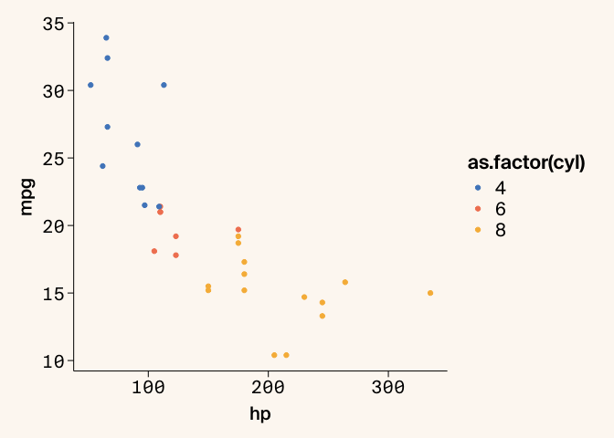
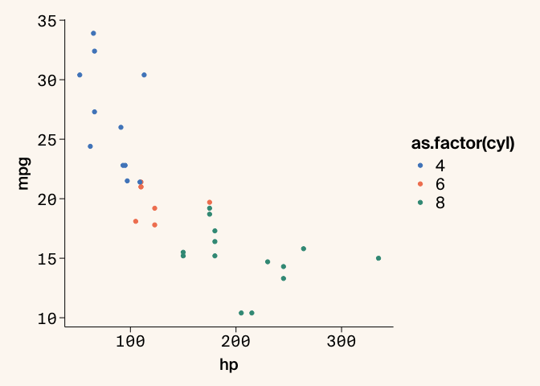
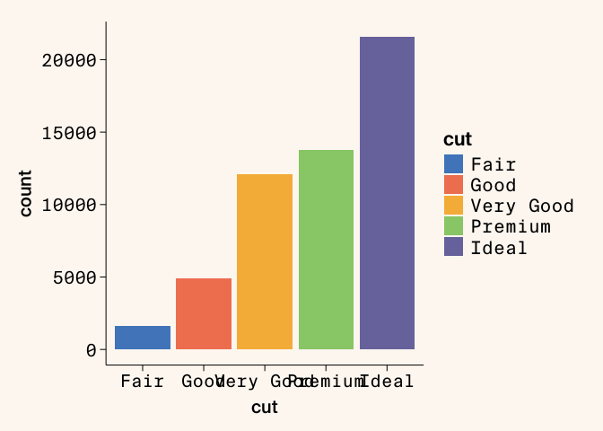
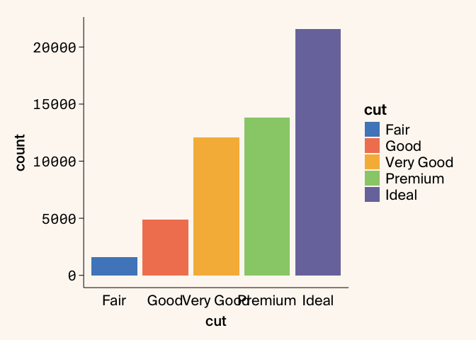
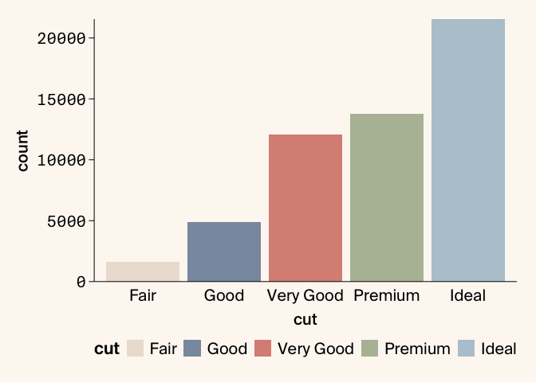
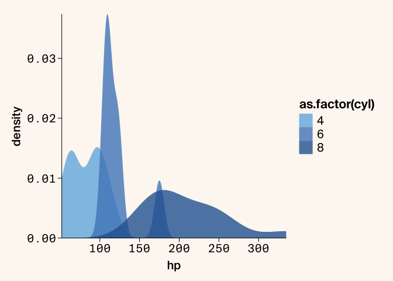
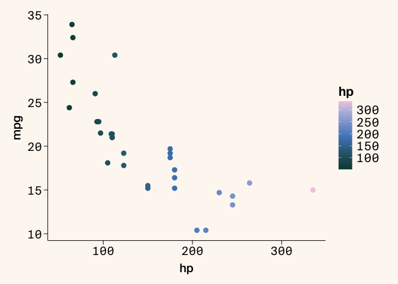
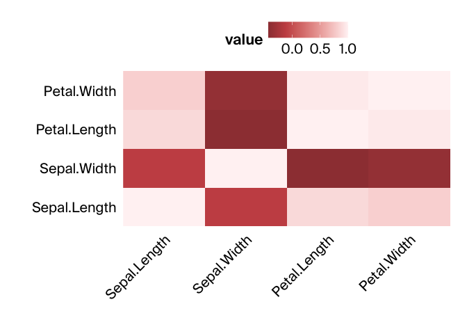

# Using `arcadiathemeR` to make figures in R

`arcadiathemeR` is an R package that provides functions to create
`ggplot2`-style figures that (mostly) adhere to the Arcadia Science
style guide. This lesson provides a quick introduction to
`arcadiathemeR` and how to use it to style `ggplot2`-style plots, which
largely follows the [package README
documentation](https://github.com/Arcadia-Science/arcadiathemeR?tab=readme-ov-file#arcadiathemer).

We’ll cover the following topics:

1.  Installing `arcadiathemeR`
2.  Using `arcadiathemeR` to layer onto a `ggplot2` plot
3.  Accessing and using colors, palettes, and gradients
4.  Saving plots

## Prerequisites and Installation

1.  You need `R` installed, and `arcadiathemeR` requires at least R
    version \>= 4.0 (the package was built and tested with version
    4.3.1). Install `R` for Mac OS X
    [here](https://cran.r-project.org/bin/macosx/).

2.  You can use `RStudio` or a Jupyter notebook for creating plots.
    Install `RStudio` for Mac OSx
    [here](https://posit.co/download/rstudio-desktop/) or Jupyter in a
    conda environment [following these
    instructions](https://training.arcadiascience.com/arcadia-users-group/20221024-jupyter-notebooks/lesson/#managing-jupyter-notebook-installations-with-conda).

3.  To use the custom fonts you need to download the `TTF` formatted
    font files and place in the `Users/YOURUSERNAME/Library/Fonts/`
    directory. You can also double click on the fonts to install them
    using FontBook. Check out the Arcadia Science Brand Assets page in
    Notion to find these. This should only need to be performed once
    even if the package is updated over time. **You must download the
    TTF formatted files to be compatible with `arcadiathemeR`.** If you
    want to download both the `TTF` and `OTF` formatted files to use
    both `arcadiathemeR` and the `arcadia-pycolor` python package that’s
    fine - there will just be duplicate selections for each font in
    Illustrator.

4.  Install `arcadiathemeR` with the `remotes` package:

        # install.packages("remotes")
        remotes::install_github("Arcadia-Science/arcadiathemeR")

5.  Load the package to use in your scripts with
    `library(arcadiathemeR)`. When you first load the package in a new R
    session it will print a message about whether the custom fonts have
    been accessed and loaded correctly.

## Layering onto an existing `ggplot2` plot

There are two main functions you will use to layer onto an existing
`ggplot2` plot to create plots adhering to the Arcadia style guide and
access palettes. These are the `theme_arcadia` and `scale` functions.
The particular `scale` function differs on whether you use `color` or
`fill` to access colors. Here is how you use these functions without
changing the default arguments:

``` r
library(ggplot2)
library(arcadiathemeR)
#> Loading Suisse fonts...
#> All custom fonts 'Suisse Int'l, Suisse Int'l Semi Bold, Suisse Int'l Medium, Suisse Int'l Mono' are successfully loaded.

ggplot(data=mtcars, aes(x=hp, y=mpg, color=as.factor(cyl))) +
  geom_point() +
  theme_arcadia() +
  scale_color_arcadia()
```

<!-- -->

If you want to change the color palette used, you can access this with
the `palette_name` argument in the `scale` function:

``` r
ggplot(data=mtcars, aes(x=hp, y=mpg, color=as.factor(cyl))) +
  geom_point() +
  theme_arcadia() +
  scale_color_arcadia(palette_name = "primary")
```

<!-- -->

We have specific font specifications for whether the represented data is
categorical or numerical. In the next plot where the x-axis is different
categories, you can see where the font isn’t specified correctly:

``` r
ggplot(data=diamonds, aes(x=cut, fill=cut)) +
  geom_bar() +
  theme_arcadia() +
  scale_fill_arcadia()
```

<!-- -->

To use the correct font type, you can specify what type of data you have
on each axis by using the `x_axis_type` or `y_axis_type` arguments in
the `theme_arcadia` function:

``` r
ggplot(data=diamonds, aes(x=cut, fill=cut)) +
  geom_bar() +
  theme_arcadia(x_axis_type = "categorical") +
  scale_fill_arcadia()
```

<!-- -->

In addition to specifying which palette to use in the `scale` function,
you can also reverse the colors of the scale used with `reverse=TRUE`.
You can also use other `ggplot2` or `theme` specifications on top of
these functions, such as moving the position of the legend or modifying
the scales to remove whitespace between the axis lines and the bars:

``` r
ggplot(data=diamonds, aes(x=cut, fill=cut)) +
  geom_bar() +
  theme_arcadia(x_axis_type = "categorical") +
  scale_fill_arcadia(palette_name = "secondary", reverse = TRUE) +
  scale_y_continuous(expand=c(0,0)) + # removes whitespace between axis and bars
  theme(legend.position = "bottom")
```

<!-- -->

In addition to reversing the order of the colors used in the palette,
you can select different indices of colors from the palettes within the
`scale` function with the `start` and `end` arguments:

``` r
ggplot(mtcars, aes(x = hp, fill = as.factor(cyl))) +
  geom_density(alpha = 0.8, linewidth = 0) + # remove border line from filled-in density plots
  theme_arcadia() +
  scale_fill_arcadia(palette_name = "blue_shades", start=2, end=5) +
  scale_y_continuous(expand=c(0,0)) +
  scale_x_continuous(expand=c(0,0)) # remove whitespace between both axes and the plot
```

<!-- -->

The `scale` functions are used to specify which palettes to use. The
`gradient` functions are used to access the gradient palettes, which
work in the same way as the `scale` functions using `color` or `fill`:

``` r
ggplot(data = mtcars, aes(x = hp, y = mpg, color = hp)) +
 geom_point(size=2.5) + 
 theme_arcadia() + 
 gradient_color_arcadia(palette_name = "lisafrank")
```

<!-- -->

There are also bicolor gradients available that are useful for heatmap
plots. You can also remove the background color with `background=FALSE`,
which is recommended when exporting plots, which is described below.

``` r
library(reshape2)

# heatmap of correlation matrix
data(iris)
iris_data <- iris[, 1:4]
cor_matrix <- cor(iris_data)
melted_cor_matrix <- (melt(cor_matrix))

ggplot(melted_cor_matrix, aes(x=Var1, y=Var2, fill=value)) +
  geom_tile() +
  theme_arcadia(x_axis_type = "categorical", y_axis_type = "categorical", background = FALSE) +
  gradient_fill_arcadia(palette_name = "purplegreen") + 
  theme(axis.text.x = element_text(angle = 45, hjust = 1),
        legend.position = "top", axis.line = element_blank()) +
  labs(x = "", y = "") +
  scale_y_discrete(expand=c(0,0)) +
  scale_x_discrete(expand = c(0,0))
#> Warning in regularize.values(x, y, ties, missing(ties), na.rm = na.rm):
#> collapsing to unique 'x' values

#> Warning in regularize.values(x, y, ties, missing(ties), na.rm = na.rm):
#> collapsing to unique 'x' values

#> Warning in regularize.values(x, y, ties, missing(ties), na.rm = na.rm):
#> collapsing to unique 'x' values
```

<!-- -->

## Accessing palettes and specific colors

To view all the color palette options and the individual hex codes that
comprise each palette, you can view these with `show_arcadia_palettes`:

``` r
show_arcadia_palettes()
#> $primary
#>  [1] "#5088C5" "#F28360" "#3B9886" "#F7B846" "#7A77AB" "#F898AE" "#73B5E3"
#>  [8] "#FFB984" "#F5E4BE" "#BABEE0" "#97CD78" "#C85152"
#> 
#> $secondary
#> [1] "#C6E7F4" "#F8C5C1" "#DBD1C3" "#B6C8D4" "#B5BEA4" "#DA9085" "#8A99AD"
#> [8] "#EDE0D6"
#> 
#> $primary_ordered
#>  [1] "#5088C5" "#F28360" "#F7B846" "#97CD78" "#7A77AB" "#F898AE" "#3B9886"
#>  [8] "#C85152" "#73B5E3" "#FFB984" "#F5E4BE" "#BABEE0"
#> 
#> $secondary_ordered
#> [1] "#C6E7F4" "#F8C5C1" "#DBD1C3" "#B5BEA4" "#B6C8D4" "#DA9085" "#EDE0D6"
#> [8] "#8A99AD"
#> 
#> $neutrals
#> [1] "#FFFFFF" "#EBEDE8" "#BAB0A8" "#8F8885" "#43413F" "#484B50" "#292928"
#> [8] "#09090A" "#596F74"
#> 
#> $blue_shades
#> [1] "#C6E7F4" "#73B5E3" "#5088C5" "#2B65A1" "#094468"
#> 
#> $orange_shades
#> [1] "#FFCFAF" "#FFB984" "#F28360" "#C85152" "#9E3F41"
#> 
#> $yellow_shades
#> [1] "#F5E4BE" "#FFD364" "#F7B846" "#D68D22" "#A85E28"
#> 
#> $purple_shades
#> [1] "#DCDFEF" "#BABEE0" "#7A77AB" "#54448C" "#341E60"
#> 
#> $teal_shades
#> [1] "#C3E2DB" "#6FBCAD" "#3B9886" "#2A6B5E" "#09473E"
#> 
#> $pink_shades
#> [1] "#FFE3D4" "#F8C5C1" "#F898AE" "#E2718F" "#C04C70"
#> 
#> $warm_gray_shades
#> [1] "#EDE6DA" "#DBD1C3" "#BAB0A8" "#8F8885" "#635C5A"
#> 
#> $cool_gray_shades
#> [1] "#E6EAED" "#CAD4DB" "#ABBAC4" "#8A99AD" "#687787"
```

To view gradient options and colors, use `show_arcadia_gradients`. The
gradients also show the positions for each individual color in the
gradient. You can use these lists of hex codes to create custom or
reordered sets of palettes.

``` r
show_arcadia_gradients()
#> $magma
#> $magma$colors
#> [1] "#341E60" "#54448C" "#A96789" "#E9A482" "#F5DFB2"
#> 
#> $magma$positions
#> [1] 0.000 0.217 0.498 0.799 1.000
#> 
#> 
#> $verde
#> $verde$colors
#> [1] "#09473E" "#4E7F72" "#FFCC7B" "#FFE3D4"
#> 
#> $verde$positions
#> [1] 0.000 0.357 0.909 1.000
#> 
#> 
#> $viridis
#> $viridis$colors
#> [1] "#282A49" "#5088C5" "#97CD78" "#FFFDBD"
#> 
#> $viridis$positions
#> [1] 0.000 0.468 0.746 1.000
#> 
#> 
#> $wine
#> $wine$colors
#> [1] "#52180A" "#C85152" "#FFB984" "#F8F4F1"
#> 
#> $wine$positions
#> [1] 0.000 0.451 0.828 1.000
#> 
#> 
#> $lisafrank
#> $lisafrank$colors
#> [1] "#09473E" "#5088C5" "#BABEE0" "#F4CAE3"
#> 
#> $lisafrank$positions
#> [1] 0.000 0.484 0.862 1.000
#> 
#> 
#> $sunset
#> $sunset$colors
#> [1] "#4D2500" "#A85E28" "#E9A482" "#FFCC7B" "#FFE3D4"
#> 
#> $sunset$positions
#> [1] 0.000 0.407 0.767 0.915 1.000
#> 
#> 
#> $oranges
#> $oranges$colors
#> [1] "#964222" "#FFB984" "#F8F4F1"
#> 
#> $oranges$positions
#> [1] 0.000 0.761 1.000
#> 
#> 
#> $sages
#> $sages$colors
#> [1] "#2A6B5E" "#B5BEA4" "#F7FBEF"
#> 
#> $sages$positions
#> [1] 0.000 0.641 1.000
#> 
#> 
#> $orangesage
#> $orangesage$colors
#> [1] "#964222" "#FFB984" "#F8F4F1" "#F7FBEF" "#B5BEA4" "#2A6B5E"
#> 
#> $orangesage$positions
#> [1] 0.000 0.761 1.000 1.000 0.641 0.000
#> 
#> 
#> $reds
#> $reds$colors
#> [1] "#9E3F41" "#C85152" "#FFF3F4"
#> 
#> $reds$positions
#> [1] 0.000 0.212 1.000
#> 
#> 
#> $blues
#> $blues$colors
#> [1] "#2B65A1" "#5088C5" "#F4FBFF"
#> 
#> $blues$positions
#> [1] 0.000 0.254 1.000
#> 
#> 
#> $redblue
#> $redblue$colors
#> [1] "#9E3F41" "#C85152" "#FFF3F4" "#F4FBFF" "#5088C5" "#2B65A1"
#> 
#> $redblue$positions
#> [1] 0.000 0.212 1.000 1.000 0.254 0.000
#> 
#> 
#> $purples
#> $purples$colors
#> [1] "#6862AB" "#7A77AB" "#FCF7FF"
#> 
#> $purples$positions
#> [1] 0.000 0.144 1.000
#> 
#> 
#> $greens
#> $greens$colors
#> [1] "#47784A" "#97CD78" "#F7FBEF"
#> 
#> $greens$positions
#> [1] 0.000 0.622 1.000
#> 
#> 
#> $purplegreen
#> $purplegreen$colors
#> [1] "#6862AB" "#7A77AB" "#FCF7FF" "#F7FBEF" "#97CD78" "#47784A"
#> 
#> $purplegreen$positions
#> [1] 0.000 0.144 1.000 1.000 0.622 0.000
```

## Exporting plots

To save plots, we have a custom `save_arcadia_plot` function built on
top of `ggsave` that helps you export plots that adhere to our size
guidelines and can be used with the Illustrator templates. The different
plot size options are
`"full_wide", "float_wide", "half_square", "full_square"`, or
`"float_square"`. These panel sizes adhere to the panel sizes available
in the Illustrator templates.

If you want to save plots in different formats (such as PNG or JPG) or
sizes that aren’t available through this convenience function, you can
still use the regular `ggsave` function. Additionally for the background
to be transparent in exported plots you need to set the `background`
argument to `FALSE` in the `theme_arcadia` function:

``` r
plot <- ggplot(data=diamonds, aes(x=cut, fill=cut)) +
  geom_bar() +
  theme_arcadia(x_axis_type = "categorical", background = FALSE) +
  scale_fill_arcadia(palette_name = "secondary", reverse = TRUE) +
  scale_y_continuous(expand=c(0,0)) + # removes whitespace between axis and bars
  theme(legend.position = "bottom")

save_arcadia_plot("figures/arcadia-plot.pdf", plot, panel_size = "full_square")
```

## Resources

This lesson follows the examples given in the [`arcadiathemeR`
documentation](https://github.com/Arcadia-Science/arcadiathemeR/tree/main).
[Open an issue](https://github.com/Arcadia-Science/arcadiathemeR/issues)
in the repo to request new features or report bugs as you come across
them!
