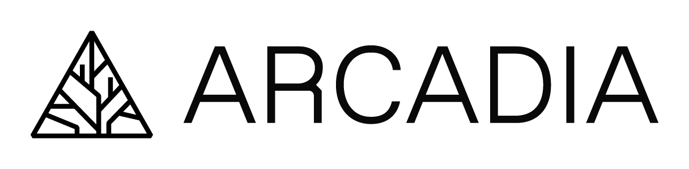

 
Welcome to the computational training website for Arcadia Science.
The purpose of this website is to catalogue and host training materials at Arcadia Science.
We strive to make our training material open and accessible so that it can be useful at time of delivery and for asynchronous learning.
To discover training materials, navigate to the pages on the left navigation bar.

The materials on this site include trainings as part of Arcadia Users Group (AUG) and workshops. 
AUG is a forum for Arcadians to bring data, conceptual problems, or low-level coding questions to discuss in a group setting. 
We also periodically prepare organized materials to teach in these sessions, which are available on the [Arcadia Users Group](arcadia-users-group/overview.md) page.
Additionally, we lead longer [Workshops](workshops/overview.md) for Arcadians on specific topics and skills.

 
 
 
 
