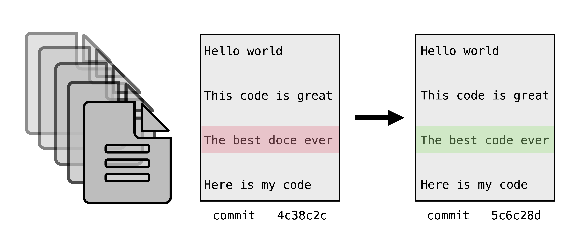
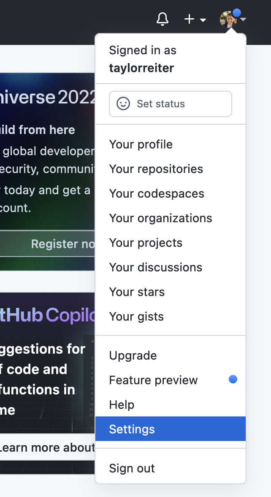
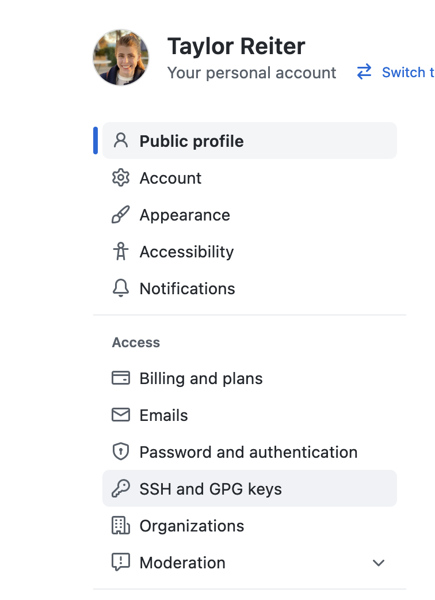
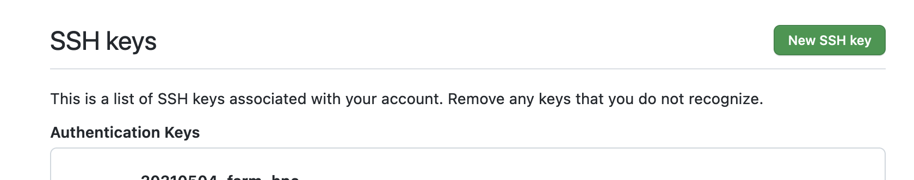
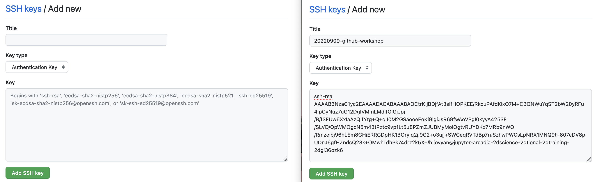
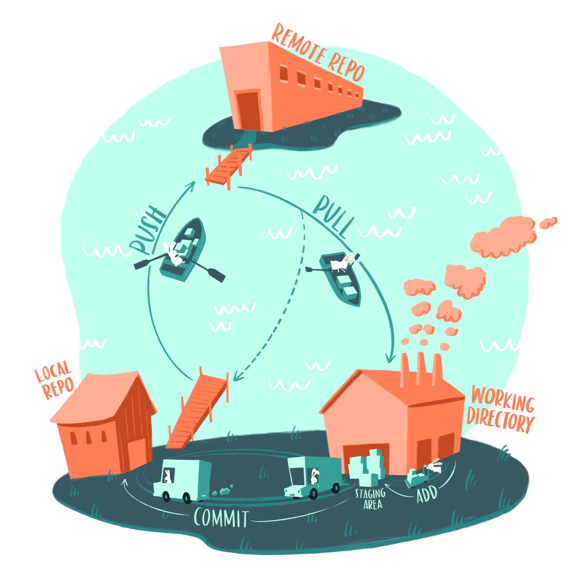
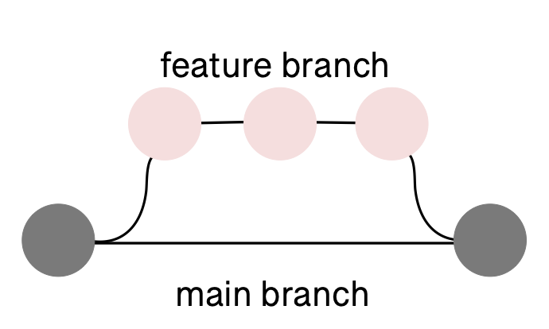
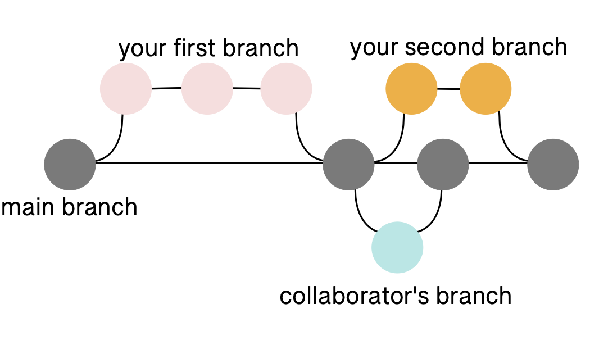
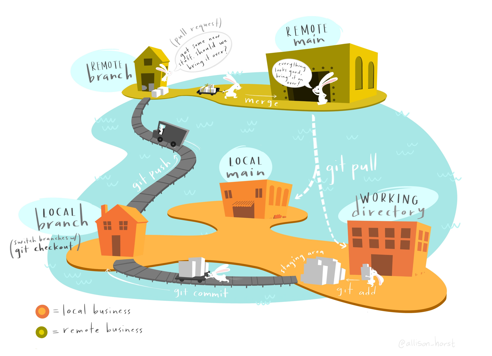

# Hands on introduction to Git and GitHub

## Version control

<center>
<figure markdown>
  { width="400" }
  <figcaption> 'Piled Higher and Deeper' by Jorge Cham <a href='http://www.phdcomics.com/comics/archive.php?comicid=1531' target='_blank'>www.phdcomics.com</a> </figcaption>
</figure>
</center>

Version control keeps track of changes to a file over time.
While the document above is technically under version control, using file names can be chaotic and unreliable especially when files are passed between multiple people working on different computers.

<center>
<figure markdown>
  { width="600" }
  <figcaption> Figure 6 in DOI 10.1093/gigascience/giaa140 <a href='https://doi.org/10.1093/gigascience/giaa140' target='_blank'>www.academic.oup.com/gigascience</a> </figcaption>
</figure>
</center>

Version control systems work by tracking incremental differences -- delineated by commits -- in files and keeping a history of those changes. 
This allows you to return to return to previous versions at any time.
The file name doesn't change and only one version of a file is displayed at a time, but the full history is accessible.
This is similar to the version control that occurs in programs like Google Docs or Microsoft Word.

#### Version control with Git and GitHub

**[Git](https://git-scm.com/)** is a [free](https://www.gnu.org/philosophy/free-sw.en.html), [distributed](https://en.wikipedia.org/wiki/Distributed_version_control) version control system.
The complete history of your project is safely stored in a hidden `.git` repository.
A **repository** is like a project folder or directory on your computer.
It contains all of the files and folders for a project as well as the history of those files.
Changes to files are recorded as **commits**.
A **commit** is marked by the user when they're ready to check in a set of changes to a file.
You can always go back to a previous commit.

**GitHub** is an internet service for hosting files that are under git version control.
You can think of it like social media for code and small text files.
GitHub houses repositories in a central locations.
Repositories on GitHub are referred to as **remote** repositories.
Users can create a **local** copy of a repository by **cloning** (downloading) it to their computer, or to a computer in the cloud that they have access to.

You don't need GitHub to use the Git version control system.
By using the Git command line interface, you can use version control locally without ever **pushing** your files to a remote repository on GitHub. 

You also don't need to know the Git command line interface to take advantage of the version control system: Git is well-integrated into GitHub, so if you know the basic terminology and definitions, you can still version control your project through GitHub alone.

However, both Git and GitHub are most powerful when combined together.
This workshop will teach you the basics of Git and GitHub so you can leverage both in your research.

## Setting up

#### Signing up for a GitHub account

You will need a GitHub account for today's workshop.
If you already have one, you can use your current username (e.g. there is no need to create an Arcadia-specific GitHub username).
If you don't, sign up at [github.com](https://github.com/).
Usernames are public so choose accordingly.

#### Accessing a Unix shell & Git

For this lesson, we need to have access to a Unix shell. 
If you're not sure how to open a terminal on your computer, see [these instructions](https://swcarpentry.github.io/shell-novice/setup.html).

Many computers come with Git installed.
Once you have a Unix shell open, run the following command to see if `git` is installed:
```
which git
```

You should see something like:
```
/usr/bin/git
```

If you don't, you'll need to install `git`.
If Git is not already installed on your computer, see [these instructions](https://carpentries.github.io/workshop-template/#git).

#### First time setup and configuration

Whenever you use Git for the first time on a computer, there are a few things you need to set up.
Unless you need to change something, these commands only need to be used the first time you use Git on a computer.

First, set your name and email:
```
git config --global user.name "Taylor Reiter"
git config --global user.email "myemail@gmail.com"
```

> Your email and user name is recorded with every commit.
> This helps ensure integrity and authenticity of the history.
> Most people keep their email public, but if you are concerned about privacy, check GitHub's tips to [hide your email](https://help.github.com/articles/keeping-your-email-address-private/).

Next, we'll set up a key pair. 
GitHub [recently discontinued password authentication](https://docs.github.com/en/rest/overview/other-authentication-methods). 
Cryptographic keys are a convenient and secure way to authenticate without having to use passwords and are an authentication method still supported by GitHub. 
They consist of a pair of files called the public and private keys: the public part can be shared with whoever you'd like to authenticate with (in our case, GitHub), and the private part is kept "secret" on your machine. 
The private key should never be shared in an unencrypted way with anyone -- this includes over email, slack, etc. 
If your private key is accidentally shared, you should stop using it for authentication and create a new key pair.
Things that are encrypted with the public key can be be decrypted with the private key, but it is computationally intractable (ie, it would take on the order of thousands of years) to determine a private key from a public key. 
You can read more about it [here](https://en.wikipedia.org/wiki/Public-key_cryptography).

```
cd ~
mkdir -p .ssh
cd .ssh
ssh-keygen
```

The `ssh-keygen` program will prompt you to input a key file name (below, we use `20220920-github-workshop`) and a passphrase.
It's ok to leave the passphrase blank; if you put in a passphrase, you'll need to remember it and type it every time you use the key file.

```
ssh-keygen
Generating public/private rsa key pair.
Enter file in which to save the key (/home/jovyan/.ssh/id_rsa): 20220920-github-workshop
Enter passphrase (empty for no passphrase): 
Enter same passphrase again: 

Your identification has been saved in 20220920-github-workshop.
Your public key has been saved in 20220920-github-workshop.pub.
The key fingerprint is:
SHA265:
The key's randomart image is:
```

Next, we'll check the key files permissions.
Permissions control who has access to a file on your computer, and key files need to have very restricted permissions.

```
ls -lah
```

We see:
```
total 16K
drwxr-xr-x 2 jovyan jovyan 4.0K Sep  9 20:21 .
drwxr-xr-x 1 jovyan jovyan 4.0K Sep  9 20:20 ..
-rw------- 1 jovyan jovyan 1.7K Sep  9 20:21 20220920-github-workshop
-rw-r--r-- 1 jovyan jovyan  445 Sep  9 20:21 20220920-github-workshop.pub
```

We are the only user who has read access to our private key file, so our permissions are fine.

When we ran `ls`, we saw that the `ssh-keygen` program generated two files. 
The first file `20220920-github-workshop` is the private key file and should never be shared.
The second file `20220920-github-workshop.pub` is the public key file that we'll upload to GitHub. 
We can tell it's the public key file because it ends in `.pub`.

Next, we need to get our public key file uploaded to GitHub so we can use it for authentication.
GitHub will need the text in the public key file.
You can view it by running `cat`:

```
cat 20220920-github-workshop.pub
```

Your public key file text should look something like this:
```
ssh-rsa AAAAB3NzaC1yc2EAAAADAQABAAABAQCtrKIjBDjfAt3sIfHOPKEE/RkcuPAfdl0xO7M+CBQNWuYqST2bW20yRFu4lpCyNuz7uG12DgIVMmLMdlfGlGjJpj/B/f3FUw6XxIaAzQIfYtg+Q+qJ0M2GSaooeEoKi9lgiJsR69fwAoVPgI0kyyA4253F/SLVD/QpWMQgcN5m43tPztc9vp1Lt5u8PZmZJUBMyMolOgtvRUYDKx7MRb9nWO/Rmzeibj96hLEm8GHiERRGDpHK1BOryiq2jI9C2+o3ujj+SWCeqRVTdBp7raSzhwPWCsLpNRX1MNQ9t+807eDV8pUDnJ6gfHZndcQ23k+OMwhTdhPk74drz2k5X+/h jovyan@jupyter-arcadia-2dscience-2dtional-2dtraining-2dgi36ozk6
```

To upload the key file text, navigate to GitHub and click on settings.

<center>
{ width="300" }
</center>

Then use the menu on the left hand side of the page to navigate to the `SSH and GPG keys` tab.

<center>
{ width="300" }
</center>

Once there, select `New SSH key`.

<center>
{ width="500"}
</center>

Give your key a descriptive name (such as `20220920-github-workshop`) and then paste in the contents of your public key file to text editor.

<center>
{ width="900" }
</center>

The very last thing we need to do is tell our computers which key file to use when we want to authenticate with GitHub.
We do this by creating a `config` file in our `.ssh` directory.
We'll use nano to do this.
Type the following contents into your `config` file and save it as `config`.

```
nano config
```

```
Host github.com
 User git
 HostName ssh.github.com
 IdentityFile ~/.ssh/20220920-github-workshop
```

Follow the command prompts in the bottom ribbon of nano to exit.

To confirm that you have set up authentication properly, run the following command:

```
ssh -i ~/.ssh/20220920-github-workshop -T git@github.com
```

You should see:
```
Hi username! You've successfully authenticated, but GitHub does not provide shell access.
```

## Getting started with version control

Now that we've established a secure connection between our computers and GitHub, it's time to learn how to start a version controlled repository and add files to it.
We'll start by creating a repository on GitHub.

#### Creating your first repository on GitHub

Follow the steps below to create your first repository.

1. Navigate to [GitHub](www.github.com).
2. Click on the plus sign in the upper right of the screen.
3. Select "New repository" from the drop-down menu.
4. On the "Create a new repository" page, choose a name for your repository.
   For this workshop, name the repository `2022-git-workshop`. 
   A repository can have any valid directory name, but putting the year at the beginning is a good practice because it makes it clear when the repo was created.
5. Check the box "Add a README file".
6. Click the green "Create repository" button at the bottom of the page.

This will create a new repository and take you to the repository's landing page on GitHub.

#### Cloning a repository from remote to local

**Cloning** is the process of copying an existing Git repository from a **remote** location (here, on GitHub) to your **local** computer (here, on our binder instances).
To clone the repository, click the green "Code" button in the top right hand corner of the repository screen. 
This creates a drop down menu with clone options.
We'll select the SSH tab because we configured an ssh key pair.
Once you select the tab, copy the path that starts with `git@gitub.com:`.
Then, navigate to your terminal and use the command below to clone the repository.
Remember to substitute out the username/URL with your own URL that we copied.

```
cd ~
git clone git@github.com:your_username/2022-git-workshop
cd 2022-git-workshop
```

#### The basic Git workflow


<center>
<figure markdown>
  { width="600" }
  <figcaption> Figure by Allison Horst. <a href='https://twitter.com/allison_horst/status/1523744022421860352' target='_blank'>www.twitter.com/allison_horst</a> </figcaption>
</figure>
</center>

We can now make changes to our files in our local repository.
The basic Git workflow begins when you communicate to Git about changes you've made to your files.
Once you like a set of changes you’ve made you can tell Git about them by using the command **`git add`**.
This stages the changes you have made.
Staging a file tells Git that you're ready to commit those files -- it's a way of telling Git which files you're ready to commit.
Next, you bake them into the branch using **`git commit`**.
When you’re ready, you can communicate those changes back to GitHub using **`git push`**.
This will push your the changes that are in your local repository up to the remote repository.

Let's try this workflow out.
Throughout this process, we'll use the command `git status` to track our progress through the workflow.
`git status` displays the state of a working direcotry and the staging area.

```
git status
```

We'll use the `echo` command to create a new file, `notes.txt`.

```
ls
echo "some interesting notes" > notes.txt
ls
```

Take a look at the contents of your `notes.txt` file:
```
less notes.txt
```

And run `git status` to see how creating a new file changes the output of that command:
```
git status
```

Once you have made changes in your repository, you need to tell Git to start tracking the file. 
The command `git add` adds the files to the "staging area", meaning Git is now tracking the changes.

```
git add notes.txt
```

After adding this file, we see our output of `git status` changes.

```
git status
```

The text associated with our file is now green because the file is staged.
When you've made all of the changes to a file that represent a unit of changes, you can use `git commit` to create a snapshot of the file in your Git version history.

```
git commit -m "start notes file"

git status
```

The `-m` flag is the message that is associated with that commit.
The message should be short and descriptive so that you or someone looking at your code could quickly determine what changes took place from one commit to the next.
What constitutes a unit of changes worthy of running `git commit`? 
That depends on the project and the person, but think about returning to this code six months in the future.
What set of changes would make it most easy to return to an earlier version of document?

Committing a file bakes changes into your local repository. 
To communicate that changes back up to your remote repository, use `git push`.

```
git push
``` 

**Challenge**: Add today's date to the `README.md` text file, stage the changes in those files, commit them to version history, and push them up to your remote repository.

<details>
  <summary>Challenge solution</summary>

You can make changes to your <code>README.md</code> file however you choose -- using a text editor on your system (TextEdit, BBEdit, VSCode, Sublime), using a text editor in your terminal, or by using a shell redirect. 
This solution demonstrates how to add text using <code>echo</code> and redirects <code>>></code>.

```
echo "20220920" >> README.md
git add README.md
git commit -m "add date to readme"
git push
```
</details>

<br />

## Working on branches

<center>
{ width="400" }
</center>

When you want to make changes to files in a repository, it’s best practice to do it in a **branch**.
A **branch** is an independent line of development of files in a repository. 
You can think of it like making a copy of a document and making changes to that copy only: the original stays the same, but the copy diverges with new content.
In a branch, all files are copied and can be changed.


<center>
{ width="600" }
</center>

Branches are particularly powerful for collaborating.
They allow multiple people to work on the same code base and seamless integrate changes.

By default, you start on the `main` branch.
You can see which branch you're on locally using the `git branch` command.

```
git branch
``` 

Let's create a branch and make changes to it.
We can create a new local branch using `git checkout -b`.
`git checkout` tells git we want to switch which branch we're currently on, while the `-b` flag tells git that we're creating a new branch.

```
git checkout -b my-first-branch 
```

Now, if we run `git branch` we'll see we're on the branch `my-first-branch`.

```
git branch
```

To go back to the `main` branch, we can use the `git checkout` command without the flag `-b`.

```
git checkout main
```


Branch names can be used to convey information that can help you and others keep track of what you're doing.
For example, you can prepend your branch names with your initials and a slash to make it clear that you were the one who created the branch, and you can specify a name that is associated with the file changes made on the branch: `<your initials>/<brief description of the code change>`. 
Example: `ter/git-workshop`.

Let's practice making a branch using these conventions. 
In our branch, we'll update our `README.md` file.
Use the code below to create a new branch, but remember to substitute out `your-initials` for your initials.

```
git checkout -b your-initials/update-readme.
```

Whenever you create a new branch, it branches off from the branch you're currently in when you make the new branch.
In this case, we started in `main`, so our branch will branch off of from here.

Next, let's add some changes to our `README.md` file and run `git status`.

```
echo "adding more text to the README file" >> README.md
git status
```

Stage the changes with `git add`:

```
git add README.md
```

git commit -m "update readme w more text"
```

Run `git push`:

```
git push
```

This gives us an error message!

```
fatal: The current branch tmp has no upstream branch.
To push the current branch and set the remote as upstream, use

    git push --set-upstream origin ter/update-readme
```

While we created our branch locally, we haven't created the same branch remotely. 
We need to tell `git` where to put our changes in the remote repository.
Luckily, the error message points us to the code we need to run to set the remote branch.

```
git push --set-upstream origin ter/update-readme
```

In the above command, `origin` is shorthand for the remote repository that a project was cloned from. 
To view what this value is, you can run `git remote -v`.

If we navigate to our repositories on GitHub, we now see a yellow banner wtih our branch name and a green button inviting us to "Compare & pull request".

#### Integrating changes into `main` using pull requests

We just created changes to our `README.md` file in a branch.
To integrate this changes formally back into the **main branch**, you can open a **pull request**.
**Pull requests** create a line-by-line comparison between the original code and the new code and generate an interface for inline and overall comments and feedback. 
Pull requests are how changes are **reviewed** before they’re integrated back into the `main` branch.

To open a pull request, click the green button "Compare & pull request".
This will take you to a page where you can draft your pull request.
You should update the title of your pull request to reflect the changes you made in your branch in plain language.
Then you should add a few sentence description of those changes. 
Once you've done that, click the "Create pull request" button.

The pull request interface has a lot of features that make collaboration and code review straight forward.
The main pull request page supports many important features:
* Each commit and the descriptive message your provided for them are displayed.
* Conversations about the file changes can take place via comments.
* You can convert your pull request to a draft if you're not done adding to it yet, or request review from other GitHub users.
The main pull request page also has a tab for "Files changed".
This provides a succint view of every line changed in every file, showing you the new content in green and the deleted content in red. 

The "Files changed" interface is the most useful interface for code review.
Code review is when someone who didn't write the code but who has domain expertise relevant to the code reads and reviews the code being added or removed by a pull request.
Code review  a) encourages you to write better documentation and cleaner code as you go because you know someone will be reading it soon, b) gives a collaborator an opportunity to comment on and improve your work, and c) increases accountability and visibility of your work.
There is no one-size-fits-all approach for code review, but these are some things to keep an eye out for when you're reviewing someone's code (modified from [here](https://carpentries-incubator.github.io/managing-computational-projects/09-codereview/index.html)):

* Bugs/Potential bugs
    * Repetitive code
    * Code saying one thing, documentation saying another
    * Off-by-one errors
    * Making sure each function does one thing only
    * Lack of tests and sanity checks for what different parts are doing
    * Magic numbers (a number hardcoded in the script)
* Unclear, messy code
    * Bad variable/method names
    * Inconsistent indentation
    * The order of the different steps
    * Too much on one line
    * Lack of comments and signposting
* Fragile and non-reusable code
    * Software or software versions not documented
    * Tailor-made and manual steps
    * Only works with the given data

For more on code review, see [this lesson](https://carpentries-incubator.github.io/managing-computational-projects/09-codereview/index.html).

From the "Files changed" tab, you can see all of the changes suggested in a pull request.
You can use in-line comments and suggestions or holistic comments on changes.
When you're finished with your review, you can submit it as a set of comments, approved changes, or requesting further changes.

Once a pull request is **approved**, the changes are merged into the main branch.

**Challenge** Open a pull request with the changes you made to your `README.md`. 
Request a review from the person sitting next to you.
After your PR has been reviewed, merge the changes into your `main` branch.

#### Pulling changes from the remote repository back to the local repostory

After we merged our pull requests, our `main` branches in our remote repositories on GitHub now contain content that our
To get the merged changes back to your local branch, you can run **`git pull`** in your local repository.

```
git pull
```

This will pull in all of the changes that are on GitHub but not in our local repo.

**Challenge** Checkout the `main` branch and run `git pull`. What happens?

<details>
  <summary>Challenge solution</summary>

```
git checkout main
git pull
```

You should see a message that ends with:
```
Already up to date.
```

This happens because we already pulled in all of the remote changes to our local repository, so there is nothing left to do.

</details>

</br>

Now that all of our changes to our `README.md` are in our local and remote branch, we can safely delete our branch.

```
git branch
```

```
git branch -d ter/update-readme
```

While you don't have to delete a branch when you're finished with it, deleting branches you're done with helps keep your project tidy and helps yourself and others not get confused when you revisit work in the future.

## Bringing the whole process together

<center>
<figure markdown>
  { width="900" }
  <figcaption> Figure by Allison Horst. <a href='https://twitter.com/allison_horst/status/1563210538510737409?s=20&t=USB46onUf9i7zYnkqjUSPQ' target='_blank'>www.twitter.com/allison_horst</a> </figcaption>
</figure>
</center>

This figure gives an overview of the entire Git & GitHub ecosystem.
It provides a succinct review of the concepts we've covered today.

GitHub has integrated enough features that many of these steps can be orchestrated completely on GitHub without needing to clone a repository to your local machine.
However, this mental model is still helpful: you can create a branch, make edits to a text file and commit them, open a pull request, and merge the pull request all from the GitHub online interface.
**You do not need to learn the Git CLI to experience the joys and benefits of GitHub and to contribute to projects that live there.**

## Undoing Changes

Confusingly, git has four different subcommands for undoing things:

* `restore`
* `revert`
* `reset`
* `checkout`

We'll cover these commands below.


#### Restoring a file to its state at the previous commit

The `git restore` command is useful if you want to undo changes you haven't committed yet.

Open up the `README.md` file in a text editor and make some changes. 
For instance, let's add the line `This is a mistake` to the end of the file. 
Then save and close the file.

Next, check the repository status:

```
git status
```

As expected, git tells us there are changes to the `README.md` file:

```
On branch main
Changes not staged for commit:
  (use "git add <file>..." to update what will be committed)
  (use "git restore <file>..." to discard changes in working directory)
        modified:   README.md
no changes added to commit (use "git add" and/or "git commit -a")
```

What if now you decide the changes were a mistake and you don't want to keep them? 
The `git restore` command restores a file in the working directory to the version of the file in the most recent commit.

Let's try out restoring the `README.md` file:

```
git restore README.md
```

Now check the status again:

```
git status
```

The status shows that there are no longer any new changes to the `README.md`
file:

```
On branch main
nothing to commit, working tree clean
```

There is no way to undo `git restore`, so be careful when you're using it.

In older versions of git, the command to restore a file in the working directory was `git checkout -- FILENAME`. 
You may occasionally see people mention this command online, and it still works in recent versions of git.
However, the `git restore` command is preferable because it disambiguates what you're trying to do (`git checkout` is also used for other things unrelated to restoring files).


#### Restoring the staging area

With a different set of arguments, you can also use the `git restore` command to remove changes from the staging area.

Open up the `README.md` file in a text editor again and make some more changes. 
This time let's add the line `Git is tough` to the end of the file. 
As usual, save and close the file.

Next, add the changes to the staging area:

```
git add README.md
```

Then check the repository status with `git status`:

```
Changes to be committed:
  (use "git restore --staged <file>..." to unstage)
        modified:   README.md
```

git tells us our changes to `README.md` are staged.

Now suppose you decide you want to unstage the changes to `README.md`. 
This removes the changes from the staging area, but not from the working directory.
Unstaging changes is especially useful when you're working with multiple files and accidentally add a file you don't want to commit yet.

To unstage a file, use `git restore` with the `--staged` argument:

```
git restore --staged README.md
```

Then check the status again:

```
Changes not staged for commit:
  (use "git add <file>..." to update what will be committed)
  (use "git restore <file>..." to discard changes in working directory)
        modified:   README.md
no changes added to commit (use "git add" and/or "git commit -a")
```

The changes to `README.md` are still in the working directory, but no longer in the staging area.

In older versions of git, the command to restore a file in the staging area was `git reset FILENAME`. 
You may occasionally see people mention this command online, and it still works in recent versions of git. 
However, the `git restore` command is preferable because it disambiguates what you're trying to do (`git reset` is also used for other things unrelated to restoring the staging area).


#### Reverting a commit

The `git revert` command is useful if you want to undo changes that you've already committed. 
Once a commit is in your repository's history, it generally stays there forever. 
There is a way to delete commits, but you should really only delete commits if you [accidentally commit sensitive data](https://docs.github.com/en/github/authenticating-to-github/keeping-your-account-and-data-secure/removing-sensitive-data-from-a-repository).
Instead, the idiomatic way to undo a commit is to create a new commit that reverses the changes.


Let's start by editing the `README.md` file again and making a commit. 
Add the line `This is a big mistake.` to the end of the file. 
Then run:

```
git add README.md
git commit -m "This commit is a mistake."
```

Now suppose you decide the commit is a mistake, and want to undo it. 
First, you need to find the ID of the commit you want to undo. 
The `git log` command opens a scrolling list of all commits in the repository's history and their IDs. 
Run the command:

```
git log
```

You can exit the log by typing `q`.

In the log, locate the the mistaken commit, and copy or remember the first 5 digits of its ID. 
Git is smart enough that it can generally recognize a commit from the first few digits of its ID, and will tell you if it needs more digits for disambiguation.

In my repo, the ID of the commit starts with `e01d1`. 
In your repo, the commit will likely have a different ID. 
Next, run this command, replacing the ID with the ID you copied:

```
git revert e01d1 --no-edit
```

The `--no-edit` flag tells `git revert` to generate the commit message for the new commit automatically. 
Without the flag, `git revert` will prompt you to enter a commit message.

Now inspect the file with `nano` or `cat`. 
You should see that the changes from your bad commit are gone. 
If you look in the log with `git log`, you'll also see a new commit to revert the changes of a previous commit.

**Challenge**: The goal of this challenge is to make a bad commit and then revert it. Work
through these steps:

1. Change a file in your repository.
2. `add` and `commit` the changes.
3. Find the ID of the commit from step 2 in the repository history.
4. `revert` the commit from step 2.

<details>
<summary>Challenge solution</summary>
Change a file like `README.md`.
Then run:
```
git add README.md
git commit -m "update README"
```

To find the ID of the commit, run:
```
git log
```

Then revert the commit:
```
git revert 07f61 --no-edit
```
</details>
<br />

#### Creating a branch from a previous commit

Another strategy to revert to a prior state is to create a new branch that starts at the state of a previous commit. 
This has the advantage of keeping a branch with the work you did on it, but allows you to continue to work in a different direction from a previous commit.
To do this, you can use `git log` like above to identify which commit you want your new branch to start out at.
Once you have the commit ID, run the following:

```
git checkout -b name-of-new-branch e01d1
```

You'll now be on a new branch that starts from the commit you indicated.
To check, run `git branch`.

## GitHub Goodies

#### Issues

GitHub issues started as a way to record problems with software and have since evolved into generalized [project planning tools](https://github.com/features/issues). 
Issues are a great way to keep track of to do items, have asynchronous conversations relevant to a repository, or otherwise deposit information relevant to a repository.

#### Releases

[Releases](https://docs.github.com/en/repositories/releasing-projects-on-github/managing-releases-in-a-repository) bundle and deliver iterations of your project.
When your entire repository reaches a consensus point, you can use GitHub to compress that version of files together.
Releases [integrate with zenodo](https://docs.github.com/en/repositories/archiving-a-github-repository/referencing-and-citing-content) to archive your repo and give it a DOI. 

#### `.gitignore`

A `.gitignore` file is a hidden text file in you repository that you can use to "ignore" files that you don't want under version control.
This is handy for really large data files that you don't want to add to your repo.
To use a `.gitignore` file, create a `.gitignore` text file in the main directory of your repo and add paths to files that you would like to ignore.
The `.gitignore` file accepts regular expressions (e.g. `*.fastq.gz` to ignore any file that ends in `.fastq.gz`).

#### Links to other goodies

* [Archive a repository that is no long in use](https://docs.github.com/en/repositories/archiving-a-github-repository/archiving-repositories)
* [Continuous integration with GitHub Actions](https://github.com/features/actions)

## Summary

<center>
<h4><i>Terms introduced:</i></h4>

| Term | Definition |
| -----| -----------|
| Git  | a version control system |
| GitHub | an internet hosting service for version control using Git |
| repository | a collection of files and folders associated with a project that is under Git version control |
| local  | accessed from your system; the computer you're working on | 
| remote | stored on a remote computer; GitHub |
| commit | a snapshot of your files and folders at a given time |
| branch | an independent line of development in a repository |
| pull request | a mechanism to suggest changes from a branch be integrated back into the `main` branch |
| review | the process of reviewing changes in a branch through a pull request |
| issue | a tracking tool integrated into a GitHub repository |

<h4><i>Commands introduced:</i></h4>

| Command | Function |
| --------| ---------| 
| `git clone` | copies a Git repository from remote to local |
| `git add` | adds new or changed files in your working directory to the Git staging area|
| `git commit` | creates a commit of your repository |
| `git push` | uploads all local branch commits to the corresponding remote branch|
| `git checkout` | switches between local branches, or creates a new branch with the `-b` flag |
| `git branch` | reports what branch you're currently on and what other local branches exist |
| `git pull` | updates current local working branch and all of the remote tracking branches |
| `git restore` | restores a file to its state at the last commit or remove a file from the staging area |
| `git revert` | reverts changes that have already been committed |

</center>
