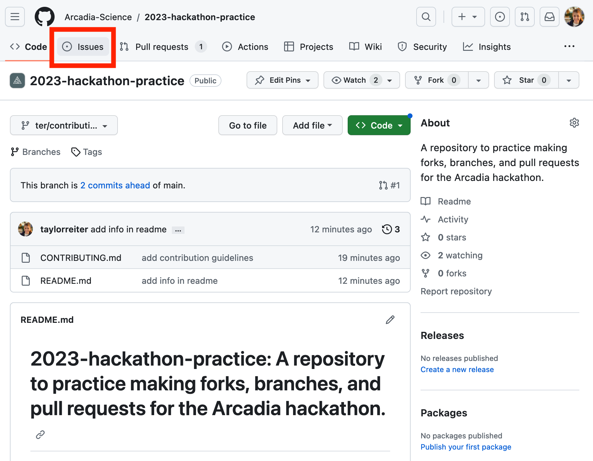
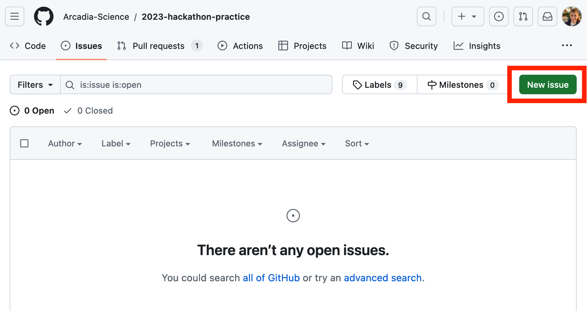
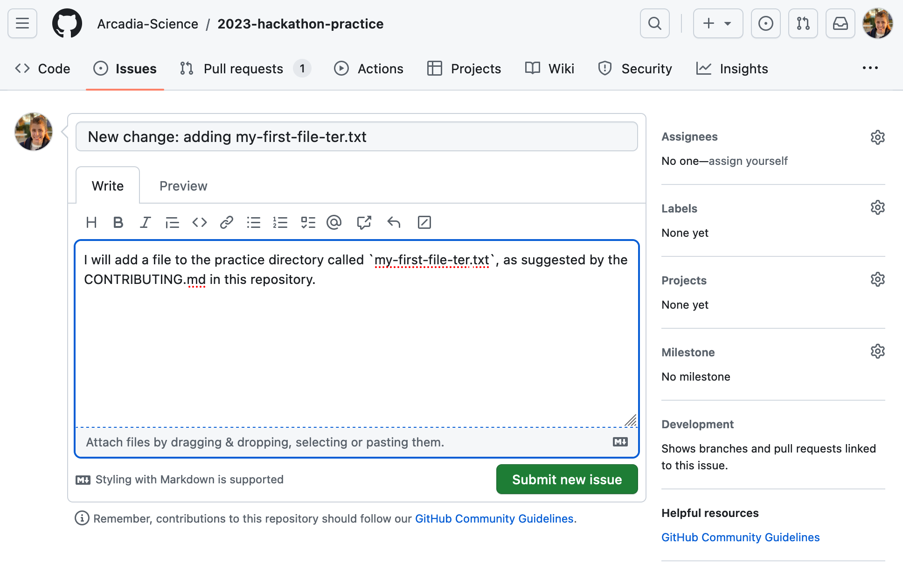
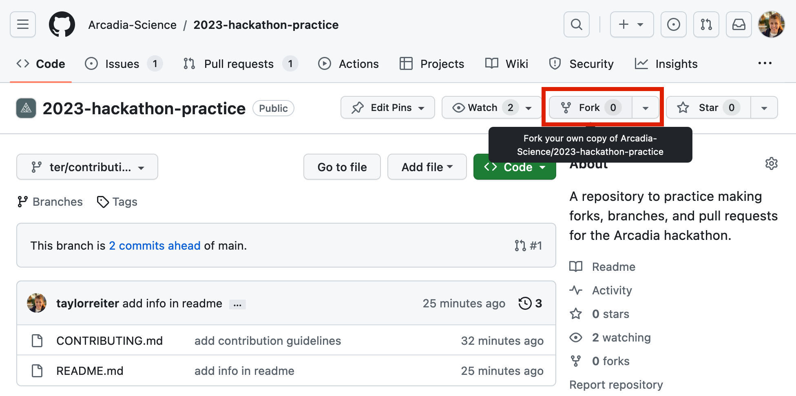
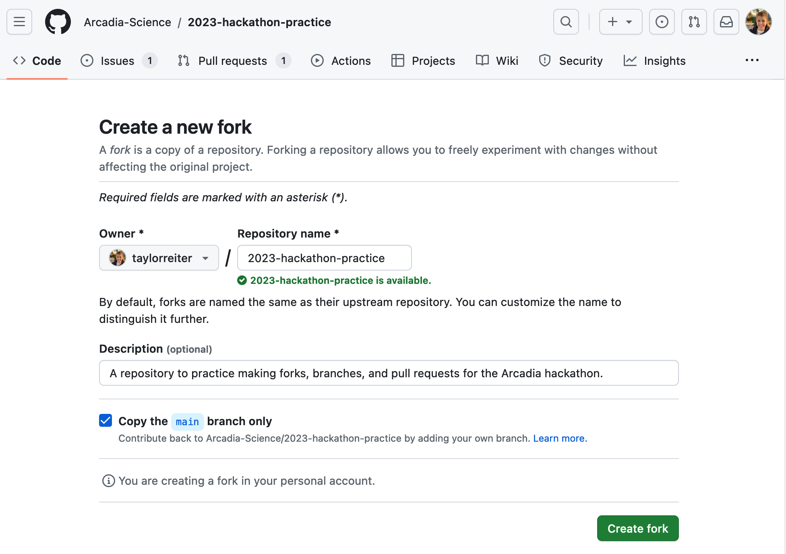
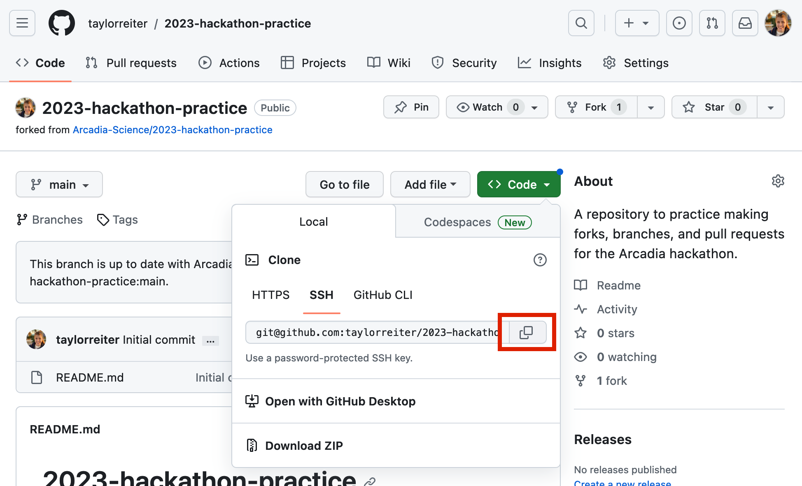
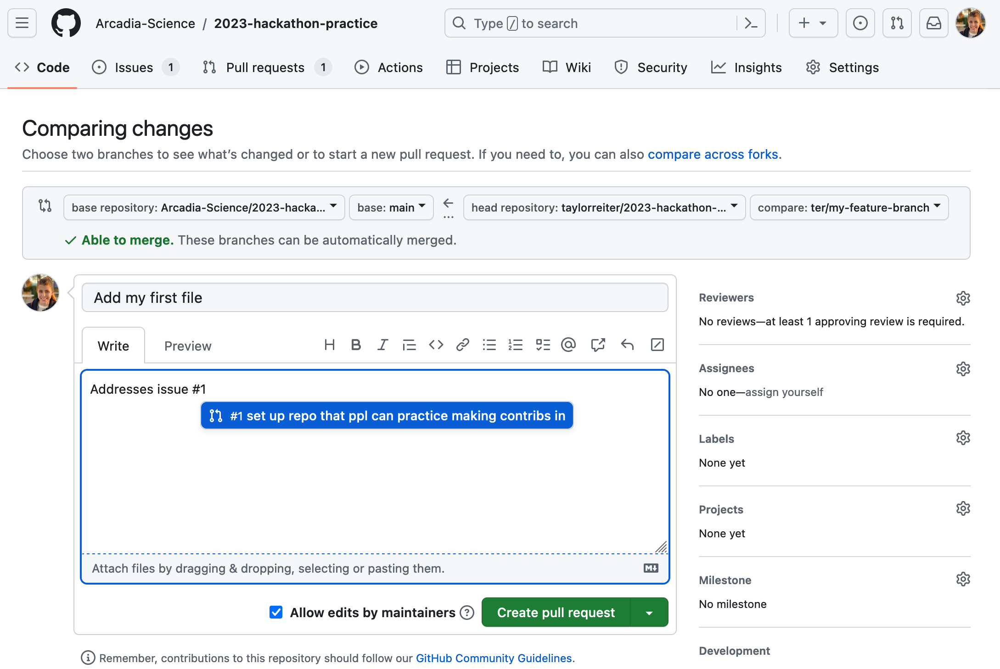
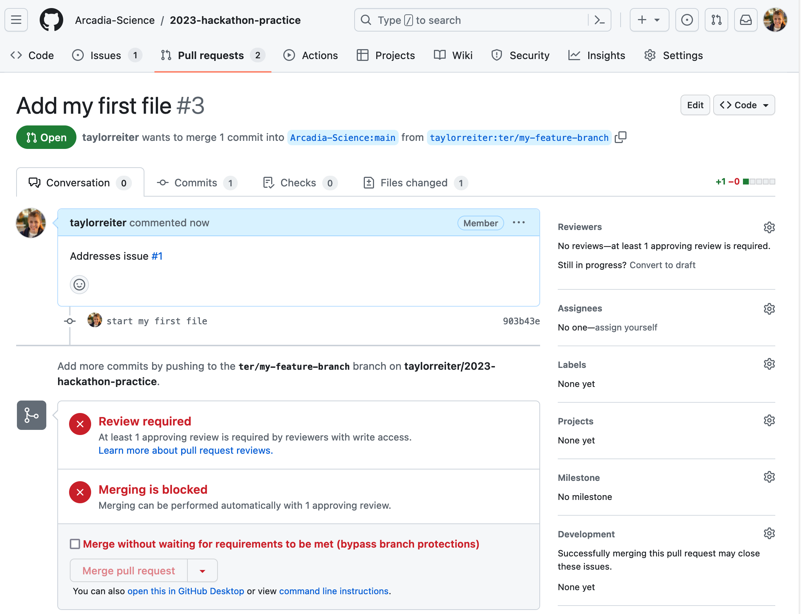
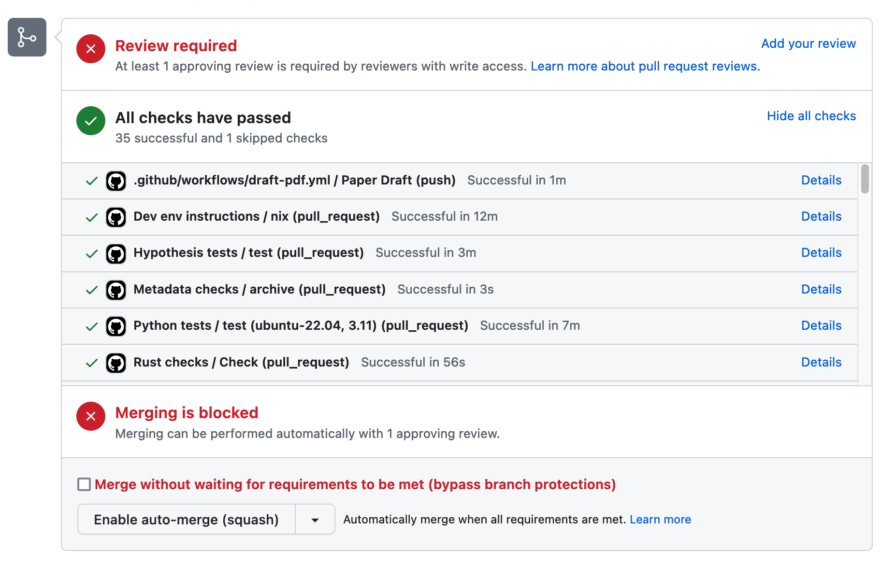

# Using Git and GitHub to Contribute to Repositories You Don't Have Write Access To

Arcadia is participating in [Hacktoberfest 2023](https://hacktoberfest.com/).
Our goal is to give back to the open source software community that we use every day in our own scientific work.
As part of this, we are hosting a mini-hackathon to create a space for and support others in making contribution to open source software libraries.
We've [curated a list of bioinformatics (or adjacent) software repos](https://docs.google.com/document/d/1EjyQOwPO-Zc4aKM_mTPEFo3K97Ox3lEk-DyZxlivyVU/edit?usp=sharing) that are accepting contributions.
The purpose the lesson below is to outline how to contribute to a GitHub repository that you don't own (e.g., you don't have write access to).

While we will cover this in more depth below, we want to highlight how important it is to only contribute to projects that are open to contributions and to abide by community- or project-specific guidelines when doing so.
Every contribution creates additional work for maintainers, many of whom are volunteers or who have responsibilities outside of software maintenance.
Approaching your contribution with this in mind ensures that suggestions you make are more likely to be a net benefit for the project to which you're contributing.
Respect, gratitude, and openness to feedback also go a long way toward fostering a fruitful collaboration.

## tl;dr

0. Select a repository to contribute to and read the contribution guide.
1. Fork your repository of interest to your own GitHub account (click the Fork button in the top right of the repo page).
2. Navigate to your fork. Clone your fork down to your local machine: `git clone https://github.com/your-username/repository-name.git`
3. Create a branch: `git checkout -b branch-name`
4. Make your changes.
5. Add your changes to be tracked by git: `git add file-changed.txt`
6. Commit your changes: `git commit -m 'short explanation of changes i made'`
7. Push your changes: `git push origin branch-name`
8. Create a new pull request from your forked repository (click the Pull request banner and then the New Pull Request button located at the top of your repo).
9. Describe your changes following the guidelines in the contribution guide or the PR template.
10. Wait for your PR to be reviewed and make any requested changes.

## Setting up

If you need to:

- sign up for a GitHub account
- install git locally
- configure global git settings
- create an ssh key to authenticate without a password

Navigate to the [Setting Up Instructions](https://training.arcadiascience.com/workshops/20220920-intro-to-git-and-github/lesson/#setting-up) in the Intro to Git and GitHub lesson and follow along with the tutorial.

## Finding repositories that accept contributions & work that needs to be done

### Searching for repositories that are open to external contributions

Not every open source repository is in a position to accept work from new contributors.
Contributing to a repository that isn't accepting these types of contributions at best leads to unintegrated pull requests and at worse creates additional work and head aches for maintainers.
To avoid these situations, look out for signals that a repository is accepting contributions from new contributors.
Good signals include:

1. The repository has contributor guidelines.
2. The repository uses issues to keep track of work that needs to be completed and labels issues to make it clear where contributions are welcome.
3. The maintainers of the repository have recently engaged with issues, pull requests, or have recently updated the repository.
4. The repository is marked with a `hacktoberfest` topic. Since Hacktoberfest is in its 10th year and repository topics have been around for three years, the tag may be from previous years so look for other signals that the repo is still accepting contributions. You can also search for the `hacktoberfest2023` tag instead to get recent labels.
 
We've [curated a list of bioinformatics (or adjacent) software repos](https://docs.google.com/document/d/1EjyQOwPO-Zc4aKM_mTPEFo3K97Ox3lEk-DyZxlivyVU/edit?usp=sharing) that are accepting contributions either for hacktoberfest or otherwise.
You can start from this list or search GitHub topics to find a repository you want to contribute to.

For the hands on portions in the rest of this lesson, we will practice making a contribution using the [Arcadia-Science/2023-hackathon-practice](https://github.com/Arcadia-Science/2023-hackathon-practice) repository.

### Contributor guidelines 

The Contributor Guidelines for a repository outline how the project would like to receive contributions.
This is a very important document to read and to continually reference as you're making your contribution to make sure you're following the preferences of the community or project you're contributing to.
Each project is a little different, so make sure you read this document closely for each project you plan to contribute to.

In the [Arcadia-Science/2023-hackathon-practice](https://github.com/Arcadia-Science/2023-hackathon-practice) repository, the contributor guide is located in the file `CONTRIBUTING.md` and it is linked to from the `README.md`.

### Finding work that needs to be completed: issues, pull requests, and repo searches

The contributor guidlines document often details how new contributors can find work that needs to be done.
Often times, projects use [GitHub **Issues**](https://github.com/features/issues) to document work that needs to be completed.
When a project is accepting external contributions, they often use issue labels to highlight work that can be done by anyone.
Common labels include "good first issue," "good second issue," and "help wanted," but these labels can vary a lot by project.

Issues can also be used to document work that is being worked on by someone else.
These can be issues all on their own or responses to issues that already exist.
Similarly, a pull request may declare work that is in progress or has already been contributed.
It's a good idea to search open issues and pull requests, as well as the repository in general, to make sure the work you want to do hasn't already been undertaken by another contributor.  


### Narrating the work that you will complete

To make sure that others know what work you plan to do, it's usually a good idea to narrate this work somewhere in the repository.
Check the contributor guidelines first to see what the recommended strategy to use is.
A common strategy is to respond with a comment to an open issue asking if the work still needs to be done or to state that you plan to work on it. 

According to the contributor guide in the [Arcadia-Science/2023-hackathon-practice](https://github.com/Arcadia-Science/2023-hackathon-practice) repository, the maintainers ask that you post an issue declaring the change that you will make the repo.
The guide also states that if you plan to add a file that the file should be added in the `practice` folder.
Practice opening an issue.
First, navigate to the issues tab.

<center>
{ width="600" }
</center>

Then, open a new issue by selecting the green "New issue" button.

<center>
{ width="600" }
</center>

Describe that you will add a file to the `practice` folder called `my-first-file-`, your initials, and then `.txt` (`my-first-file-ter.txt`).

<center>
{ width="600" }
</center>

## Workflow for making changes on a repository you don't own 

Once you have identified a repository you want to contribute to and the work that you plan on doing, it's time to start making actual changes.
Below, we cover how to make changes in a way that will allow you to contribute those changes back to the main code base when you are finished with your work.

### Forking the repository

When you don't have write access to a repository, you need to make a copy of the repo into a user name or organization that you do have write access to.
This process is called **forking** or creating a **fork** for a repo.
You do this by clicking the fork button in the upper right hand corner of a repository.

<center>
{ width="600" }
</center>

Select the new owner (for this lesson, yourself), and then select the green "Create fork" button.

<center>
{ width="600" }
</center>

You should now have a copy of the repository in your own GitHub account.

### Cloning the fork from remote to local

**Cloning** is the process of copying an existing Git repository from a **remote** location (here, on GitHub) to your **local** computer.
Navigate to your fork of the repository you're working with (GitHub did this for you after forking if you kept the same tab open).
The URL should start with your GitHub user name.
To clone the repository, click the green "Code" button in the top right hand corner of the repository screen. 
This creates a drop down menu with clone options.
We'll select the SSH tab because we configured an ssh key pair.
Once you select the tab, copy the path that starts with `git@gitub.com:`.

<center>
{ width="600" }
</center>

Then, navigate to your terminal and use the command below to clone the repository.
Remember to substitute out the username/URL with your own URL that we copied.

```
cd ~ # this will clone the repo to your home directory. Feel free to put it somewhere else if you prefer.
git clone git@github.com:your_username/2023-hacktathon-practice
cd 2023-hackathon-practice
```

### Making changes to the code: working on a branch

<center>
{ width="400" }
</center>

When you want to make changes to files in a repository, it’s best practice to do it in a **branch**.
A **branch** is an independent line of development of files in a repository. 
You can think of it like making a copy of a document and making changes to that copy only: the original stays the same, but the copy diverges with new content.
In a branch, all files are copied and can be changed.

<center>
{ width="600" }
</center>

Branches are particularly powerful for collaborating.
They allow multiple people to work on the same code base and seamless integrate changes.
Because we'll be contributing to someone else's code base, it's best to do so on a branch.

By default, you start on the `main` branch (some older repositories will start from `master`).
You can see which branch you're on locally using the `git branch` command.

```
git branch
``` 

Let's create a branch and make changes to it.
We can create a new local branch using `git checkout -b`.
`git checkout` tells git we want to switch which branch we're currently on, while the `-b` flag tells git that we're creating a new branch.

```
git checkout -b ter/my-feature-branch 
```

Branch names can be used to convey information that can help you and others keep track of what you're doing.
For example, you can prepend your branch names with your initials and a slash to make it clear that you were the one who created the branch, and you can specify a name that is associated with the file changes made on the branch: `<your initials>/<brief description of the code change>`.
Now, if we run `git branch` we'll see we're on the branch `ter/my-feature-branch`.

```
git branch
```

To go back to the `main` branch, we can use the `git checkout` command without the flag `-b`.

```
git checkout main
```

and to go back to our feature branch, we can use `git checkout` again.
```
git checkout ter/my-feature-branch
```

Whenever you create a new branch, it branches off from the branch you're currently in when you make the new branch.
In this case, we started in `main`, so our branch will branch off of from here.

### Making changes to the code: adding, committing, and pushing

We can now make changes to our files in our local repository.
The basic Git workflow begins when you communicate to Git about changes you've made to your files.
Once you like a set of changes you’ve made you can tell Git about them by using the command **`git add`**.
This stages the changes you have made.
Staging a file tells Git that you're ready to commit those files -- it's a way of telling Git which files you're ready to commit.
Next, you bake them into the branch using **`git commit`**.
When you’re ready, you can communicate those changes back to GitHub using **`git push`**.
This will push your the changes that are in your local repository up to the remote repository.

Let's try this workflow out.
Throughout this process, we'll use the command `git status` to track our progress through the workflow.
`git status` displays the state of a working direcotry and the staging area.

```
git status
```

We'll use the `echo` command to create a new file matching the name of the file we said we'd make in our issue.

```
ls
echo "creating my first file" > practice/my-first-file-ter.txt
ls
```

Take a look at the contents of your `practice/my-first-file-ter.txt` file:
```
less practice/my-first-file-ter.txt
```

And run `git status` to see how creating a new file changes the output of that command:
```
git status
```

Once you have made changes in your repository, you need to tell Git to start tracking the file. 
The command `git add` adds the files to the "staging area", meaning Git is now tracking the changes.

```
git add practice/my-first-file-ter.txt
```

After adding this file, we see our output of `git status` changes.

```
git status
```

The text associated with our file is now green because the file is staged.
When you've made all of the changes to a file that represent a unit of changes, you can use `git commit` to create a snapshot of the file in your Git version history.

```
git commit -m "start my first file"

git status
```

The `-m` flag is the message that is associated with that commit.
The message should be short and descriptive so that you or someone looking at your code could quickly determine what changes took place from one commit to the next.
What constitutes a unit of changes worthy of running `git commit`? 
That depends on the project and the person, but think about returning to this code six months in the future.
What set of changes would make it most easy to return to an earlier version of document?

Committing a file bakes changes into your local repository. 
To communicate that changes back up to your remote repository, use `git push`.

```
git push origin ter/my-feature-branch
``` 

In the above command, `origin` is shorthand for the remote repository that a project was cloned from. 
To view what this value is, you can run `git remote -v`.

## Contributing changes 

Pull requests are used to contribute changes from your fork back to the main repository.
Before opening a pull request, re-read the contributing guidelines and make sure to fulfill all of the requirements requested therein.
This will often include that all test should be passing locally.
For more on testing, see this [Carpentries Incubator lesson](https://carpentries-incubator.github.io/python-testing/) on testing in python.

To create a new pull request, you can click the yellow banner with the green button, "Compare & pull request."

<center>
{ width="600" }
</center>

This will launch a page that suggests where the changes are coming from and where they're being integrated into.
Pay special attention on this page to make sure you select the appropriate branches and forks here.
Use the title and dialogue box to annotate what your PR accomplishes.
Be sure to link to the issue you're addressing using a `#`.
Re-read the contributor guidelines or follow the PR template to make sure you're including all required information.

<center>
{ width="600" }
</center>

The opened PR looks something like this

<center>
{ width="600" }
</center>

In some repositories, opening a PR may launch [continuous integration with GitHub Actions](https://github.com/features/actions).
These will appear as banners of tasks.
When they pass successfully you'll see a green check mark.
Generally, all tests need to pass before a PR is merged.

<center>
{ width="600" }
</center>

After opening your PR, a maintainer will typically review the PR and request or make changes.

## Summary

<center>
<h4><i>Terms introduced:</i></h4>

| Term | Definition |
| -----| -----------|
| Git  | a version control system |
| GitHub | an internet hosting service for version control using Git |
| repository | a collection of files and folders associated with a project that is under Git version control |
| local  | accessed from your system; the computer you're working on | 
| remote | stored on a remote computer; GitHub |
| commit | a snapshot of your files and folders at a given time |
| branch | an independent line of development in a repository |
| pull request | a mechanism to suggest changes from a branch be integrated back into the `main` branch |
| review | the process of reviewing changes in a branch through a pull request |
| issue | a tracking tool integrated into a GitHub repository |

<h4><i>Commands introduced:</i></h4>

| Command | Function |
| --------| ---------| 
| `git clone` | copies a Git repository from remote to local |
| `git status` | summarizes the current status of the Git repository, including the branch you are on and any changes on that branch |
| `git add` | adds new or changed files in your working directory to the Git staging area|
| `git commit` | creates a commit of your repository |
| `git push` | uploads all local branch commits to the corresponding remote branch|
| `git checkout` | switches between local branches, or creates a new branch with the `-b` flag |
| `git branch` | reports what branch you're currently on and what other local branches exist |
| `git pull` | updates current local working branch and all of the remote tracking branches |

</center>
